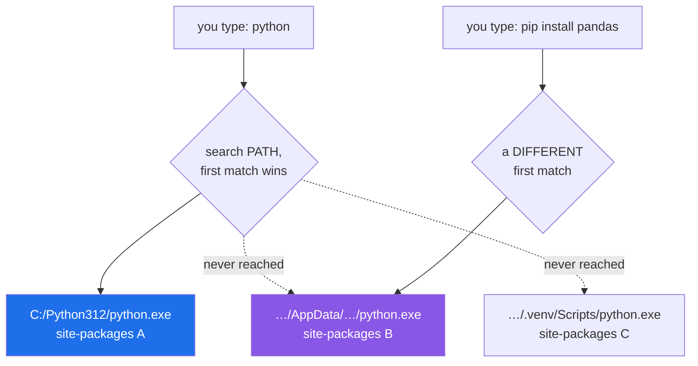

# 1.1 — Why one tool must own the environment

## One-line answer

When two programs on your machine can both answer to the name `python`, the word stops
naming a thing and starts naming a coin toss — so exactly one tool is given the job of
deciding which interpreter runs and which packages it can see.

---

## The story

Think about a house where four people have each put up a shelf for the post.

Somebody puts a letter on a shelf. Somebody else comes home, checks a different shelf, finds
nothing, and says the letter never arrived. Both of them are telling the truth. Both of them
looked properly. The letter is sitting on a shelf two metres away from the person who could
not find it.

Nobody in that house is being careless. The problem is that "the shelf" is four shelves and
the name does not say which. And it gets worse quietly rather than loudly: for months the
system works, because for months there is only ever one letter and everyone happens to check
the same shelf first. The day it breaks is the day somebody puts a letter on shelf three.

The fix in a house is not a better memory. It is a rule: **one shelf for post, and if you
put post anywhere else it is not post.** One place, named, and everybody knows which.

That rule is the whole of this document.

---

## The idea in plain language

Start from nothing. When you type a command into a terminal, the terminal has to turn a
**word** — `python` — into a **file on disk** that it can run. It does that by looking
through a list of folders, in order, and taking the first file with that name it finds.

That list is called **`PATH`**. It is an ordinary list of folder names, held as a variable
in your shell, and every installer you have ever run has added itself to it.

Two facts follow, and together they are the whole problem:

1. **`PATH` is a list, so it has an order, so ties are broken by position.** If two folders
   both contain a `python`, the one earlier in the list wins. Nothing announces this.
2. **`PATH` is read once, when a shell starts.** A terminal window you already have open is
   holding a copy of the list from when you opened it. An installer that edits `PATH` has
   not edited *that* window's copy.

Now add the second half. A Python interpreter does not look for packages in one global
place. Each interpreter has its own folder of installed packages, called **`site-packages`**,
and it belongs to that interpreter alone. So "is pandas installed?" is not a question about
your computer. It is a question about *one specific interpreter*.

Put the two together and you get the failure everyone meets:

- `pip install pandas` runs some `pip`. That `pip` belongs to one interpreter, and installs
  into **that** interpreter's `site-packages`.
- `python script.py` runs the first `python` on `PATH`, which may be a **different**
  interpreter, with a **different** `site-packages`.
- The import fails. The package is right there on disk. You can see the folder.

Nothing is broken. Two words on one keyboard are pointing at two different machines that
happen to share a hard drive.

A **virtual environment** is the conventional fix: a folder holding one interpreter and its
own `site-packages`, so a project's packages are its own. It is a real fix and this project
uses one. But it does not, by itself, answer the question that actually bites — *which
interpreter am I talking to right now?* — because activating an environment is a thing you
can forget, and a shell that has forgotten looks exactly like a shell that has not.

So the rule this repository adopts is stronger, and it is one sentence:

> **One tool owns the environment, and every command goes through it.**

That tool is `uv`, and you meet it in [1.3](1.3-uv-the-one-binary.md). You will never type
`pip` here. Not because `pip` is bad — because a second way to install a package is a second
shelf for the post.

---

## Why Jāla needs it

This curriculum spends 152 days claiming that a specific byte was in a specific place. Every
one of those claims is worth exactly as much as your confidence that the code you ran is the
code you think you ran.

Three concrete places this bites, all of them later in this plan:

- **Day 8 reads a capture byte by byte.** If your parser imports a version of a library from
  one interpreter while your test runs under another, you will spend an evening debugging a
  wrong byte offset that is not wrong.
- **Day 18 compares your hand-built Ethernet frame against `scapy`'s** (P3 — build first,
  compare after). That comparison is meaningless unless "the `scapy` I installed" and "the
  `scapy` my code imported" are provably the same install.
- **Every measurement, from Day 12 onward, names its tooling and version** in
  `docs/MEASUREMENTS.md` (P8). A version you cannot pin down is a measurement you cannot
  defend, and P8 is the rule this plan says you are most likely to break.

There is also a rule-shaped reason. P6 says *never invent a version*, and P8 says *never
invent a number*. Both assume there is a single answer to "what is installed". Four shelves
means there is not.

---

## The mechanism

Look at the actual list your shell is using. This is not a metaphor; it is a variable you
can print.

```bash
echo "$PATH" | tr ':' '\n' | head -20
```

**Line by line:**

- `echo "$PATH"` — print the variable. **The quotes matter**: without them the shell splits
  the value on spaces, and folder names on Windows are full of spaces (`Program Files`).
  Unquoted, you would see the list mangled in a way that hides the very thing you are
  looking at.
- `|` — a **pipe**: send the left command's output into the right command's input. It is the
  single most useful character in a shell and you will use it all year.
- `tr ':' '\n'` — **tr**anslate every `:` into a newline. `PATH` is one long string with
  entries separated by colons, which is unreadable; this puts one folder per line. On Git
  Bash the separator is `:` even though Windows natively uses `;`, because Git Bash presents
  a Unix-shaped world.
- `head -20` — print only the first 20 lines. **Order is the whole point** — the first match
  wins — so the top of the list is the part that decides.

Now ask which files actually answer to the name:

```bash
type -a python
```

**Line by line:**

- `type` — a shell builtin that answers "what would happen if I typed this word?" It knows
  about builtins, functions and aliases, which is more than a plain path lookup would tell
  you.
- `-a` — **all** matches, in `PATH` order, instead of only the winner. This is the flag that
  turns a comforting answer into an honest one: one line is a tidy machine, three lines is
  the house with four shelves.

And prove the second half — that packages belong to an interpreter, not to the computer:

```bash
python -c "import sys; print(sys.executable); print(sys.path[-1])"
```

**Line by line:**

- `-c` — run the string that follows as a program, instead of a file. Handy for a one-line
  question you do not want to save.
- `sys.executable` — the **full path of the interpreter that is running right now**. Not the
  one you meant; the one you got. If this ever surprises you, that surprise is the bug.
- `sys.path[-1]` — the last entry of the list of folders this interpreter searches for
  imports, which is normally its own `site-packages`. This is the shelf. Note that it sits
  *underneath* `sys.executable` — change the interpreter and you change the shelf.
- `;` inside the string — two statements on one line. Fine for a probe; not how you write a
  file.



The diagram is the bug. `python` resolved to A. `pip` resolved to B. Pandas is installed —
into B — and the import under A fails. Both commands succeeded. Neither told you they were
talking to different machines.

---

## When it breaks

The classic, and it is worth reading the two lines together rather than separately:

```text
$ pip install pandas
Successfully installed pandas-3.0.5

$ python -c "import pandas"
Traceback (most recent call last):
  File "<string>", line 1, in <module>
ModuleNotFoundError: No module named 'pandas'
```

**What it says:** this interpreter has no pandas.
**What it means:** *some* interpreter has pandas. Not this one. The install succeeded and
went somewhere you did not look. `ModuleNotFoundError` is telling you the truth about a
question you did not mean to ask.

**The smallest fix** — stop guessing which `pip` you got, and use the one that belongs to
the interpreter you are actually running:

```text
$ python -m pip install pandas
```

`python -m pip` means "run the `pip` module *inside this interpreter*", so the install and
the import are guaranteed to be the same machine. It is a good habit, and this project goes
further and removes the choice entirely ([1.3](1.3-uv-the-one-binary.md)).

**The second one, and it is worse because it is silent.** Suppose both interpreters have
pandas, at different versions:

```text
$ pip show pandas | head -2
Name: pandas
Version: 3.0.5

$ python -c "import pandas; print(pandas.__version__)"
2.1.4
```

Nothing failed. No traceback, no warning, no red text. You are reading the documentation for
one version and running another, and the first thing you will notice is behaviour that
"makes no sense" in a function whose signature changed. **A failure that raises is a gift; a
failure that returns a plausible wrong answer is the expensive kind**, and this curriculum
is full of the second sort — that is what plan §6 is about.

**And the one that makes people distrust installers:**

```text
$ uv --version
bash: uv: command not found
```

Almost always fact 2 above: `PATH` is read once, at shell start. The installer edited the
list; your open window is holding the old copy. Close the terminal, open a new one. The
installer did not lie.

---

## In production

**This is not a beginner problem that you outgrow.** It changes costume and comes back with
a bigger budget.

*In a container image.* A Dockerfile that runs `pip install` relies on the base image's
system Python and its `pip`. Rebuild six months later and the base image has moved: a
different patch release, a different `pip`, a different resolution. The image that ships is
not the image you tested. The professional answer is the same one this document argues for —
one tool owns the environment, and the exact resolution is committed to the repository, not
re-derived at build time.

*On a CI runner.* Every hosted runner ships several Pythons and a `PATH` you did not choose.
"Works on my machine" is, almost always, this document: two different first-matches. The
question a build must be able to answer is not "did it install?" but "which interpreter, and
which resolved versions?" — and it must be able to answer it from a file, not from a log.

*On a server at three in the morning.* An operator runs `python` to check something during
an incident and gets the system interpreter rather than the service's. The reading is wrong
and the wrongness is not visible, so it feeds a decision. This is why service units name an
absolute interpreter path and never inherit an interactive `PATH`.

**What an operator does differently.** They stop asking "is it installed?" and start asking
"installed *where*, and which one does this process load?" The commands are `type -a`,
`sys.executable`, and reading the lockfile — never the file explorer.

**The review comment.** On a pull request that adds a bare `pip install` line to a script:
*"Which interpreter does this install into? Use the project's runner so the install and the
import are the same environment — otherwise this passes in CI and fails on the box."*

**The interview question.** *"`pip install requests` succeeded and `import requests` fails.
Walk me through it."* They are not testing whether you know the fix. They are testing
whether you reach for `PATH` and `sys.executable` — evidence — or start reinstalling things
and hoping. The candidate who says *"first I'd print `sys.executable`, then `type -a pip`,
because I want to know if those two are the same install"* has already answered it.

---

## Check yourself

```bash
type -a python 2>/dev/null | wc -l && python -c "import sys; print(sys.executable)"
```

The first number is **how many programs on this machine answer to the word `python`**. One
is a tidy machine. Two or more is the house with four shelves — which is not a problem to
fix today, because from [1.3](1.3-uv-the-one-binary.md) onward you stop typing the ambiguous
word at all.

**Answer out loud, without scrolling up:**

> Explain why `pip install X` can succeed and `import X` can fail on the same machine, in
> the same terminal, seconds apart — using the words `PATH` and `site-packages`, and without
> using the word "broken". Then say which of those two failures is more dangerous: the one
> that raises `ModuleNotFoundError`, or the one where both interpreters have the package at
> different versions.

---

**Next:** [1.2 — Git, and the shell every command in this repository is written in](1.2-git-and-the-shell.md)
