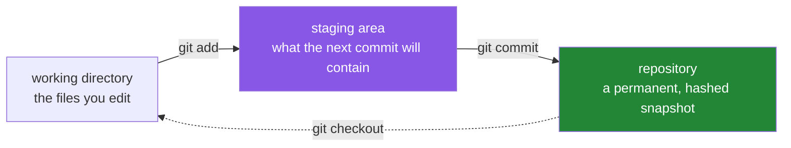

# 1.2 — Git, and the shell every command in this repository is written in

## One-line answer

Git records **snapshots of your whole project**, each one named by a hash of its contents, so
"what did this look like on Day 61?" is a question with an exact answer — and every command
in these 152 days is written for **bash**, which on Windows arrives with Git rather than with
Windows.

---

## The story

You are cooking from a recipe you have been changing for years. You have crossed things out,
written in the margin, stuck a note on top of an earlier note.

Tonight it comes out wrong. Too salty. And you know — you are certain — that it was right the
last three times, so something you changed recently did it. But the page only holds the
*current* state of your thinking. The crossed-out amounts are half readable. The note you
stuck on covers the thing it replaced. There is no version of the page that says "this is
exactly what I did the night it worked".

So you cannot go back. You can only guess forward, cook it again, and hope.

Now imagine that every single time you changed the recipe, a fresh clean copy of the whole
page was filed in a drawer, dated, with a line saying what you changed and why. Tonight you
pull out the three copies from the good nights, lay them next to tonight's, and the extra
half-spoon is *visible*. Not remembered — visible.

The drawer is not a backup. A backup answers "what did it look like most recently?" The
drawer answers **"what did it look like at every point, and what changed between any two of
them?"** That second question is the one that finds the salt.

---

## The idea in plain language

**Git** is that drawer. Three words carry almost all of it:

- A **repository** (repo) is a project folder plus a hidden `.git` folder holding its whole
  history. The history lives *inside the project*, on your disk. Nothing is on anybody's
  server unless you deliberately push it there — an important thing to know before you write
  a `.gitignore` in [2.2](../02-skeleton/2.2-gitignore-before-secrets-exist.md).
- A **commit** is one filed copy: a complete snapshot of every tracked file, plus who made
  it, when, a message saying why, and a pointer to the commit before it. Each one is named by
  a **hash** — a 40-character fingerprint computed from the contents. Change one byte
  anywhere and the name changes, which is why a commit id is a *guarantee* about content and
  not just a label.
- A **branch** is a movable sticky note pointing at one commit. `main` is a branch. That is
  genuinely all a branch is, and knowing it makes Git stop being mysterious:
  [2.3](../02-skeleton/2.3-git-init-and-what-a-repo-is.md) opens the file and shows you the
  hash inside it.

Because each commit points at its parent, the commits form a chain. That chain is the
history, and it is **append-only in practice**: you add to the end. This repository leans on
that hard — P2 is *one day, one commit*, so the chain of commits and the 152 days are the
same list read two ways.

Now the second half, which is a different subject wearing the same day.

A **shell** is the program that reads what you type and runs it. Different shells are
different *languages*, not different skins. `mkdir -p`, `touch`, `chmod`, `$VAR`, `|`, and
the `<<EOF` heredoc are all **bash** — the shell that Linux and macOS use. Windows natively
has PowerShell, which is a genuinely good shell that speaks a different language: it uses
`$env:VAR`, `New-Item`, and objects rather than lines of text.

Every command in these 152 days is bash. That is not a preference; it is forced by the
subject. `ip netns`, `tcpdump`, `tc`, `nft` and `ss` are Linux tools, the lab is Linux
namespaces ([4.1](../04-the-linux-door/4.1-namespaces-need-linux.md)), and `./m` is a bash
script. Writing the curriculum twice, once per shell, would mean two things to keep correct
and one of them silently rotting.

On Windows, bash arrives **with Git**. The Git for Windows installer includes **Git Bash**: a
real bash, plus the small Unix toolkit (`ls`, `grep`, `sed`, `curl`, `head`, `tr`) that these
documents assume. So installing Git does two jobs at once, and that is why one part covers
both.

---

## Why Jāla needs it

- **P2 — one day, one commit.** The history is the progress ledger's spine. `./m done N`
  makes exactly one commit per day, and `docs/PROGRESS.md` records its hash. On Day 100, "what
  did my TCP look like before I added fast retransmit?" is answerable because of this.
- **P12 — reproduce the fault before you fix it.** Diagnosing a bug you introduced means
  comparing a working commit against a broken one. Without per-day commits there is nothing
  to compare, and "it worked last week" stays an opinion.
- **P9 — captures and keys are never committed.** That rule is enforced by `.gitignore`, and
  `.gitignore` only makes sense once you know what "tracked" means. Which is this part.
- **`./m` is bash.** `set -euo pipefail`, the `case` dispatcher and the `done` gate —
  [3.1](../03-the-driver/3.1-set-euo-pipefail.md) through
  [3.3](../03-the-driver/3.3-the-done-gate.md) — are bash constructs with no PowerShell
  equivalent that behaves the same way.

---

## The mechanism

Install Git for Windows from <https://git-scm.com/download/win>. Accept the defaults, with
one thing worth reading: the installer offers to add Git Bash to your context menu, which is
the fastest way to open a shell in the right folder.

On macOS or Linux you already have bash (or zsh, which is close enough for everything here)
and Git is `xcode-select --install` or your distribution's package manager.

Then, in **Git Bash**:

```bash
git --version
git config --global user.name "Your Name"
git config --global user.email "you@example.com"
```

**Line by line:**

- `git --version` — proves the binary exists and is on `PATH` ([1.1](1.1-why-one-tool-owns-the-environment.md)).
  Harmless, and it answers both questions at once. If this fails, reopen the terminal before
  anything else: `PATH` is read once, at shell start.
- `git config --global` — write a setting into your per-user config file (`~/.gitconfig`)
  rather than into one repository. `--global` is the right scope here because your name does
  not change per project.
- `user.name` / `user.email` — **stamped into every commit you make, permanently, and they
  are not authentication.** Git does not check them. They are how a human later reads the
  history, and they are why a commit cannot be silently reattributed.

Two more settings that prevent specific, boring disasters:

```bash
git config --global init.defaultBranch main
git config --global core.autocrlf input
```

**Line by line:**

- `init.defaultBranch main` — names the first branch `main` in repositories you create from
  now on. It does **not** rename an existing one. Worth setting so every repo you make agrees
  with every tutorial you read.
- `core.autocrlf input` — the line-ending rule, and this one genuinely matters here. Windows
  ends lines with two characters (carriage return + line feed, `CRLF`); Linux and macOS use
  one (`LF`). `input` means **convert CRLF to LF when committing, and leave files alone when
  checking out**. Why it matters on this project specifically: `./m` is a bash script. A bash
  script saved with `CRLF` fails with a confusing error, because the shell reads the
  carriage return as part of the command name. This setting is why that will not happen to
  you.

Now look at what Git actually stores, rather than taking it on faith:

```bash
git config --global --list | grep -E 'user|autocrlf|defaultBranch'
```

**Line by line:**

- `--list` — print every setting currently in effect, so you are reading the machine's state
  rather than your memory of what you typed.
- `grep -E 'a|b|c'` — keep only lines matching any of these patterns. `-E` turns on extended
  regular expressions, which is what makes `|` mean "or" rather than a literal pipe
  character.



The middle box is the one people skip, and it is the one that makes Git feel arbitrary until
it clicks. **Editing a file does not stage it, and staging it does not commit it.** Those are
three separate states, and `git status` is the command that tells you which state everything
is in. [5.2](../05-first-commit/5.2-the-first-commit.md) is entirely about reading it before
you commit rather than after.

---

## When it breaks

**The line-ending failure, which is the one this part exists to prevent:**

```text
$ ./m check
bash: ./m: /usr/bin/env: bad interpreter: No such file or directory
```

**What it says:** the interpreter named on the first line does not exist.
**What it means:** it does exist. The file's first line ends with `CRLF`, so bash is looking
for a program named `env\r` — `env` followed by a carriage return — and there is no such
program. The error names the thing that is present and misses the invisible character that is
the actual cause, which is what makes it memorable once and baffling every time before that.

The fix, and then the prevention:

```text
$ sed -i 's/\r$//' m          # strip the carriage returns from this file
$ git config --global core.autocrlf input   # so it does not come back
```

**The identity failure, on your first commit:**

```text
$ git commit -m "day 000: complete"
Author identity unknown

*** Please tell me who you are.

Run

  git config --global user.email "you@example.com"
  git config --global user.name "Your Name"

to set your account's default identity.
```

This one is friendly: it tells you the exact fix. Worth noticing *why* Git refuses rather
than guessing — an unattributed commit is a permanent record with a hole in it, and Git will
not create one on your behalf.

**And the silent one.** You run a command from this repository in **PowerShell** instead of
Git Bash:

```text
PS> mkdir -p docs/adr
New-Item: A positional parameter cannot be found that accepts argument 'docs/adr'.
```

PowerShell's `mkdir` is a different command that does not take `-p`. That failure is loud and
harmless. The dangerous version is a command that exists in *both* shells and means something
subtly different — which is why these documents state their shell instead of assuming it.

---

## In production

**Commit messages are read far more often than they are written**, and almost always by
somebody trying to understand a failure under pressure. The message that earns its keep says
*why*, because the *what* is already in the diff. This repository fixes the format —
`day NNN: <title> — closes <IDs>` — so the history reads as a curriculum rather than as 152
variations on "update".

**`git log` is a debugging tool, not an archive.** The two commands an engineer actually
reaches for are `git bisect`, which finds the commit that introduced a bug by binary search
over history, and `git log -S'<string>'`, which finds the commit where a particular line of
code appeared or vanished. Both are only as good as the granularity of your commits — which
is the practical argument for P2 that has nothing to do with tidiness. Bisecting 152 one-day
commits is a handful of steps. Bisecting one enormous commit is not bisecting.

**Line endings at scale.** A team with mixed Windows and Linux machines and no line-ending
policy produces pull requests where every line of a file appears changed. Reviewers stop
reading those diffs, and a real change hides inside one. The professional fix is not
`core.autocrlf` on each laptop — it is a `.gitattributes` file committed to the repo, so the
policy travels with the code instead of depending on every clone being configured correctly.
This project is a single-author repository, so `core.autocrlf input` is enough; a team
project is where you would reach for the committed version.

**The review comment.** On a pull request whose history is one commit called "fixes":
*"Please split this — I can't review a schema change and a retry-logic change in the same
diff, and if this needs reverting we'd lose both."*

**The interview question.** *"What is a commit, exactly?"* The weak answer is "a save point".
The answer they want is closer to: a commit is an immutable object naming a complete tree of
file contents, its parent commit, an author and a message, addressed by a hash of all of
that — so a commit id is a cryptographic claim about the exact state of the project, and a
branch is just a movable pointer to one. If you can say that, the follow-up about rebase
versus merge stops being frightening, because you are reasoning about pointers rather than
reciting steps.

---

## Check yourself

```bash
git config --global --list | wc -l && git --version
```

The first number is **how many global Git settings you have**. Four is expected right now
(name, email, default branch, line endings). The point of printing a count is that it is a
fact about your machine rather than a recollection.

**Answer out loud, without scrolling up:**

> Say what a commit contains and why changing one byte of one file gives it a different name.
> Then explain why this project pins `core.autocrlf` to `input` — name the exact file that
> breaks without it, and what the error message says instead of saying "wrong line endings".

---

**Next:** [1.3 — `uv`, the one binary](1.3-uv-the-one-binary.md)
