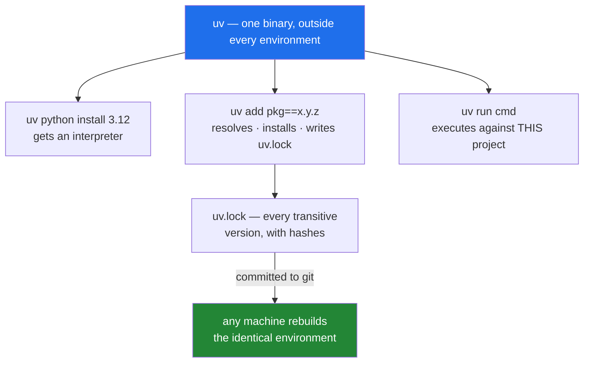

# 1.3 — `uv`, the one binary that owns the environment

## One-line answer

`uv` is a single program that does four jobs that used to need four tools — install a Python,
create the environment, resolve and lock the dependencies, and run your code inside it — which
makes it the "one owner" that [1.1](1.1-why-one-tool-owns-the-environment.md) said the
environment needs.

---

## The story

You want to hang a shelf. You go to the cupboard for the toolbox.

There is no toolbox. There is a drill in one room, the drill bits in a drawer somewhere else,
the spirit level behind the sofa, the screws in a jar in the kitchen, and the wall plugs are
in a bag that you are fairly sure came with the drill but might have gone out with the
recycling.

You spend more effort gathering than drilling. Worse, on the third shelf you realise the bit
you used the first time is not the one you used the second time, so the holes are different
sizes and one shelf wobbles. Nothing was faulty. Everything was somewhere.

Each of those things ended up in its own place for a sensible reason at the time. The drill
lives near the last job. The screws went in the kitchen jar because the jar was empty. No
single decision was wrong, and the result is still a cupboard you dread opening.

A toolbox is not a better drill. It is the decision that these things live together, so
"where is the level?" stops being a question.

---

## The idea in plain language

Start from zero. A **package** is reusable code somebody else wrote and published. A
**package manager** fetches packages and puts them where your interpreter can find them —
the `site-packages` folder from [1.1](1.1-why-one-tool-owns-the-environment.md).

That job is harder than "download a file", because packages depend on other packages, and
those have their own version requirements. Finding one set of versions that satisfies every
requirement **at the same time** is called **dependency resolution**, and it is a genuine
search problem with a real possibility of no solution.

Here are the four jobs, plainly, and who used to do each:

| The job | In plain words | Old tool | Now |
| --- | --- | --- | --- |
| Get a Python | put a specific interpreter version on this machine | `pyenv`, installers | `uv python install` |
| Make an environment | create the private folder holding this project's packages | `venv` | `uv` (automatic) |
| Resolve and install | pick versions satisfying every constraint, fetch, **record** | `pip` + `pip-tools` | `uv add` |
| Run code in it | execute against **this** project's interpreter | `activate`, then `python` | `uv run` |

Two properties make `uv` different in kind rather than in degree, and both matter here.

**It is a standalone binary.** `uv` is written in Rust and is not installed by `pip`. It is
one compiled file that depends on nothing. So it can install a Python for you without needing
a Python to run first — the chicken-and-egg problem simply does not exist.

**It writes a lockfile by default.** Every `uv add` updates `uv.lock`, which records the
exact resolved version of *every* package in the tree — including the ones you never named —
along with cryptographic hashes of the files. That file is committed, and from it any machine
rebuilds the same environment. This is P6 (*never invent a version*) made mechanical instead
of aspirational, and you open the file in
[2.4](../02-skeleton/2.4-pyproject-and-the-lockfile.md).

One idea to retire early. In the old workflow you would **activate** an environment: a
command that edits `PATH` in your current shell so `python` means this project's Python. It
works, and it is stateful and invisible — a forgotten activation is one more way to run the
wrong interpreter, which is exactly the failure [1.1](1.1-why-one-tool-owns-the-environment.md)
described. `uv run <command>` does the same job per command, with no mode to be in and no
mode to forget. [2.5](../02-skeleton/2.5-the-venv-you-never-activate.md) is entirely about
that shift.

---

## Why Jāla needs it

- **P6 says never invent a version, and every pin gets a dated row in `docs/PACKAGES.md`.**
  `uv` produces the lockfile as a side effect of ordinary use, so there is no separate step to
  forget and no way for the file to drift from reality.
- **P3 says build first, compare after.** Day 18 compares your hand-built Ethernet frame
  against `scapy`; Day 88 compares your resolver against `dnspython`. Those comparisons are
  only evidence if the library version is pinned and recorded — otherwise you are diffing
  against a moving target and calling it a result.
- **Packages arrive on the day they are first used, never up front.** `uv add` is a
  single action that installs, pins and locks, which is what makes that rule cheap enough to
  actually follow on day 34 rather than abandoning it.
- **The tests must run offline and unprivileged** (plan §5). An environment rebuilt from a
  lockfile is reproducible without a network round trip to a resolver that might answer
  differently today.

---

## The mechanism

On macOS, Linux, or Git Bash on Windows:

```bash
curl -LsSf https://astral.sh/uv/install.sh | sh
```

**Line by line:**

- `curl` — fetches a URL. It comes with Git Bash.
- `-L` — **follow redirects.** Download URLs normally redirect to a content network; without
  this you save the redirect page instead of the file.
- `-s` — **silent**: no progress meter. Wanted because the output is being piped, and a
  progress bar inside a pipe is noise.
- `-S` — **show errors anyway.** `-s` alone silences genuine failures too; `-sS` together
  mean "quiet on success, loud on failure", which is what you want in anything scripted.
- `-f` — **fail on an HTTP error.** Without it, a 404 makes `curl` exit *successfully* having
  downloaded an error page — which the next stage would then execute as a shell script. This
  flag is the difference between a failed download and running a web server's error page as
  code.
- `| sh` — pipe the downloaded text into a shell and run it. **Piping the internet into a
  shell deserves suspicion as a general habit**, which is why the URL is written out in full
  rather than shortened: `astral.sh` is the official installer domain for `uv`. If you would
  rather read before running — a good instinct — drop the pipe, save the file, open it, then
  run it.

Now **close Git Bash and open it again**, then:

```bash
uv --version
```

**Line by line:**

- Reopening the shell is not optional, and it is fact 2 from
  [1.1](1.1-why-one-tool-owns-the-environment.md): the installer appended `uv`'s folder to
  `PATH`, and **a shell reads `PATH` once, when it starts.** Your open window is holding the
  old list. This is the single most common "the installer lied to me" moment and it is not the
  installer's fault.
- `uv --version` — proves the binary exists and is reachable, in one harmless command.

Look at what you installed, and at where it is *not*:

```bash
which uv && uv --help | head -20
```

**Line by line:**

- `which uv` — the full path of the binary that will run. **Note there is no `site-packages`
  anywhere in it.** `uv` lives outside every Python environment, which is precisely why it is
  able to manage all of them — a manager that lived inside one of the things it manages could
  not install the first one.
- `&&` — run the right-hand command **only if the left one succeeded**. Every program returns
  a number when it exits and zero means success by convention. You will use `&&` all year to
  stop a sequence at its first failure; `./m` depends on the same idea in
  [3.1](../03-the-driver/3.1-set-euo-pipefail.md).
- `uv --help | head -20` — the command list, truncated to the first 20 lines. Reading it once
  now is worth more than looking each command up later; you will recognise `add`, `run`,
  `sync`, `lock` and `python`.



---

## When it breaks

**Immediately after installing:**

```text
$ uv --version
bash: uv: command not found
```

**What it means.** Almost always the un-reopened shell. Close the window, open a new Git
Bash, try again. If it still fails, the installer's `PATH` edit did not land in the file this
shell reads at startup:

```text
$ ls ~/.local/bin/uv
$ echo "$PATH" | tr ':' '\n' | grep -n "local/bin"
```

If the binary is there but the folder is not in `PATH`, call it by full path once
(`~/.local/bin/uv --version`) to confirm it works, then fix your shell profile — the
installer prints which file it modified.

**Behind a corporate proxy or a filtered network:**

```text
$ curl -LsSf https://astral.sh/uv/install.sh | sh
curl: (35) schannel: failed to receive handshake, SSL/TLS connection failed
```

**What it means.** The TLS handshake was intercepted or blocked — typically a proxy
presenting its own certificate, which `curl` correctly refuses to trust silently. **The wrong
fix is disabling verification with `-k`**; that converts a *detected* interception into an
undetected one, and you will meet the full version of this argument on Day 107 when you
verify a certificate chain by hand. The right fix is to install your organisation's root
certificate, or download the release archive from the project's releases page through the
browser your organisation has already configured. `uv` is a single file, so "download it
manually" is a complete solution rather than a workaround.

**And the one that is not `uv`'s fault at all:**

```text
$ uv add scapy==2.4.0
  × No solution found when resolving dependencies:
  ╰─▶ Because scapy==2.4.0 has no wheels with a matching Python ABI tag and
      your project depends on scapy==2.4.0, we can conclude that your
      project's requirements are unsatisfiable.
```

**What it means.** The version exists, but not for your Python version, operating system or
CPU architecture. A **wheel** is a pre-built package file, built for specific combinations —
`cp312` for CPython 3.12, `win_amd64` for 64-bit Windows, and so on. The fix is a compatible
version, not a compatible belief: resolve a range once, read what it actually chose, then pin
*that* exactly and write the row in `docs/PACKAGES.md`. This is also the first hint of why
[1.4](1.4-python-3-12-and-not-the-newest.md) picks its Python version deliberately instead of
taking the newest.

---

## In production

**Resolver speed changes behaviour, not just comfort.** A dependency resolve that is slow is
one that gets skipped. Teams start caching aggressively, reusing stale environments, and
adding "don't check dependencies" flags to make it quick — each of which quietly breaks
reproducibility. When a fresh, fully-resolved environment is cheap, the correct habit becomes
the convenient one. Tooling that is fast enough changes what people actually do, and that is
worth more than the elapsed time it saves.

**A single static binary is a deployment property.** In a container image, `pip` needs a
Python interpreter to exist before it can install anything, so the base image, its system
Python and its `pip` all become inputs to your build. `uv` is one file you can copy in — the
official images ship the binary precisely so a multi-stage build can resolve dependencies in
a builder stage and copy only the finished environment into a slim runtime image. Fewer
inputs means fewer things that can silently differ between your laptop and production.

**The lockfile is a security artifact, not a convenience.** `uv.lock` records hashes, so an
install verifies that the file it downloaded is byte-identical to the one that was resolved.
That defends against a compromised mirror or a package re-uploaded under the same version.
It is also the input to vulnerability scanning: when a advisory lands against a transitive
dependency three levels down, "are we affected, and where?" is answered by reading lockfiles.
A project without one cannot answer it, and during an incident that is the difference between
an hour and a week.

**The professional's version of `uv run`.** In CI and in containers the two commands that
matter are `uv sync --locked` — build the environment from the lockfile exactly, and **fail**
if the lockfile disagrees with `pyproject.toml` rather than silently updating it — and
`uv run --no-sync <cmd>`. `--locked` is the important one: it turns "somebody edited
dependencies and forgot to commit the lock" from a mystery into a build failure with a clear
message. Do not confuse it with `--frozen`, which *skips* the up-to-date check rather than
enforcing it. That is the general shape of good production tooling: **make the wrong state
loud and early.**

**The review comment.** On a pull request that changes `pyproject.toml` but not `uv.lock`:
*"Lockfile not updated — CI will resolve differently from your laptop. Run the add through
the tool and commit both files."*

**The interview question.** *"What is the difference between `pyproject.toml` and a lockfile,
and why commit both?"* The answer they are listening for: the project file states your
**intent** — your direct dependencies and the ranges you will accept — and the lockfile
records the **resolution**, every transitive package at an exact version with hashes. You
commit both because a human edits the intent and a machine must reproduce the resolution, and
because without the second, "it worked yesterday" is not something you can prove or restore.

---

## Check yourself

```bash
uv --version && which uv && uv python list 2>/dev/null | wc -l
```

The last number is **how many Python interpreters `uv` can currently see**. It may well be
zero right now, which is fine — [1.4](1.4-python-3-12-and-not-the-newest.md) is what fills
it, and watching the number change is the point.

**Answer out loud, without scrolling up:**

> Name the four jobs `uv` performs and the older tool that used to do each. Then explain why
> `uv` being a standalone binary — rather than a Python package installed with `pip` — is not
> a detail but the thing that makes the *first* of those four jobs possible at all.

---

**Next:** [1.4 — Python 3.12, and why not the newest one](1.4-python-3-12-and-not-the-newest.md)
