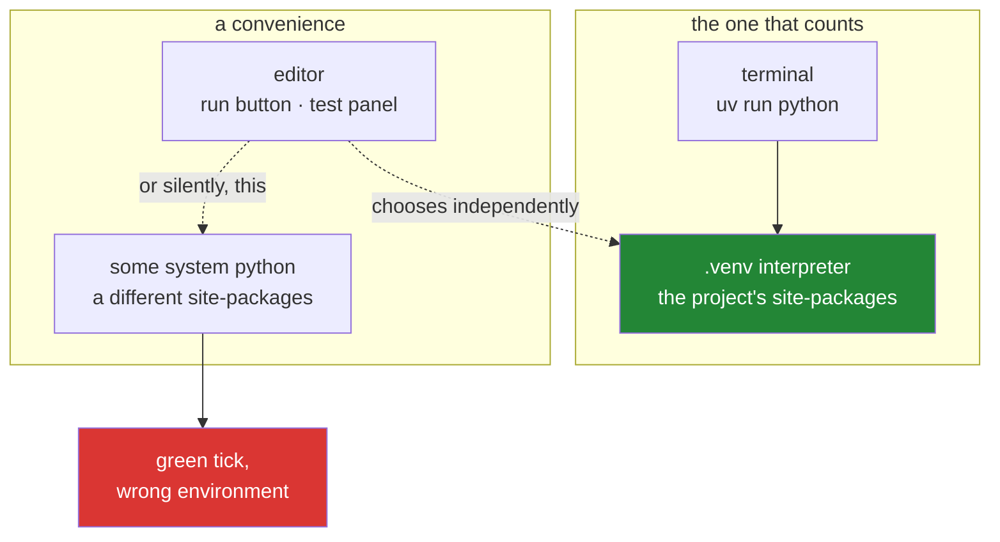

# 1.5 — The editor, and the interpreter trap inside it

## One-line answer

Your editor picks its own Python and can disagree with your terminal about which one is
running — so you tell it, in a committed settings file, to use this project's interpreter,
and when they still disagree you believe the terminal.

---

## The story

Two clocks in one house.

The kitchen clock says twenty past. The clock in the hall says quarter past. You have lived
here long enough that you stopped noticing, because you always check the same one, and being
five minutes out has never mattered.

Then one morning you check the hall clock, leave the house, and miss a bus.

Here is the part worth sitting with: for months, **the disagreement caused no symptom at
all.** Every day you were five minutes wrong about something and nothing happened. The clocks
did not break on the morning of the bus. They had been disagreeing the whole time, silently,
and the bus was simply the first thing that cared.

You cannot fix that by looking harder at a clock. Both clocks look completely convincing —
they show a time, confidently, with no hint that anything is off. The only fix is to decide
**which clock is the one that counts**, and set the other from it.

---

## The idea in plain language

An editor that understands Python has to choose an interpreter. It needs one to tell you
whether a name is undefined, to offer completions, to run a file when you press the run
button, and to run your tests through its test panel.

It does not have your terminal's `PATH` and it does not ask you. It picks — from a workspace
setting, from a remembered choice, from something it detected, or from whatever it found
first. **The editor's choice and your terminal's choice are made by different mechanisms and
can differ**, which puts you back in [1.1](1.1-why-one-tool-owns-the-environment.md) with a
graphical interface in front of it.

What makes it worse than the terminal version is the confidence of the output. A red squiggle
under an import says "this package is not installed" in the same way whether the package is
genuinely missing or whether the editor is simply looking at the wrong interpreter. A green
tick in the test panel says "passing" whether it ran your project's code or a different
environment's copy of it.

So there are two rules, and the second is the one that saves an evening.

**First: tell the editor, in writing, which interpreter to use.** Not by clicking a menu —
by a settings file committed to the repository, so the answer survives reinstalling the
editor and is the same for anybody who clones the project.

**Second: when the editor and the terminal disagree, the terminal is right.** Not because
terminals are virtuous, but because the terminal is what `./m check` runs in, and `./m check`
is the gate ([3.3](../03-the-driver/3.3-the-done-gate.md)). The editor is a convenience. The
gate is the definition of done, so the gate's environment is the one that counts.

---

## Why Jāla needs it

- **P11 — every day ends with a check that can go RED.** A check is only worth something if
  its result is trustworthy. A green test panel produced by the wrong interpreter is worse
  than no test: it is a false negative wearing a tick.
- **This curriculum is full of the same failure at protocol scale.** Plan §6 lists five
  silent failures, and #1 is *the cache answered, not the network* — the request succeeded,
  the page loaded, and the thing you believe you proved is not what happened. Two clocks is
  that shape, in your editor, before a single packet exists. Meeting it here makes it
  recognisable on Day 84.
- **Days 8 and 18 read bytes and compare them.** "The import works" and "the import works in
  the environment my test runs in" must be the same statement, or a byte-offset comparison is
  measuring the wrong install.

---

## The mechanism

Install the two extensions this project assumes. From Git Bash:

```bash
code --install-extension ms-python.python
code --install-extension charliermarsh.ruff
```

**Line by line:**

- `code` — the editor's command-line interface. If this is not found, the editor was
  installed without adding it to `PATH`; open the command palette and run "Shell Command:
  Install 'code' command in PATH", then reopen the terminal — the same `PATH`-is-read-once
  fact from [1.1](1.1-why-one-tool-owns-the-environment.md).
- `ms-python.python` — language support: completions, the test panel, the run button. It is
  the thing that has to choose an interpreter.
- `charliermarsh.ruff` — the linter and formatter this project uses, so the editor and
  `./m check` are running the *same* checker rather than two that mostly agree. Two linters
  is two clocks again.

Now the settings file. It is committed, which is the entire point:

```bash
mkdir -p .vscode
```

**Line by line:**

- `mkdir -p` — create the folder, and **do not error if it already exists**. `-p` also
  creates missing parents. It is what makes a setup script safe to run twice, which is the
  same idempotence idea that `./m lab up` will need on Day 9.

`.vscode/settings.json` holds four things that matter:

```text
{
  "python.defaultInterpreterPath": "${workspaceFolder}/.venv/Scripts/python.exe",
  "python.terminal.activateEnvironment": false,
  "python.testing.pytestEnabled": true,
  "files.eol": "\n"
}
```

Taking those one at a time, because each prevents a specific failure:

- `python.defaultInterpreterPath` — points the editor at **this project's** interpreter,
  inside `.venv`. `${workspaceFolder}` is expanded by the editor, so the file works on any
  machine and contains no personal paths. On macOS or Linux the path ends `.venv/bin/python`
  rather than `.venv/Scripts/python.exe`; that difference is Windows putting executables in
  `Scripts`.
- `python.terminal.activateEnvironment: false` — stop the editor from auto-activating the
  environment in every terminal it opens. This project never activates
  ([2.5](../02-skeleton/2.5-the-venv-you-never-activate.md)); every command goes through
  `uv run`. An editor that helpfully activates in the background reintroduces exactly the
  invisible state that decision removed.
- `python.testing.pytestEnabled: true` — the test panel uses pytest, matching `./m check`.
- `files.eol: "\n"` — new files get Unix line endings. Paired with `core.autocrlf input`
  from [1.2](1.2-git-and-the-shell.md), this is belt and braces on the failure that breaks
  `./m`.

**Now prove the two clocks agree**, which is the actual deliverable of this part:

```bash
uv run python -c "import sys; print(sys.executable)"
```

**Line by line:**

- This prints the terminal's answer — the one that counts. Then open any Python file in the
  editor and read the interpreter shown in its status bar. **The two strings must be
  identical.** Not similar; identical. If they differ, the editor is a clock set to a
  different time and everything it tells you about imports is suspect.



---

## When it breaks

**The loud version, and the easy one:**

```text
Import "pytest" could not be resolved from source  Pylance(reportMissingModuleSource)
```

A red squiggle under an import that works perfectly well when you run it. **What it means:**
the editor's interpreter has no pytest. Yours does. Nothing is wrong with your project — the
editor is reading a different `site-packages`. Point it at `.venv` and the squiggle goes.

**The dangerous version, and the reason this part exists.** You press the editor's run button
on a test file:

```text
============================= test session starts ==============================
platform win32 -- Python 3.11.4, pytest-8.0.0, pluggy-1.4.0
collected 3 items

tests/test_setup.py ...                                                  [100%]

============================== 3 passed in 0.04s ===============================
```

Three passed. Green. **And it is a false negative** — look at the header: `Python 3.11.4` and
`pytest-8.0.0`, when this project pins 3.12 and `pytest==9.1.1`
([1.4](1.4-python-3-12-and-not-the-newest.md), and the row in `docs/PACKAGES.md`). The tests
ran, and they ran somewhere else.

**The check that catches it** is the header line, every time, and it is worth building the
habit now while the stakes are three trivial tests: **read the platform line of a test run
before you believe the result.** That is the same habit as reading `ss -i` for a real
congestion window instead of quoting a remembered default (P8) — trust the output that names
its own conditions, not the summary.

**And the confusing one:**

```text
$ code --install-extension ms-python.python
bash: code: command not found
```

The editor is installed; its command-line helper is not on `PATH`. Install it from the
command palette and **reopen the terminal**. Third time this fact has caused a problem in
this section, which is the point of stating it three times.

---

## In production

**This is the same class of bug as a stale cache, and it never stops being relevant.** A
production reading taken from the wrong source — the wrong region's dashboard, a metric
aggregated over the wrong window, a health check hitting a load balancer instead of the
service — is a green tick from the wrong environment. Plan §6's first silent failure is
exactly this shape: *the cache answered, not the network*. The discipline that generalises is
one sentence: **make the tool tell you what it did, and read that, rather than reading
whether it succeeded.**

**Editor configuration belongs in the repository.** A project where every developer clicks
their own interpreter has a class of bug that only reproduces for one person and cannot be
diagnosed remotely. Committing `.vscode/settings.json` moves that from folklore into
reviewable code — and the same argument scales to editorconfig files, formatter versions and
linter rules. If a setting can make two machines disagree, it is code, not preference.

**The formatter's version is part of the contract.** If a developer's editor formats with a
different `ruff` build than CI checks with, every save produces a diff that CI rejects, and
the team's response is to disable format-on-save — losing the tool. This is why the version
is pinned exactly in `pyproject.toml` and recorded in `docs/PACKAGES.md`, not installed
globally into the editor.

**What an operator does differently.** They distrust any interface that reports success
without naming its conditions. The professional reflex during an incident is to ask "which
host, which version, which environment produced this line?" before acting on it — and if the
output cannot answer, they go and get output that can.

**The review comment.** On a pull request adding a `.vscode/settings.json` with an absolute
path like `C:/Users/someone/...`: *"This won't work on anyone else's machine. Use
`${workspaceFolder}` so the setting is about the project rather than about your laptop."*

**The interview question.** *"Your tests pass locally and fail in CI. Where do you start?"*
The answer they are listening for is not a guess about the code — it is a comparison of
environments: interpreter version, resolved dependency versions, working directory,
environment variables. The candidate who says *"first I'd get both to print their platform
line and diff them"* has already told you they have debugged this before.

---

## Check yourself

```bash
uv run python -c "import sys,platform; print(platform.python_version(), sys.executable)"
```

That is the terminal's answer. Now read the interpreter in your editor's status bar and
compare the two strings **character by character**. The number this prints is the version
that counts; the comparison is the check.

**Answer out loud, without scrolling up:**

> Explain why a green test run can be a false negative, and name the exact line of pytest's
> output that reveals it. Then say which of the two clocks — editor or terminal — this project
> treats as authoritative, and give the reason in terms of `./m check` rather than in terms of
> preference.

---

**Next:** [2.1 — The folder skeleton, and what each folder claims](../02-skeleton/2.1-the-folder-skeleton.md)
