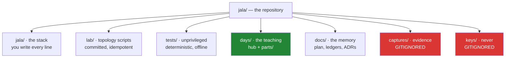

# 2.1 — The folder skeleton, and what each folder claims

## One-line answer

Every folder in this repository makes a **claim about the files inside it** — this must
survive, this proves it, this rebuilds a network, this is teaching, this is history — so
where a file lives is an assertion you can be wrong about, and therefore one a reviewer can
check.

---

## The story

Somebody hands you a set of keys before going away for a month, and says: "the spare, the
shed, the bike lock, the meter cupboard, and one I think is for my old flat."

Five keys on one ring. No labels.

You will find the right key each time by trying them, and that is genuinely fine for a
month. It costs you a few seconds at each door and you stop noticing.

The trouble starts when you need the meter cupboard **in a hurry**, in the dark, because
water is coming through a ceiling. Now the few seconds are the whole problem, and worse — you
have no way to know that the fifth key is useless. It looks exactly like the other four. You
will keep trying it forever, once a month, because nothing about it says "this opens nothing
any more".

Labels would not make the keys work better. They would make **the set honest about itself**:
which key does what, and which one is dead weight you should have thrown away.

---

## The idea in plain language

A folder layout is a set of labels. Each one says what the files inside it are *for*, and —
just as usefully — what they are not.

Two ideas make it more than tidiness.

**A location is a claim, and a claim can be wrong.** If `tests/` means "runs unprivileged,
offline, deterministically", then a test in there that quietly needs root is not untidy, it
is **false**. That is a bug you can find by reading the path, before you run anything. A
folder with no meaning cannot be wrong about anything, which sounds relaxing and means it
tells you nothing.

**Some folders are promises about the future.** `captures/` and `keys/` will hold things that
must never be committed. Creating them, and ignoring them, on Day 0 — before either has ever
existed — is the difference between a rule and a hope
([2.2](2.2-gitignore-before-secrets-exist.md)).

Here is the skeleton, and what each folder claims:

| Folder | The claim | What being wrong looks like |
| --- | --- | --- |
| `jala/` | The stack. **You** write every line, from the day documents. | Code appearing here that no day taught. |
| `lab/` | Topology scripts: committed, idempotent, one per topology. | A topology you built by typing commands and cannot rebuild. |
| `scripts/` | Repo tooling — the checks, not the subject. | Curriculum code hiding in a helper. |
| `tests/` | Unprivileged, deterministic, offline. Mirrors `jala/`. | A test that needs root, a network, or `time.sleep`. |
| `days/` | The teaching. One folder per day, hub plus `parts/`. | A day with no `parts/` — which is a day that is not written. |
| `docs/` | The plan, the ledgers, the decisions. The repo's memory. | A number quoted anywhere with no row backing it. |
| `captures/` | Regenerated evidence. **Gitignored, always.** | A `.pcap` in `git status`. |

Two of those deserve a sentence each now, because they are choices rather than conventions.

**`jala/` is empty on purpose, and stays empty for a while.** Nothing under it is
pre-written. Every line arrives because a day document told you to write it. You cannot debug
a TCP state machine on Day 100 that you never typed on Day 61 — and a repository that ships
the answer removes the only part that teaches.

**`tests/` carries a hard constraint that shapes the whole curriculum.** Tests run on a
laptop with no root and no network. A test that genuinely needs a namespace or a raw socket
is marked and excluded from the default gate, and its *logic* is exercised unprivileged by
feeding recorded bytes through the codec directly. This is why the header parsers you build
are separable from the sockets that carry them — the constraint is doing design work for you,
which you will feel from Day 17 onward.

---

## Why Jāla needs it

- **P9 — topologies, configs and scripts are committed; captures and keys never are.** That
  rule needs `lab/` and `captures/` to be different places with different rules, from the
  first commit rather than from the first mistake.
- **Plan §24.2 — every folder name carries its subject.** `days/day-037-pmtu-black-hole/`
  rather than `days/day-37/`. `ls` becomes a table of contents, and `./m depth` rejects the
  unlabelled form.
- **Plan §5 — tests are unprivileged, deterministic and offline.** The folder is where that
  promise lives, and `./m check` runs `-m "not root"` to keep it.
- **`docs/` is the memory.** `OPS-01` — Day 1's whole subject — is *the repo as the network's
  memory*. The ledgers it describes need somewhere to be before Day 1 can fill them.

---

## The mechanism

One command, from the project folder:

```bash
mkdir -p jala/{wire,stack,route,resolve,app,crypt,probe} lab scripts tests days docs/adr .vscode
```

**Line by line:**

- `mkdir -p` — create these folders, creating missing parents, and **do not error if one
  already exists**. That last property is what makes the command safe to run twice, which is
  the same idempotence you will need from every `lab/<name>.sh` on Day 9.
- `jala/{wire,stack,...}` — **brace expansion**, a bash feature. The shell expands this into
  seven separate arguments before `mkdir` ever sees it, so this is one command rather than
  seven. It is bash-only — in PowerShell it does nothing useful, which is
  [1.2](../01-toolchain/1.2-git-and-the-shell.md)'s point.
- `docs/adr` — architecture decision records. `-p` creates `docs/` on the way, so it does not
  need naming separately.
- The seven names under `jala/` are the seven layers of the artifact: framing and checksums
  (`wire`), the protocols over TUN/TAP (`stack`), the routing tables and speakers (`route`),
  DNS (`resolve`), HTTP (`app`), TLS and tunnels (`crypt`), and the measurement tools
  (`probe`).

Read back what you built, rather than assuming it:

```bash
find . -type d -not -path './.git/*' -not -path './.venv/*' | sort
```

**Line by line:**

- `find .` — walk this directory tree. Unlike `ls`, it descends, so you see the shape rather
  than the top level.
- `-type d` — directories only. You have not created files yet and this is a question about
  structure.
- `-not -path './.git/*'` — exclude Git's internals, which are hundreds of folders you did
  not create and do not want in the answer. The second exclusion does the same for the
  virtual environment.
- `| sort` — alphabetical, so two runs are comparable. Unsorted output from a filesystem walk
  has no guaranteed order, and comparing two unordered lists is how a real difference gets
  missed.



Notice that `captures/` and `keys/` are drawn in the tree even though nothing will ever be
committed from them. **The folder is committed; the contents never are.** That is not a
contradiction — it is how you make the rule visible to the next person, and it is exactly
what [2.2](2.2-gitignore-before-secrets-exist.md) is about.

---

## When it breaks

**The one that looks like a filesystem problem and is a shell problem:**

```text
$ mkdir -p jala/{wire,stack,route}
$ ls jala/
{wire,stack,route}
```

**What it means.** You got a single folder with a literal brace name. Brace expansion is a
**bash** feature, and this ran in a shell without it — `sh`, `dash`, or a PowerShell session
pretending to cooperate. The command did not fail; it did something else and reported
success. Delete the folder (`rm -rf 'jala/{wire,stack,route}'`) and rerun in Git Bash.

**The one that wastes an afternoon.** You create the folders, write a module, and the import
fails:

```text
$ uv run python -c "from jala.wire import checksum"
Traceback (most recent call last):
  File "<string>", line 1, in <module>
ModuleNotFoundError: No module named 'jala.wire'
```

**What it means.** A directory is not a package until Python can treat it as one. On modern
Python a plain directory can work as a namespace package, but the moment two of them share a
name — or the working directory is not what you assumed — resolution stops being obvious.
The fix that removes the ambiguity is an `__init__.py`, added on the day a module first
lands there. **The folder existing is not the same as the folder being importable**, and this
error is the difference.

**And the silent one, which is the reason the table above exists.** A test lands in `tests/`
that needs a namespace. It passes on your machine, where you happened to run as root once:

```text
$ uv run python -m pytest -q -m "not root"
1 passed in 0.31s
```

Green — and meaningless. The test is in a folder claiming "unprivileged, offline,
deterministic" and it is none of those. Nothing detects this except the claim itself being
taken seriously: the marker exists so the test can say what it is, and a test that lies about
where it belongs is Silent Failure #4's cousin — a result that is really a statement about
your machine rather than about the code.

---

## In production

**Layout is the cheapest architecture decision you will make, and the most quietly
expensive to change later.** Moving a folder after two hundred files import from it is a
mechanical change with a long tail of broken paths in scripts, CI configuration and
documentation. Deciding what each folder *means* on day zero costs one conversation.

**The `src/`-versus-flat question, and why this project is flat.** Many Python projects put
their package under `src/` so tests import the *installed* package rather than the directory
sitting next to them — which catches packaging mistakes, because what you test is what ships.
That is the right call for a library you distribute. This repository is not distributed: it
is a workspace where you build a network stack by hand, `jala/` is never installed anywhere,
and there is no wheel to get wrong. Adding `src/` here would buy a guarantee against a
failure this project cannot have, at the cost of one more folder between you and the code you
are writing. **The reason for the convention matters more than the convention**, which is
worth knowing precisely so that you can tell when it does apply.

**Directory conventions are how large codebases stay navigable to people who did not write
them.** A new engineer who knows that `tests/` mirrors the package can find the test for a
function without searching. One who does not have that guarantee greps — and grep finds
everything named plausibly, including the dead code nobody deleted. This scales into
`OPS-12`: the runbook and the design document are useful precisely because somebody can
predict where things are.

**Empty folders and what they signal.** Git does not track empty directories, so a folder
that exists only as a promise needs something in it — conventionally a `.gitkeep`, or in this
project a `.gitignore` rule that names it. The professional habit is that **a folder in the
repository is a commitment**: if nothing will ever go there, delete it, because a stale
folder is the fifth key on the ring.

**The review comment.** On a pull request adding a utility to `scripts/`:
*"`scripts/` is repo tooling — this is stack code that a day teaches. It belongs in `jala/`
with a test, or it belongs in a day's `lab/` if it is scratch."*

**The interview question.** *"How do you decide where a new file goes?"* The shallow answer
describes a convention. The better answer describes a *claim*: name the property every file
in that folder must have, then check whether this file has it — and if it does not, either
the file is in the wrong place or the folder's meaning has drifted and needs restating.

---

## Check yourself

```bash
find . -maxdepth 2 -type d -not -path './.git*' -not -path './.venv*' | wc -l
```

That number is **how many folders your skeleton claims**, counting the root. Read the list
alongside the table above and, for each one, say the property every file inside it must have.
A folder you cannot finish that sentence for is a folder that is not carrying its weight.

**Answer out loud, without scrolling up:**

> Pick `tests/` and state the exact claim it makes. Then describe a file that would be
> *syntactically fine, passing, and still wrong* to put there — and say what makes it wrong,
> using the words "unprivileged" and "deterministic".

---

**Next:** [2.2 — `.gitignore`, written before anything secret exists](2.2-gitignore-before-secrets-exist.md)
