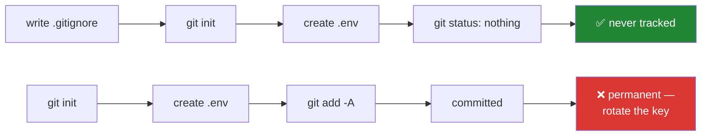

# 2.2 — `.gitignore`, written before anything secret exists

## One-line answer

A commit is permanent, so deleting a leaked key in a later commit does not remove it — which
is why the rules that keep keys and packet captures out of this repository are written on Day
0, before either has ever existed.

---

## The story

You write something on the last page of a notebook, then decide it should not be there and
scribble it out.

The words are still readable if anyone tilts the page. And even if you tear the page out
completely, the notebook has been photocopied twice and one copy is at a friend's house.
Removing it from *your* copy changes nothing about theirs. What you have actually done is
mark the exact page where the interesting thing was.

There is no version of this where scribbling helps. The only thing that would have worked was
not writing it on that page in the first place — and the only way to reliably do that is to
decide **before** you have anything worth hiding, while the decision is boring and costs
nothing.

---

## The idea in plain language

Git's history is **append-only**, and that is a feature, not a limitation. Every commit
points at its parent ([1.2](../01-toolchain/1.2-git-and-the-shell.md)), and every commit is
named by a hash of its contents. Change any historical commit and every commit after it gets
a different name — so history is not edited, it is replaced.

Two consequences, and they surprise people in exactly the wrong direction:

1. **Deleting a file in a new commit does not remove it from history.** The old commit still
   contains it, and `git show <old-hash>:path/to/file` prints it back. The file is not gone;
   it is one command away, forever.
2. **Once you have pushed, other clones have it too.** Even a full history rewrite on your
   side does not reach into somebody else's copy, or a fork, or a backup, or a build cache.

So the professional rule is not "be careful what you commit". It is:

> **A secret that has been committed is a secret that has been disclosed. Rotate it. Do not
> try to hide it.**

`.gitignore` is how you stop that happening. It is a list of patterns; a file matching one is
**untracked** — Git does not stage it, does not commit it, and does not mention it in
`git status`. Two properties matter:

- **It only protects files that are not already tracked.** Once a file is committed, adding
  it to `.gitignore` does nothing at all. This is the single most common misunderstanding,
  and it is why the ordering in this part is not stylistic.
- **`!` re-includes.** `.env` is ignored; `!.env.example` brings the example back, so the
  *shape* of the configuration is committed and the *values* are not.

This project has two categories to keep out, and the second is unusual:

**Keys and secrets** — `.env`, `*.pem`, `*.key`. Standard practice everywhere.

**Packet captures** — `*.pcap`, `*.pcapng`, `captures/`. This is the one that is specific to
networking, and it is a privacy question before it is a technical one. A capture is a
recording of real traffic. From your own lab it holds your own traffic; taken anywhere else,
it holds other people's. Plan §4.2 rule 4 is explicit: *a capture is evidence and is handled
as such.* It may contain credentials — an HTTP request carrying a session cookie, a DNS query
naming an internal host, an old protocol sending a password in plain text.

So P9 draws the line in an unusual place: **the repository holds what *reproduces* a capture,
never the capture.** The topology script, the filter, the capture point and the tool version
go in `docs/CAPTURES.md`; the bytes stay on your disk and get deleted. That is why
`./m cap` writes into an ignored folder and prints a reminder, and why `docs/CAPTURES.md` has
a column recording whether the capture was checked for credentials.

---

## Why Jāla needs it

- **P9 says captures and keys are never committed**, and `./m done N` refuses to commit if a
  `.pcap` or a `.pem` is staged. That refusal is a backstop; this file is the actual defence.
- **Day 107 builds a TLS client and Day 111 builds a tunnel.** Both generate private keys.
  Those days are far enough away that a rule written then would be written under time
  pressure, next to a working key — which is the worst moment to be designing a policy.
- **`SEC-22` is the credential-in-a-capture concept**, and Day 8 reads a capture *end to
  end*. The habit needs to exist before the first capture does.
- **The phase gate checks it every phase, not once** (§25 item 8):
  `git log --all --name-only | grep -E '\.(pcap|pcapng|pem|key)$'` must return nothing.
  Checked repeatedly, because the day it fails is the day it became permanent.

---

## The mechanism

**Write this file before `git init`.** The order is the lesson: a file that is never tracked
cannot need untracking.

```bash
cat > .gitignore <<'EOF'
# --- keys and secrets: never, under any circumstances (P9) ---
.env
.env.*
!.env.example
*.pem
*.key
keys/

# --- captures: the repo holds what REPRODUCES a capture, never the capture (P9) ---
captures/
*.pcap
*.pcapng

# --- environments and caches: a tool made them, a tool can remake them ---
.venv/
__pycache__/
*.py[cod]
.pytest_cache/
.ruff_cache/
EOF
```

**Line by line:**

- `cat > .gitignore <<'EOF'` — a **heredoc**: everything up to the closing `EOF` becomes the
  file's contents. The **quotes around `'EOF'` are load-bearing** — they stop the shell
  expanding `$` and backticks inside the block. Without them a line containing `$VAR` would
  be silently replaced by its value, which in a file of security rules is precisely the kind
  of surprise you do not want.
- `.env` then `.env.*` — the file and any variant (`.env.local`, `.env.production`). People
  reach for a suffix when they need a second one, and the second one is the one that leaks.
- `!.env.example` — **re-include** this one. Order matters: a `!` rule must come *after* the
  rule that excluded it. This is how the shape of the configuration stays reviewable while
  the values never land.
- `*.pem`, `*.key`, `keys/` — private key material by extension and by folder. Two
  overlapping rules on purpose: extensions catch a key saved in the wrong place, the folder
  catches a key saved with the wrong extension.
- `captures/`, `*.pcap`, `*.pcapng` — the networking-specific half, for the reasons above.
- `*.py[cod]` — a **character class**: matches `.pyc`, `.pyo` and `.pyd` in one line.
- `.venv/`, `__pycache__/`, `.pytest_cache/`, `.ruff_cache/` — a tool made them and a tool
  can remake them. Committing a virtual environment also commits compiled binaries built for
  one operating system, which is both large and wrong.

Now prove it works — **before** you have anything real to protect:

```bash
touch .env && git check-ignore -v .env
```

**Line by line:**

- `touch` — create an empty file. Safe here: it is empty, and it is about to be proven
  invisible.
- `git check-ignore -v` — ask Git **which rule** ignores this path. `-v` (verbose) prints the
  file, the line number and the pattern that matched. This is the difference between
  believing you are protected and reading the rule that protects you — and it is the same
  reflex as `type -a python` in [1.1](../01-toolchain/1.1-why-one-tool-owns-the-environment.md):
  ask the tool what it will actually do.

Expected output, naming the rule:

```text
.gitignore:2:.env	.env
```

**Line by line:**

- `.gitignore:2` — the file and line number of the matching rule.
- `:.env` — the pattern that matched.
- After the tab, the path being tested. Reading this as "line 2, pattern `.env`, matched
  `.env`" is the whole confirmation.



---

## When it breaks

**The one everybody hits, and the reason ordering matters.** You committed the file first,
then added the rule:

```text
$ git check-ignore -v .env
$ echo $?
1
```

**What it means.** No output and exit status 1 mean **no rule matched** — but the file is
right there in your `.gitignore`. The reason is the property stated above: `.gitignore`
governs *untracked* files only, and this one is already tracked, so the rule is skipped
entirely. The fix removes it from tracking while leaving it on disk:

```text
$ git rm --cached .env
rm '.env'
```

`--cached` is the important flag: it untracks without deleting. **And note what this does not
do** — if that file was ever committed, it is still in history. The next paragraph is the
part that matters.

**The one that is not a Git problem at all.** You find a key in an old commit:

```text
$ git log --all --name-only | grep -E '\.(pem|key)$'
keys/server.key
```

**What it says:** a private key exists in this repository's history.
**What it means:** that key is compromised and must be **rotated** — regenerated, and the old
one revoked. Not deleted from history and hoped about. Rewriting history is sometimes worth
doing to stop the file spreading further, but it is cleanup after a disclosure, not a
substitute for one. If the repository was ever pushed, cloned or forked, other copies exist
and you cannot reach them.

**And the silent one, which is this curriculum's own.** No error, no warning:

```text
$ git status --porcelain
?? captures/ping.pcap
```

Two question marks mean untracked, so `.gitignore` is working — good. But now imagine the
rule had a typo, `*.pcapng` only, and this file is `.pcap`. `git status` would show the same
two question marks in either case *until* somebody runs `git add -A`, at which point the
capture is staged and looks exactly like every other new file in the diff. **The wrong output
here is not an error message — it is a file appearing in a list where nobody is looking
carefully.** That is why `./m done N` greps the staged set for those extensions rather than
trusting the ignore file to be correct.

---

## In production

**Secret scanning is a control, not a courtesy.** Real projects run a scanner in CI and as a
pre-commit hook, because `.gitignore` only helps for files you anticipated. A key pasted into
a Python file, a token in a notebook output cell, a connection string in a test fixture —
none of those match a pattern. The professional posture is layered: ignore the obvious
things, scan for the rest, and treat any hit as a rotation event.

**"Rotate, do not hide" is the whole of incident response for this class of problem**, and
the instinct to quietly rewrite history is the thing that makes it worse. The clock starts
when the secret was *pushed*, not when it was noticed — public repositories are scraped
continuously by automated scanners, and credentials in a public commit are typically used
long before a human sees them. The right sequence is: revoke the credential, issue a new one,
*then* clean history, then work out how it got in.

**Captures deserve the same seriousness as credentials, and usually get less.** A `.pcap`
attached to a support ticket to "show the problem" routinely carries session cookies,
internal hostnames, and the full topology of a private network. Mature teams have a redaction
step and a retention limit for captures, and treat sharing one as a disclosure decision. This
is `SEC-22`, and it is the reason `docs/CAPTURES.md` has a credential-checked column rather
than a comment.

**What an operator does differently.** They assume anything that ever existed in a repository
is public, and design so that a leak is survivable: short-lived credentials, scoped
permissions, and a rotation procedure that has actually been rehearsed. "We are careful" is
not a control; a credential that expires without anyone acting is.

**The review comment.** On a pull request that adds a `.env` to `.gitignore` in the same
commit that removes it from tracking: *"This file is in the history from three weeks ago —
the ignore rule doesn't undo that. Rotate the key, then we can talk about cleaning history."*

**The interview question.** *"You notice an API key was committed last month. What do you
do, in order?"* The answer they want starts with **revoke and rotate**, not with
`git filter-repo`. A candidate whose first instinct is to rewrite history is optimising for
the appearance of the repository over the security of the system — and the follow-up question
is usually "and if it was pushed to a public fork?", which only has one honest answer.

---

## Check yourself

```bash
git check-ignore -v .env captures/x.pcap keys/server.key 2>/dev/null | wc -l
```

That number is **how many of those three paths are covered by a rule**. It must be **3**.
Anything less means a category you believe is protected is not, and you would rather find
that out now than on Day 107 with a real key in the folder.

**Answer out loud, without scrolling up:**

> Explain why adding a file to `.gitignore` after committing it does nothing, using the word
> "tracked". Then say what the correct first action is when you find a private key in last
> month's history — and why deleting it from history is not that action.

---

**Next:** [2.3 — `git init`, and what a repository actually is](2.3-git-init-and-what-a-repo-is.md)
