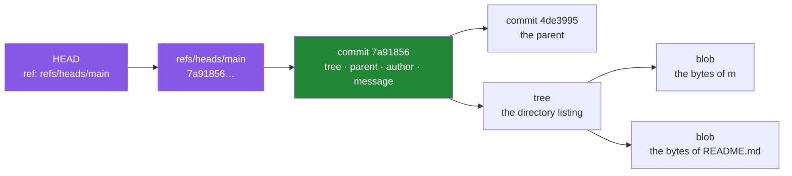

# 2.3 — `git init`, and what a repository actually is

## One-line answer

`git init` creates one hidden folder called `.git`, and everything mysterious about Git —
branches, history, the ability to go back — is ordinary files inside it that you can open and
read.

---

## The story

Somebody shows you a light switch on a wall and you press it and a lamp across the room comes
on. Fine. You use it every day and never think about it.

Then the lamp stops working, and now the switch is frightening. Is it the bulb? The switch?
Something in the wall? You have no model of what is between the switch and the lamp, so every
possible fault feels equally likely and equally beyond you. You end up pressing the switch
repeatedly, which is what people do when they have no model — repeat the action and hope.

The moment somebody opens the fitting and shows you that a switch is two bits of metal that
touch or do not touch, and a wire goes from there to the lamp, the fear goes. Not because you
have become an electrician. Because the space of possible faults just became small and
nameable: the metal, the wire, the bulb.

Git is the switch. Almost everyone learns the commands and never opens the fitting, and so
the first time something goes wrong they press the switch again. This part opens the fitting.

---

## The idea in plain language

`git init` does one thing: it creates a folder called `.git` in your project. That folder is
the repository. Your other files — the ones you edit — are the **working directory**, and Git
thinks of them as a scratch space it can rebuild from `.git` at any time.

Inside are four kinds of object, and they are all just content addressed by a hash:

- A **blob** is the contents of one file. Not its name, not its permissions — just the bytes.
- A **tree** is a directory listing: names, permissions, and the hash of the blob or tree each
  name points at.
- A **commit** points at one tree (the whole project at that moment), at its parent commit,
  and carries an author, a date and a message.
- A **tag** is a name pinned to a commit. You will not need one here.

Each is stored under the SHA-1 hash of its own content. That single design choice explains
several things at once:

- **Identical content is stored once.** Commit the same file in ten places and there is one
  blob, because the hash is the same.
- **A commit id is a claim about content.** Change one byte anywhere in the tree and every
  hash above it changes, up to the commit. You cannot alter history quietly; you can only
  create different history.
- **Nothing is a "diff".** Git stores whole snapshots and *computes* diffs when you ask for
  one. The mental model of "Git saves my changes" is backwards and causes real confusion
  later; Git saves states.

And then the part that demystifies branches completely:

> **A branch is a file containing a hash.**

`.git/refs/heads/main` is a text file whose entire contents are the 40 characters naming the
commit `main` currently points at. Committing writes a new hash into that file. Switching
branches reads a different file. That is why creating a branch is instant regardless of
project size — you are writing 41 bytes.

`HEAD` is one more small file saying which branch you are on. "Detached HEAD", which sounds
alarming, means `HEAD` contains a commit hash directly rather than the name of a branch. It
is a state, not damage.

---

## Why Jāla needs it

- **P2 — one day, one commit.** 152 commits are the spine of the progress ledger, and
  `docs/PROGRESS.md` records each hash. Knowing that a commit is an immutable snapshot is
  what makes that row meaningful rather than decorative.
- **P12 — reproduce the fault before you fix it.** On Day 63 you will have a TCP that used to
  work. Finding what changed means comparing two commits, and `git bisect` — binary search
  over history — only works if history is made of small, honest steps.
- **The phase gate reads history, not the working tree** (§25 item 8):
  `git log --all --name-only` searches every commit that ever existed for a capture or a key.
  That command only makes sense once you know history is append-only, which is
  [2.2](2.2-gitignore-before-secrets-exist.md)'s whole argument.
- **`./m done N` makes the commit** ([3.3](../03-the-driver/3.3-the-done-gate.md)), and it
  refuses first. A gate you do not understand is a gate you will eventually work around.

---

## The mechanism

With `.gitignore` already written — the ordering from
[2.2](2.2-gitignore-before-secrets-exist.md):

```bash
git init
```

**Line by line:**

- `git init` — create `.git/` here and set up an empty repository. It is **safe to run
  twice**: on an existing repository it reinitialises harmlessly rather than destroying
  anything. It touches nothing outside this folder and contacts no network.

Now open the fitting:

```bash
ls .git/
```

**Line by line:**

- `ls .git/` — list what was actually created. You should see `HEAD`, `config`, `objects/`,
  `refs/` and a few others. **This is the entire repository.** Copy this folder and you have
  copied the whole history; delete it and you have an ordinary directory of files with no
  memory.

Read the two files that make branching make sense:

```bash
cat .git/HEAD
```

**Line by line:**

- `cat .git/HEAD` — print it. You will see `ref: refs/heads/main`. **That is all `HEAD` is**:
  a one-line text file naming the branch you are on. Not a pointer in some database — a file
  with 23 characters in it.

After your first commit exists, the other half:

```bash
cat .git/refs/heads/main && git rev-parse HEAD
```

**Line by line:**

- `cat .git/refs/heads/main` — the branch file. Its contents are one 40-character hash and a
  newline. **This is the branch.**
- `&&` — only run the second command if the first succeeded.
- `git rev-parse HEAD` — ask Git to resolve `HEAD` to a commit hash. **The two outputs are
  identical**, which is the point of running them together: you have just watched Git's
  answer and the file on disk agree, so the abstraction is not hiding anything from you.

And look inside an object, so "content addressed by hash" stops being a phrase:

```bash
git cat-file -p HEAD
```

**Line by line:**

- `git cat-file -p` — **p**retty-print the object named by the argument. For a commit you get
  the tree hash, the parent hash (absent on the very first commit — it is the root), the
  author, the committer and the message. Five lines of plain text.
- Follow it further with `git cat-file -p HEAD^{tree}` to see the directory listing, then
  print a blob hash to see a file's contents. Three commands and you have walked from a
  commit to the bytes of a file, by hand.



Every box is a file in `.git/`. The two purple ones are the only mutable things in the
picture — they get overwritten as you work. Everything green and below is immutable and named
by its own hash.

---

## When it breaks

**Running a Git command outside a repository:**

```text
$ git status
fatal: not a git repository (or any of the parent directories): .git
```

**What it means.** Exactly what it says, and the parenthesis is the useful half: Git searched
this directory *and every parent*, and found no `.git`. That search behaviour is why a
command run from a subdirectory works fine — and also why running one from your home folder
can unexpectedly find a repository you forgot you made there.

**The `main` / `master` confusion:**

```text
$ cat .git/refs/heads/main
cat: .git/refs/heads/main: No such file or directory

$ git branch --show-current
master
```

**What it means.** `init.defaultBranch` was not set when this repository was created
([1.2](../01-toolchain/1.2-git-and-the-shell.md)), so the branch is called `master`. Setting
the config now does **not** rename an existing branch — it only affects repositories created
afterwards. Rename this one with `git branch -m main`, which literally renames the file in
`refs/heads/`.

**The empty-repository surprise:**

```text
$ git init && git log
Initialized empty Git repository in /c/Users/…/jala/.git/
fatal: your current branch 'main' does not have any commits yet
```

**What it means.** `main` is a *promise* rather than a thing: the file
`.git/refs/heads/main` does not exist yet, because there is no commit for it to point at. It
springs into existence with your first commit. This is a small thing and it is worth seeing,
because it is the clearest possible demonstration that a branch is a pointer and nothing more
— you cannot point at nothing, so until there is a commit there is no file.

**And the one that is genuinely alarming and genuinely harmless:**

```text
$ git checkout 7a91856
Note: switching to '7a91856'.

You are in 'detached HEAD' state. You can look around, make experimental
changes and commit them, and you can discard any commits you make in this
state without impacting any branches by switching back to a branch.
```

**What it means.** `HEAD` now contains a commit hash instead of `ref: refs/heads/main`. That
is the entire condition. Nothing is broken, nothing is lost, and `git switch main` puts it
back. People panic at this message because they have never opened `.git/HEAD` and seen that
it is a one-line file with two possible shapes.

---

## In production

**Understanding the object model is what separates using Git from being afraid of it.** The
commands that intimidate people — `rebase`, `cherry-pick`, `reset --hard`, `reflog` — are all
ordinary operations on the graph above. `reset` moves a branch file. `cherry-pick` builds a
new commit with the same diff and a different parent. `rebase` does that repeatedly. None of
them are magic, and none of them destroy commits: commits become *unreachable*, and
`git reflog` lists what `HEAD` recently pointed at so you can reach them again. **Almost
nothing in Git is unrecoverable within the garbage-collection window**, and knowing that
changes how boldly you can work.

**History is an operational asset during an incident.** `git log -S'<string>'` finds the
commit where a line appeared or vanished; `git blame` attributes a line to a commit and its
message; `git bisect` finds the commit that introduced a regression in a logarithmic number
of steps. All three degrade badly against a history of large, mixed commits — which is the
concrete, unsentimental argument for small ones. This is `OPS-09` arriving early: a postmortem
worth reading depends on a history worth searching.

**Repository hygiene is a real operational concern at scale.** Committed binaries and
captures never leave the object store, so a repository that once held a large `.pcap` carries
it forever, in every clone, for every developer, on every CI run. That is the practical cost
behind P9 and behind [2.2](2.2-gitignore-before-secrets-exist.md) — not only the privacy
question, but a clone time that grows and never shrinks.

**What an operator does differently.** They read `git log` before they read the code, because
the message explains intent and the diff only shows result. And during a rollback they
identify the last known-good commit by hash — not by "yesterday's build" — because a hash is
an exact claim about content and a date is not.

**The review comment.** On a pull request whose branch was force-pushed mid-review:
*"Please don't force-push while a review is open — my comments are anchored to commits that
no longer exist, and I can't see what changed since I last looked."*

**The interview question.** *"What is the difference between `git reset --soft`, `--mixed`
and `--hard`?"* The answer is only memorable if you have the three-area model from
[1.2](../01-toolchain/1.2-git-and-the-shell.md): `--soft` moves the branch pointer and leaves
the staging area and working directory alone; `--mixed` also resets the staging area;
`--hard` resets the working directory too, and that third one is the only version that can
lose uncommitted work. Someone who has read `.git/refs/heads/main` answers this by reasoning;
someone who has memorised it guesses under pressure.

---

## Check yourself

```bash
git count-objects -v | head -3 && cat .git/HEAD
```

`count-objects` prints **how many objects your repository holds** — zero right now, and the
number will climb by a handful with each commit. Then `HEAD` prints the one line naming your
branch. Two facts read straight off the disk, neither of them taken on trust.

**Answer out loud, without scrolling up:**

> Say what a branch physically is, including the path of the file and what is inside it. Then
> explain why creating a branch is instant on a project with a hundred thousand files — and
> why "detached HEAD" is a description rather than a warning.

---

**Next:** [2.4 — `pyproject.toml`, and the lockfile beside it](2.4-pyproject-and-the-lockfile.md)
