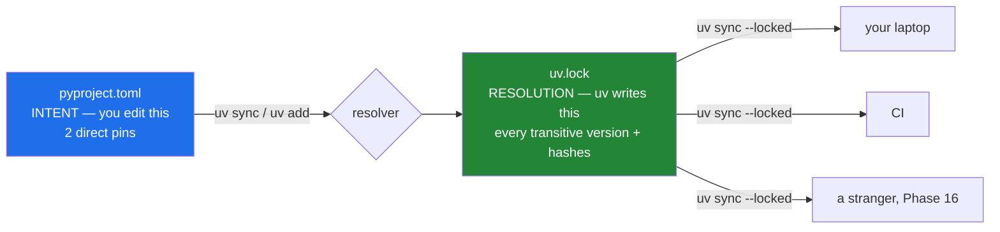

# 2.4 — `pyproject.toml`, and the lockfile beside it

## One-line answer

`pyproject.toml` records what you **meant** — your direct dependencies and the versions you
will accept — and `uv.lock` records what was **resolved** — every package in the tree, at an
exact version, with hashes — and you commit both because a human edits the first and a
machine must reproduce the second.

---

## The story

You send someone to the shop with a list that says "bread, cheese, something for pudding".

They come back with a sourdough loaf, a strong cheddar, and a lemon tart. Perfect. Next week
you send the same list and get sliced white, a mild cheese, and a box of ice lollies. Also a
correct reading of the list. Nothing has gone wrong; the list was never precise enough to
have a single answer, and you only noticed because this week's answer was not the one you had
in mind.

Now imagine you are cooking from the first week's shopping for eight people and it matters.
You do not want "bread". You want *that* loaf, from *that* shop. So you keep the receipt.

The list and the receipt are different documents doing different jobs, and you need both. The
list is what you edit when your plans change — it is short and it is about intent. The receipt
is what you hand somebody when you need this exact meal again — it is long, boring, and
exact. **A receipt is a terrible shopping list, and a shopping list is not evidence of what
you actually bought.**

---

## The idea in plain language

**`pyproject.toml` is the list.** It is the standard Python project file, in TOML — a plain
configuration format designed to be readable and unambiguous. You write it by hand (or `uv`
edits it for you), and it holds:

- what the project is called and which Python it requires,
- your **direct** dependencies — the ones you actually import,
- a separate group of development dependencies, which are needed to *work on* the project but
  not to *run* it,
- configuration for your tools, so `ruff` and `pytest` are configured in the same file rather
  than in four dotfiles.

**`uv.lock` is the receipt.** You never edit it. `uv` writes it, and it holds every package
that ended up installed — including the ones you never named, pulled in by the ones you did —
each at one exact version, with a cryptographic hash of the file that was downloaded.

The distinction that makes this click: **your direct dependencies are the tip of a tree.**
Ask for one package and you may get twenty. Those twenty are **transitive dependencies**, and
they are where reproducibility actually lives, because you never wrote their versions down
and they change without you doing anything.

Two more ideas that this project depends on.

**Exact pins.** This repository uses `==` everywhere, never `>=`. A range means two machines
resolving the same file on different days can install different versions — and P8 says a
number you cannot attribute is a rumour. A version you cannot attribute is the same problem
one level up: on Day 18 you compare your hand-built Ethernet frame against `scapy`, and
"which `scapy`?" must have exactly one answer.

**Dependency groups.** `ruff` and `pytest` go in the `dev` group. They are how you *work on*
the project; they are not part of the artifact. Keeping them separate means a deployment can
install what it needs and nothing else — smaller, and with less surface to worry about.

And the rule that makes this file grow slowly and honestly: **a package is added on the day it
is first used, never in advance, and — outside cryptography — only after the hand-rolled
version exists** (P3). So today the runtime dependency list is *empty*, and that is not an
oversight. It is Day 0 refusing to pre-install a future it has not reached.

---

## Why Jāla needs it

- **P6 — never invent a version, and every pin gets a dated row in `docs/PACKAGES.md`.**
  This file is where the pin lands; the ledger is where the *date it was looked up* lands.
  Both are needed: the pin is what the machine reads, the row is what a human audits.
- **P3 — build first, compare after.** Day 18 (`scapy`), Day 88 (`dnspython`), Day 107
  (`cryptography`). Each of those days adds exactly one pin, on the day it is first used, and
  the comparison is only evidence because the version is fixed.
- **Tests are offline and deterministic** (plan §5). An environment rebuilt from a lockfile
  does not consult a resolver, so it cannot resolve differently because of something that
  changed on an index overnight.
- **The lockfile is how a stranger reproduces your results.** Phase 16's gate is exactly
  that: someone clones the repository, rebuilds, and reproduces every headline number. A
  number produced by an environment nobody can rebuild is not reproducible.

---

## The mechanism

`uv` can scaffold the file, but writing it by hand once is worth more, because every line is
a decision:

```bash
cat > pyproject.toml <<'EOF'
[project]
name = "jala"
version = "0.1.0"
description = "152-day computer-networking curriculum, built from the wire up."
requires-python = "==3.12.*"
dependencies = []

[dependency-groups]
dev = [
    "ruff==0.16.6",
    "pytest==9.1.1",
]

[tool.ruff]
line-length = 100
target-version = "py312"
extend-exclude = ["days/*/lab"]

[tool.ruff.lint]
select = ["E", "F", "I", "UP", "B", "SIM"]

[tool.pytest.ini_options]
addopts = "-q --strict-markers"
testpaths = ["tests"]
markers = [
    "root: needs a namespace, a TUN device or a raw socket",
    "slow: takes more than a few seconds",
]
EOF
```

**Line by line:**

- `[project]` — the standard section every Python tool understands. Not a `uv` invention;
  `pyproject.toml` is a Python packaging standard, which is why moving between tools does not
  mean rewriting this.
- `requires-python = "==3.12.*"` — the pin from
  [1.4](../01-toolchain/1.4-python-3-12-and-not-the-newest.md). Accepts any 3.12 patch,
  refuses 3.13.
- `dependencies = []` — **empty on purpose.** Runtime packages arrive on the day they are
  first used (P3). An empty list here is a statement, not a gap.
- `[dependency-groups] dev` — tools for working on the project. Both pinned with `==`, both
  with a row in `docs/PACKAGES.md` recording the date the version was read from the index.
- `line-length = 100` — one number, applied by both the linter and the formatter, so
  "formatted correctly" has a single definition.
- `extend-exclude = ["days/*/lab"]` — **do not lint the learner's scratch code.** `days/*/lab`
  is where you experiment; experiments are allowed to be ugly, and a linter shouting at a
  scratch file trains you to ignore the linter.
- `select = ["E", "F", "I", "UP", "B", "SIM"]` — which rule families are on: pycodestyle
  errors, pyflakes, import sorting, pyupgrade, bugbear, and simplify. `F` is the one that
  catches genuine mistakes — undefined names, unused imports — and `B` catches the
  mutable-default-argument class of bug.
- `addopts = "-q --strict-markers"` — **`--strict-markers` is the important half**: an
  unregistered marker becomes an *error* rather than a silent no-op. Without it, a typo like
  `@pytest.mark.rooot` makes a test that needs root run in the default gate, and it fails in
  a way that looks like the code is broken.
- `markers = [...]` — declaring `root` and `slow`, which is what makes `-m "not root"` mean
  something. This is plan §5's constraint made mechanical.

Now install, which is one command that does three jobs:

```bash
uv sync
```

**Line by line:**

- `uv sync` — read `pyproject.toml`, **resolve** the full dependency tree, create `.venv` if
  it does not exist, install everything, and write `uv.lock`. One command; the four jobs from
  [1.3](../01-toolchain/1.3-uv-the-one-binary.md) minus the interpreter download.

Now open the receipt. This is the part people skip and it is the part worth doing:

```bash
grep -c '^\[\[package\]\]' uv.lock && grep -A2 'name = "pytest"' uv.lock | head -6
```

**Line by line:**

- `grep -c '^\[\[package\]\]'` — **count** the `[[package]]` blocks. That is how many packages
  are actually in your environment. You named two; the count will be higher, and the
  difference is the transitive tree you never wrote down. **This number is the argument for
  the lockfile in one line.**
- `grep -A2 'name = "pytest"'` — print the matching line and the **2** lines **A**fter it, so
  you see the name, the version, and the start of its own dependency list.
- `head -6` — trim, because the file is long by design.

To add a package later — on the day it is first used, not before:

```bash
uv add "scapy==2.7.0"
```

**Line by line:**

- `uv add` — resolve, install, **write the pin into `pyproject.toml`, and update `uv.lock`**,
  as one action. The pin and the lock cannot drift apart, because a single command writes
  both.
- The quotes — `==` is harmless in bash, but `>=` and `<` are redirection operators and would
  silently create files. Quoting every specifier is the habit that stops that.



**Both files are committed.** That is the whole point: the left box is what a human reviews in
a pull request, the right box is what makes the three environments on the right identical.

---

## When it breaks

**The lockfile disagreeing with the project file — and this is `uv` doing its job:**

```text
$ uv sync --locked
error: The lockfile at `uv.lock` needs to be updated, but `--locked` was provided.
To update the lockfile, run `uv lock`.
```

**What it means.** Somebody edited `pyproject.toml` and did not commit the regenerated lock —
usually by hand-editing a version instead of using `uv add`. **In CI this is exactly the
error you want**, because the alternative is a silent re-resolve that builds a different
environment from the same commit. `--locked` converts a mystery into a build failure with a
clear message.

**An impossible request:**

```text
$ uv add "pytest==9.1.1" "pluggy==1.0.0"
  × No solution found when resolving dependencies:
  ╰─▶ Because pytest==9.1.1 depends on pluggy>=1.5 and you require pluggy==1.0.0,
      we can conclude that your requirements are unsatisfiable.
```

**What it means.** Read it as a proof, because that is what it is: two constraints that cannot
both hold. The resolver is not failing — it is reporting that no set of versions satisfies
what you asked. The fix is to change a constraint, and the useful habit is to notice **which
one you actually care about**. Here you care about `pytest`; `pluggy` is transitive and you
had no business pinning it directly.

**And the silent one, which is why `--strict-markers` is in the file above.** Without it:

```text
$ uv run python -m pytest -q -m "not root"
1 passed in 0.28s
```

Green. But the test was marked `@pytest.mark.rooot` — a typo — so `-m "not root"` did not
exclude it, and a test that needs a namespace just ran in the unprivileged gate. It passed
here only because the machine happened to have the capability. On a fresh clone it fails, and
the failure looks like broken code rather than a misspelled marker. `--strict-markers` turns
that into an immediate, loud error at collection time. **This is the shape of every silent
failure in plan §6: the run succeeded, and it was not the run you thought.**

---

## In production

**The intent-versus-resolution split is universal**, and recognising it transfers everywhere:
`package.json` and `package-lock.json`, `Gemfile` and `Gemfile.lock`, `go.mod` and `go.sum`,
`Cargo.toml` and `Cargo.lock`. Every mature ecosystem converged on two files for the same
reason, and a team that commits only the first has decided — usually without discussing it —
that "works on my machine" is acceptable.

**The lockfile is what makes a vulnerability question answerable.** When an advisory lands
against a package three levels down your tree, the questions are "are we affected?", "in
which services?", and "at what version?" A lockfile answers all three by being read. Without
one, the honest answer is "we would have to build each service and look", which during an
incident is the difference between an hour and a week. This is why the hashes matter too: a
lockfile with hashes also defends against a package being re-uploaded under the same version
number.

**Pinned versus ranged is a genuine trade-off, and this project sits at one end deliberately.**
Exact pins mean reproducibility and manual upgrades; ranges mean automatic patches and
non-reproducible builds. Real teams resolve it by pinning exactly *and* running an automated
dependency-update bot that opens a pull request per bump — so upgrades are frequent, visible,
and tested, rather than silent. The thing to avoid is the middle: loose ranges with no
automation, which gives you neither reproducibility nor currency.

**Tool configuration in one file is not cosmetic.** When linter and formatter settings live in
`pyproject.toml` rather than in per-developer editor settings, "formatted correctly" is a
property of the repository. The failure mode of the alternative is the one from
[1.5](../01-toolchain/1.5-the-editor-and-the-interpreter-trap.md): a developer's editor
formats one way, CI checks another, every save produces a rejected diff, and the team's
response is to turn the tool off.

**The review comment.** On a pull request that changes a version in `pyproject.toml` by hand:
*"`uv.lock` didn't move — this was hand-edited. Run it through `uv add` so the lock is
regenerated, otherwise CI resolves something different from what you tested."*

**The interview question.** *"Why commit a lockfile if the project file already has versions
in it?"* The answer is the transitive tree: your file names the packages you import, the lock
names the hundred you actually installed. Pinning your direct dependencies exactly still
leaves every version below them free to move — so without the lock, two builds of the same
commit can differ, and the difference is in code you never chose and cannot name.

---

## Check yourself

```bash
grep -c '^\[\[package\]\]' uv.lock && grep -c '==' pyproject.toml
```

The first number is **how many packages are actually installed**. The second is **how many
you named**. The gap between them is the transitive tree — the part you never wrote down and
the part the lockfile exists to hold. Read both numbers out; the ratio is the argument.

**Answer out loud, without scrolling up:**

> Explain the difference between `pyproject.toml` and `uv.lock` using the words "intent" and
> "resolution", and say why committing only the first is not enough. Then say what
> `--strict-markers` prevents, and why a mistyped marker is more dangerous than a failing
> test.

---

**Next:** [2.5 — The `.venv` you never activate](2.5-the-venv-you-never-activate.md)
