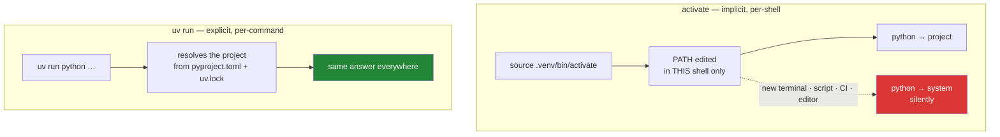

# 2.5 — The `.venv` you never activate

## One-line answer

`activate` edits `PATH` in your current shell so `python` means this project's Python — which
works, and is invisible state you can forget — so this project never activates and puts
`uv run` in front of every command instead.

---

## The story

A shared kitchen with a rule: before you use the big oven, flip the switch by the door.

The switch does something real and necessary. But it is on the wall, not on the oven, and
nothing about the oven tells you which way the switch is set. So the failure is always the
same shape: somebody puts a dish in, comes back later, and it is stone cold. Nobody did
anything wrong. Somebody just did not flip a switch that gives no feedback.

The eventual fix in a real kitchen is not a bigger sign. It is a different oven — one where
turning the dial *is* turning it on, so there is no second thing to remember and no state to
be in.

That is the difference between activating an environment and prefixing a command. One is a
switch on the wall. The other is the dial on the oven.

---

## The idea in plain language

A **virtual environment** is a folder — here, `.venv` — containing a Python interpreter and
its own `site-packages`. It is the answer to
[1.1](../01-toolchain/1.1-why-one-tool-owns-the-environment.md)'s problem: this project's
packages live somewhere that belongs to this project.

`uv sync` created it for you in [2.4](2.4-pyproject-and-the-lockfile.md). It is real, it is
useful, and it is gitignored — it is built from `uv.lock`, so committing it would be
committing something that a tool can rebuild exactly, in a platform-specific form that is
wrong on every other machine.

Now, **activation**. Running `source .venv/bin/activate` (or `.venv/Scripts/activate` on
Windows) does three modest things to your *current shell*:

1. prepends `.venv`'s script folder to `PATH`, so `python` now finds this one first;
2. remembers the old `PATH` so `deactivate` can put it back;
3. usually changes your prompt, as a hint.

Nothing clever, and nothing wrong with it. The problem is the *category* it belongs to:
**invisible, per-shell state**.

- It applies to **one shell**. Open a second terminal and that one is not activated.
- It is **forgettable in both directions** — forgetting to activate runs the wrong Python,
  and forgetting that you *did* activate makes you misread the next thing you run.
- It **does not survive** a script, a scheduled job, an editor's test runner, or a CI step
  unless each one re-does it.
- And the prompt hint, which is the only feedback, is exactly the sort of thing you stop
  seeing after a week.

Compare with the alternative:

```text
uv run python -m pytest
```

This runs the command against **this project's** environment, once, explicitly. There is no
mode to enter and no mode to forget. It also works identically inside a script, inside CI,
and from an editor — because the intent is written into the command rather than held in the
shell's memory. That is why every command in these 152 days is written with `uv run` in front
of it, and why `./m` never activates anything.

The general principle, which is worth more than the specific rule:

> **Prefer explicit state in the command over implicit state in the environment.** When
> something goes wrong, the command is evidence you can read; the environment is a thing you
> have to remember.

You will meet this exact principle again as a networking problem. On Day 84 a DNS answer can
come from a cache instead of the network; on Day 26 an ARP entry can answer instead of the
wire. In every case the mechanism is the same: **hidden state answered, and the answer looked
identical to the real one.** That is Silent Failure #1, and this is its shell-shaped version.

---

## Why Jāla needs it

- **`./m` runs unattended** ([3.2](../03-the-driver/3.2-the-case-dispatcher.md)). A script
  that depended on the caller having activated something would work for you and fail for
  anyone else — and fail in the confusing way, by running a *different* Python rather than by
  erroring.
- **P11 — every day ends with a check that can go RED.** A check whose result depends on
  invisible shell state is not a check;
  [1.5](../01-toolchain/1.5-the-editor-and-the-interpreter-trap.md) already showed a green
  test run produced by the wrong interpreter.
- **Plan §5 — tests are deterministic.** "Deterministic" has to include "does not depend on
  which terminal window you are in".
- **Phase 16's gate is a stranger cloning the repository and reproducing every number.** A
  stranger will not know which shell you had activated, and no document can reliably tell
  them, because the state is not written anywhere.

---

## The mechanism

Look at what `uv sync` built:

```bash
ls .venv/ && ls .venv/Scripts/python.exe 2>/dev/null || ls .venv/bin/python
```

**Line by line:**

- `ls .venv/` — the environment folder. On Windows the executables sit in `Scripts/`; on
  macOS and Linux they sit in `bin/`. That difference is the only reason the second half of
  this line exists.
- `||` — run the right-hand command **only if the left one failed**. It is the mirror of
  `&&` from [1.3](../01-toolchain/1.3-uv-the-one-binary.md), and together they are how a
  shell expresses "try this, otherwise that" without an `if`.

Now prove the two interpreters are different — the system one and the project one:

```bash
python -c "import sys; print('system :', sys.executable)"
uv run python -c "import sys; print('project:', sys.executable)"
```

**Line by line:**

- The first line asks whatever `python` resolves to on `PATH` — the ambiguous word from
  [1.1](../01-toolchain/1.1-why-one-tool-owns-the-environment.md).
- The second asks `uv` to run it against this project. **The two paths differ**, and the
  second one contains `.venv`. Seeing them side by side is the whole demonstration: the same
  five characters, `python`, meaning two different programs, distinguished only by the prefix.

And confirm the packages follow the interpreter, not the machine:

```bash
uv run python -c "import pytest; print(pytest.__version__)"
```

**Line by line:**

- If this prints `9.1.1`, you have the pinned version from
  [2.4](2.4-pyproject-and-the-lockfile.md) and `docs/PACKAGES.md`. If it raises
  `ModuleNotFoundError`, `uv sync` has not run. If it prints a *different* version, you are
  not in the environment you think you are — which is the failure this part exists to remove.

Add the last defence, so the editor cannot reintroduce the state you just removed:

```bash
grep -n 'activateEnvironment' .vscode/settings.json
```

**Line by line:**

- `grep -n` — print matching lines **with line numbers**. You are looking for
  `"python.terminal.activateEnvironment": false` from
  [1.5](../01-toolchain/1.5-the-editor-and-the-interpreter-trap.md). Without it the editor
  helpfully activates in every terminal it opens, and the invisible state is back — set by
  something that is not you.



---

## When it breaks

**The forgotten activation, in its most confusing form:**

```text
$ python -m pytest
============================= test session starts ==============================
platform win32 -- Python 3.11.4, pytest-8.0.0
collected 0 items

============================ no tests ran in 0.01s =============================
```

**What it says:** no tests were collected.
**What it means:** you are in the wrong interpreter, and it has a *different* pytest — look
at the header. This is not a failure about your tests. It is
[1.5](../01-toolchain/1.5-the-editor-and-the-interpreter-trap.md)'s two clocks again, and the
fix is the three characters `uv run` rather than anything to do with test discovery.

**Activation succeeding and then not surviving:**

```text
$ source .venv/Scripts/activate
(jala) $ ./m check
bash: uv: command not found
```

**What it means.** The activate script replaced `PATH` rather than prepending to it — an
older or hand-edited environment can do this — so `uv`, which lives *outside* every
environment ([1.3](../01-toolchain/1.3-uv-the-one-binary.md)), is now unreachable. The prompt
says `(jala)`, which reads as reassurance while the shell is in a worse state than before.
`deactivate` fixes it. This is a good illustration of why a prompt hint is not feedback: it
reported the state accurately and told you nothing about the consequence.

**And the silent one, which is the reason for all of the above.** Two terminals, one
activated and one not:

```text
# terminal A (activated)
$ python -c "import scapy; print(scapy.__version__)"
2.7.0

# terminal B (not activated, same machine, same folder)
$ python -c "import scapy; print(scapy.__version__)"
2.5.0
```

**Nothing failed.** Both commands succeeded, in the same directory, seconds apart, and
returned different answers. If you are on Day 18 comparing your hand-built Ethernet frame
against `scapy`'s and a field disagrees, you now have a mystery that is not about Ethernet at
all. **The check that catches it** is the one this part has used throughout: print
`sys.executable` alongside any version you are about to trust, so the answer carries its own
provenance. That is P8's habit — *a number without its source is a rumour* — applied to your
own toolchain before it is applied to a measurement.

---

## In production

**The general rule is: put the state in the command, not in the session.** This shows up
everywhere in operations. A `kubectl` context set once in a shell and forgotten is how a
command intended for staging lands in production — which is why careful teams put
`--context` on the command, or use a prompt that screams. An `AWS_PROFILE` exported in one
terminal is the same failure with a different blast radius. The pattern to internalise:
**anything that changes what a command means, and is not visible in the command, is a
liability.**

**Containers made this argument mainstream.** A container image *is* the environment, so there
is nothing to activate — the interpreter and its packages are the filesystem. That is
activation taken to its logical end, and it is why the container ecosystem never developed an
equivalent ritual.

**Where activation is still the right answer.** Interactive exploration. If you are going to
run twenty commands in a row against one project, activating once is genuinely more
comfortable, and the risk is low because you are watching each result. The distinction that
matters is **interactive versus automated**: a human at a prompt can notice a wrong answer; a
script cannot. This project is written as if everything is automated, because `./m check`
runs unattended and because a curriculum that only works when you are paying attention is not
teaching a habit worth having.

**What an operator does differently.** They make the environment visible in the output rather
than trusting it to be right. A deployment script that prints the cluster, the image tag and
the interpreter version before doing anything costs three lines and removes an entire class
of "wrong environment" incident — and those three lines are what somebody reads in the
postmortem.

**The review comment.** On a pull request adding a shell script that starts with
`source .venv/bin/activate`: *"This won't work in CI or from a cron job, and it silently runs
the system Python instead of failing. Prefix the commands with the project runner instead."*

**The interview question.** *"What does activating a virtual environment actually do?"* The
answer is deliberately unglamorous — it prepends a directory to `PATH` in the current shell
and saves the old value so it can be restored. The follow-up is the real question: *"so what
happens when a cron job runs your script?"* If you know activation is per-shell `PATH`
manipulation, you know immediately that the cron job gets the system Python and that the
failure will be a wrong result rather than an error.

---

## Check yourself

```bash
uv run python -c "import sys; print(len(sys.path)); print(sys.executable)"
```

The first number is **how many folders this interpreter searches on every import**. The
second proves it is the project's interpreter, inside `.venv`, without a single thing having
been activated. Run the same command from a brand-new terminal and both outputs must be
identical — that reproducibility is the property this part bought.

**Answer out loud, without scrolling up:**

> Describe the three things `activate` does, and then name two situations where the
> activation is silently absent. Then explain why "the prompt shows `(jala)`" is not
> sufficient evidence that a command will run against the right environment.

---

**Next:** [3.1 — `set -euo pipefail`, the line that makes bash safe](../03-the-driver/3.1-set-euo-pipefail.md)
