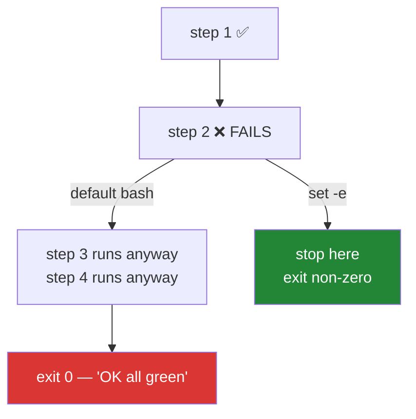

# 3.1 — `set -euo pipefail`, the line that makes bash stop lying

## One-line answer

By default bash carries on after a failed command, treats a misspelt variable as empty, and
reports a pipeline as successful when only its last stage worked — and one line at the top of
a script turns off all three.

---

## The story

You send someone a list of four things to do while you are out: take the parcel to the post
office, buy stamps, pick up the dry cleaning, get milk.

They come back and say "all done". And it is *mostly* true. The post office was shut, so the
parcel is still in the bag — but they did the other three, so from where they are standing
the trip was a success. They are not lying. They answered the question "did the trip go
alright?" and the trip did go alright.

You find the parcel two days later.

The problem is not their honesty. The problem is that "all done" was a summary of the last
thing that happened rather than of every thing that happened, and nobody agreed in advance
that a failed step should stop the trip and be reported.

The fix is a rule stated **before** they leave: *if any one of these fails, stop and tell me
straight away.*

---

## The idea in plain language

A shell script is a list of commands run in order. Every command ends with an **exit status**
— a number, where zero means success, by long convention.

Bash's defaults were chosen for an interactive session, where a human is watching each line
and can react. Those same defaults are dangerous in a script, where nobody is watching. There
are three of them, and each is its own kind of quiet failure:

**One: a failed command does not stop the script.** Bash runs the next line. So a script
whose third step failed carries on to steps four through ten, which now run against a state
nobody planned for.

**Two: an unset variable expands to nothing, silently.** Misspell `$DAY` as `$DYA` and bash
substitutes an empty string. It does not warn. The classic demonstration is
`rm -rf "$PREFIX/"` where `PREFIX` is undefined — which becomes `rm -rf /`. This failure mode
is famous precisely because the language is being helpful.

**Three: a pipeline reports only its last command's status.** In `a | b | c`, if `a` fails but
`c` succeeds, the pipeline's status is zero — success. So `tcpdump -r missing.pcap | wc -l`
prints `0` and reports success, and a script downstream believes the capture had no packets
rather than that it did not exist.

One line turns off all three:

```text
set -euo pipefail
```

- `-e` — **e**xit immediately if any command fails.
- `-u` — treat an **u**nset variable as an error rather than as an empty string.
- `-o pipefail` — a pipeline fails if **any** stage fails, not just the last.

The reason this is a `production`-level part rather than a bit of trivia: **all three defaults
produce a script that reports success while having done something other than what you asked.**
That is precisely the shape of the five silent failures in plan §6. Meeting it here, in ten
lines of bash, is the cheapest possible introduction to a pattern this whole curriculum is
about detecting on the wire.

`-e` has real subtleties, and pretending otherwise would be its own kind of dishonesty. It
does *not* trigger for a command whose status is being tested — in an `if`, before `&&` or
`||`, or negated with `!`. That is deliberate and useful: it means you can still check
whether something succeeded without the check itself killing the script. It is also why
`./m` writes `set +e` around the pytest call in
[3.2](3.2-the-case-dispatcher.md) — there is one exit code that needs interpreting rather
than obeying.

---

## Why Jāla needs it

- **`./m check` is the gate** ([3.3](3.3-the-done-gate.md)). A gate that continues past a
  failed linter and prints `OK all green` at the end is worse than no gate, because it
  actively certifies a false claim.
- **Topology scripts must be idempotent** (`OPS-03`). `lab/<name>.sh` on Day 9 will create
  namespaces and links; a script that carries on after a failed `ip link add` leaves a
  half-built topology, and every measurement taken on it is a measurement of something you
  cannot describe.
- **`./m cap` runs `tcpdump` in a pipeline.** Without `pipefail`, a capture that failed to
  start looks like a capture with no packets — and "no packets arrived" is a *result* in this
  curriculum, so the two must never be confusable.
- **P10 — fail honestly.** A script is the first place that principle is either enforced or
  quietly abandoned.

---

## The mechanism

Every script in this repository starts the same way:

```bash
#!/usr/bin/env bash
set -euo pipefail
```

**Line by line:**

- `#!/usr/bin/env bash` — the **shebang**: the first two bytes tell the kernel which
  interpreter to run this file with. Using `env bash` rather than a hard path like
  `/bin/bash` finds bash wherever it lives, which differs between Linux, macOS and Git Bash.
  **This is the line that breaks if the file has Windows line endings** — the kernel looks
  for `bash\r` and reports "bad interpreter", which is
  [1.2](../01-toolchain/1.2-git-and-the-shell.md)'s `core.autocrlf` rule earning its place.
- `set -euo pipefail` — the three switches above, in one line, before any other command.
  Order matters: everything before this line runs under the dangerous defaults.

Now watch each default misbehave, then watch the switch fix it. Save this as a scratch file:

```bash
cat > /tmp/demo.sh <<'EOF'
#!/usr/bin/env bash
false
echo "still running, and the exit status was $?"
EOF
bash /tmp/demo.sh; echo "script exited with: $?"
```

**Line by line:**

- `false` — a real program whose only job is to exit with status 1. It is the cleanest way to
  cause a failure on purpose, which is what P12 asks for: *reproduce the fault before you fix
  it.*
- `$?` — the exit status of the previous command. Printing it is how you read the thing bash
  is deciding on.
- `bash /tmp/demo.sh; echo …` — run it, then print the script's own status. **You will see
  `still running` and a final status of 0** — the script failed in the middle and reported
  success. That is failure number one.

Add the line and run it again:

```bash
cat > /tmp/demo.sh <<'EOF'
#!/usr/bin/env bash
set -euo pipefail
false
echo "you will never see this"
EOF
bash /tmp/demo.sh; echo "script exited with: $?"
```

**Line by line:**

- Same script, one line added. Now the `echo` never runs and the final status is 1. **The
  script has stopped claiming to have succeeded.**

The unset-variable one, which is the frightening one:

```bash
bash -c 'echo "removing [$UNDEFINED_DIR/]"'
bash -c 'set -u; echo "removing [$UNDEFINED_DIR/]"'
```

**Line by line:**

- `bash -c '…'` — run a string as a script, so this is one line rather than a file.
- The first prints `removing [/]` — the variable vanished and left a bare slash. Imagine that
  string handed to `rm -rf` instead of `echo`. **The square brackets are there so you can see
  the emptiness**, which is exactly what the shell will not show you.
- The second prints `UNDEFINED_DIR: unbound variable` and exits non-zero. That is `-u`.

And `pipefail`, using the failure that will matter on Day 8:

```bash
bash -c 'cat /nonexistent.pcap | wc -l; echo "status: $?"'
bash -c 'set -o pipefail; cat /nonexistent.pcap | wc -l; echo "status: $?"'
```

**Line by line:**

- The first prints `0` from `wc -l`, then `status: 0`. `cat` failed, `wc` succeeded on the
  empty input, and the pipeline reported the last stage. **An absent file and an empty file
  are now indistinguishable.**
- The second prints `status: 1`. The pipeline now reports the failure that actually happened.



---

## When it breaks

**What the fix looks like when it fires** — and this is the output you *want*:

```text
$ ./m check
error: Failed to spawn: `ruff`
  Caused by: program not found
```

The script stopped at the first failing gate and said so. Nothing after it ran, and no
misleading `OK all green` was printed. Compare with the same run under default bash, which
would print that error *and then continue*, run the tests, and finish with a confident
success line — a script that told you two contradictory things and let you read whichever
you looked at last.

**`-u` firing on an argument you did not pass:**

```text
$ ./m depth
./m: line 4: $2: unbound variable
```

**What it means.** The script read `$2` and there was no second argument. This is `-u` doing
its job, and the fix is not to remove `-u` — it is to give the variable a default:
`DAY="${2:-}"` means "use `$2`, or an empty string if it is unset". That is the pattern `./m`
uses, and it is why the script can be called with or without a day number without either
crashing or silently misbehaving.

**And the trap that catches people who have just learned `-e`.** A command that returns
non-zero *as information* rather than as failure:

```text
$ cat check.sh
#!/usr/bin/env bash
set -euo pipefail
grep -q "TODO" README.md
echo "no TODOs found"

$ bash check.sh; echo "exit: $?"
exit: 1
```

**What it means.** `grep -q` returns 1 when it finds nothing — which here is the *good* case
— and `-e` dutifully killed the script. The `echo` never ran, and the script reports failure
for a passing condition. **`-e` cannot tell the difference between "this broke" and "the
answer was no"**, and you have to. The fix is to test it explicitly:
`if grep -q "TODO" README.md; then …; fi`, or `grep -q … || true` when you genuinely do not
care. `./m` does this deliberately around pytest, whose exit code 5 means "collected no
tests" — a fact to interpret, not a failure to obey.

---

## In production

**This line is a standard in every serious shell codebase**, and its absence is a review
finding. The reason is not style. Deployment scripts, database migrations, backup jobs and
CI steps are all shell, all unattended, and all capable of doing half their work and
reporting success. A backup script that fails to reach the storage bucket, carries on, and
exits zero produces a monitoring dashboard that is green for months — and the failure is
discovered during a restore.

**`pipefail` deserves particular attention because pipelines are everywhere in operations.**
`kubectl get pods | grep Running | wc -l`, `journalctl | grep ERROR | tail`,
`tcpdump -r cap.pcap | grep -c SYN` — in every one of those the interesting failure is in the
*first* stage and the reported status comes from the last. Without `pipefail`, "zero results"
and "the command did not run" are the same output, which is the difference between "no errors
in the log" and "I could not read the log".

**Where teams go beyond this line.** `set -x` prints each command as it runs, which turns a
CI log into a transcript. `trap 'cleanup' EXIT` guarantees teardown even on failure — which
is exactly what a topology script needs so that a failed `./m lab up` does not leave orphaned
namespaces behind. And `shellcheck` is the linter for shell, catching unquoted variables and
the subtle `-e` cases above; a mature repository runs it in CI the same way this one runs
`ruff`.

**The honest limitation.** `set -e` has enough edge cases — inside command substitutions,
inside functions called in a conditional context, with `&&` chains — that experienced people
sometimes argue against relying on it and prefer explicit `|| exit 1` on every command. That
position is defensible. The pragmatic consensus, and this project's position, is: use all
three switches, and additionally check explicitly wherever the status carries meaning. Belt
and braces, because the failure you are guarding against is silent.

**The review comment.** On a pull request adding a deployment script without the line:
*"No `set -euo pipefail` — if the image push fails this will carry on and mark the deploy
successful. Please add it and handle the `grep` on line 20 explicitly, since a no-match there
is expected."*

**The interview question.** *"Your deploy script exited 0 but the service is running the old
version. Where do you look?"* The answer they are listening for names the mechanism: check
whether the script stops on error at all, and check whether the failing step was inside a
pipeline whose last stage succeeded. A candidate who reaches for `set -euo pipefail` and
`pipefail` specifically has debugged this before; one who starts re-reading the deployment
logic has not yet learned that the script was lying to them.

---

## Check yourself

```bash
bash -c 'set -o pipefail; cat /nonexistent | wc -l; echo "with pipefail: $?"'
bash -c 'cat /nonexistent | wc -l; echo "without pipefail: $?"'
```

Two numbers: **1 and 0**. Same pipeline, same missing file, two different claims about
whether it worked. That gap is the entire argument for the line, and it is a fact you just
produced rather than one you were told.

**Answer out loud, without scrolling up:**

> Name the three defaults `-e`, `-u` and `-o pipefail` each switch off, and give a concrete
> failure for each. Then explain why `set -e` alone would break a script that uses
> `grep -q` to test for something's absence — and what you write instead.

---

**Next:** [3.2 — The `case` dispatcher, and why `./m` has one](3.2-the-case-dispatcher.md)
