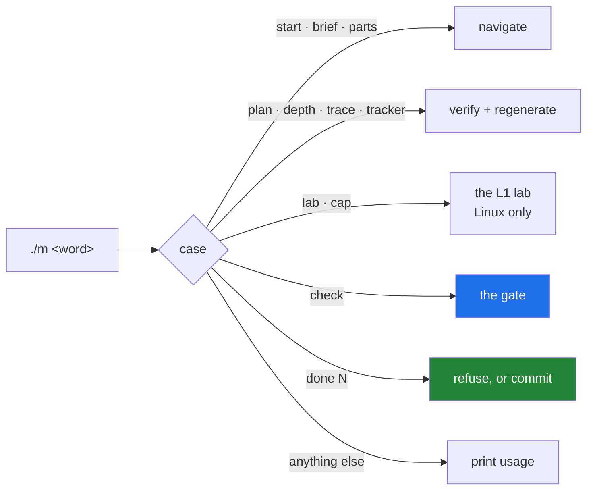

# 3.2 — The `case` dispatcher, and why `./m` has one

## One-line answer

`./m` is one file whose whole body is a `case` statement matching its first argument, so
every routine in this project has exactly one name and one implementation instead of living
in your memory.

---

## The story

A washing machine with one dial.

There are fifteen programmes on it and you use three. You do not know what most of the others
do, and it does not matter, because the dial has the names printed around it. When somebody
else uses the machine they turn the dial to "quick wash" and get the quick wash — the same
one you get, because there is only one.

Now picture the alternative that would be *more flexible*: no dial, and instead a card taped
to the wall listing the water temperature, drum speed, and cycle length for each programme,
which you enter by hand each time.

The card version can do more. It is also the version where somebody eventually washes a wool
jumper at ninety degrees, because the numbers are on a card and the card is not the machine.
And when a setting turns out to be wrong, the card gets corrected and three people carry on
using the numbers they memorised months ago.

The dial is worse at flexibility and better at everything else: it is discoverable, it is the
same for everyone, and correcting it corrects it for everybody at once.

---

## The idea in plain language

Most projects accumulate a set of routines — run the tests, run the linter, build the thing,
check the docs. They usually live in three places at once: a `README`, somebody's shell
history, and folklore. That is the card on the wall.

A **driver script** is the dial. One file, one entry point, one name per routine:

```text
./m check
./m depth 12
./m done 0
```

The bash construct that makes this cheap is `case`. It compares one value against a series of
patterns and runs the first branch that matches:

```text
case "$1" in
  check)  … ;;
  depth)  … ;;
  *)      … ;;
esac
```

Three details are worth knowing rather than copying:

- **Patterns are globs, not regular expressions.** `check)` matches the literal word;
  `lab*)` would match anything starting with `lab`; `*)` matches everything and is
  conventionally last, as the fallback.
- **`;;` ends a branch**, and unlike C's `switch` there is no fall-through by default. You
  cannot forget a `break`.
- **`esac` closes it** — `case` backwards, which is bash's sense of humour and also `fi` for
  `if`.

Why `case` rather than a chain of `if`? Because a `case` is a *table*. Reading the script
tells you the complete list of things it can do, in one screen, and adding a routine means
adding a row rather than extending a chain. The shape of the code matches the shape of the
idea.

Why not `make`? Because `make` is not installed on a Windows machine by default, and this
project's environment is Git Bash on Windows as much as it is Linux. Adding a dependency that
half the readers must install first, to run the setup day, is the wrong trade. `./m` is
sixty lines of bash and needs nothing.

One more design decision that is easy to miss and does real work:

> **A day is resolved by number, never by folder name.**

`./m depth 12` finds `days/day-012-*` by globbing on the number. So the slug after the number
is a label a human reads, and a folder can be renamed to a better slug at any time without
breaking `./m`, `depth_check.py`, `tracker.py` or `trace.py`. Plan §24.2 states this directly:
*the number is the identity, the slug is a label on it.*

---

## Why Jāla needs it

- **152 days of the same three commands.** `./m start N`, `./m check`, `./m done N`. A
  routine you type from memory is a routine that drifts; a routine in a committed file is one
  that improves.
- **`./m check` has a specific order and the order is an argument** (below). That reasoning
  has to live somewhere it can be read and reviewed, not in a habit.
- **`./m done N` must be able to refuse** ([3.3](3.3-the-done-gate.md)). A gate implemented
  as "remember to check the checklist" is not a gate.
- **Plan §5 says `make` is not used and `./m` is the driver.** This part is where that
  sentence becomes a file.

---

## The mechanism

The skeleton, which is the shape of the whole script:

```bash
#!/usr/bin/env bash
set -euo pipefail
cd "$(dirname "$0")"

DAY="${2:-}"
pad() { printf "%03d" "$1"; }
```

**Line by line:**

- `set -euo pipefail` — [3.1](3.1-set-euo-pipefail.md). Without it a failing gate would not
  stop the script.
- `cd "$(dirname "$0")"` — change to the folder containing the script. `$0` is the path the
  script was invoked as, `dirname` strips the filename, and `$(…)` substitutes the result.
  **This is what makes `./m` work from any directory**: every path inside can be relative to
  the repository root and mean the same thing regardless of where you were standing.
- `DAY="${2:-}"` — the second argument, **or an empty string if it is unset**. Without the
  `:-` this line would abort under `-u`, which is exactly the trap
  [3.1](3.1-set-euo-pipefail.md) described: `-u` is correct, and it means you write your
  defaults down.
- `pad() { …; }` — a function. `printf "%03d"` formats a number to **three digits with
  leading zeros**, so `0` becomes `000`. Three digits because the plan runs to 151, and
  `day-9` sorting after `day-100` in every file listing is a papercut paid 152 times
  (§24.2).

Resolving a day by number:

```bash
daydir() {
  local n d
  n="$(pad "$1")"
  for d in days/day-"$n"-*; do
    [ -d "$d" ] && { echo "$d"; return; }
  done
  echo ""
}
```

**Line by line:**

- `local n d` — declare the variables local to the function. Bash variables are global by
  default, and a function that quietly overwrites a caller's variable is a bug that appears
  much later.
- `for d in days/day-"$n"-*` — glob on the **number**, accepting any slug. This is the
  rename-safety property above, in one line.
- `[ -d "$d" ]` — is this a directory? A glob that matches nothing expands to the pattern
  itself, so without this test you would return a literal `days/day-000-*`. **The quotes
  matter** — a path with a space would otherwise split into two arguments.
- `&& { …; return; }` — run the block only if the test passed, then leave. The braces group
  commands without a subshell, and the semicolon before `}` is required by bash's grammar.
- `echo ""` at the end — an empty string means "not found", so the caller tests one thing.

The dispatcher itself:

```bash
case "${1:-help}" in
  depth)
    if [ -n "$DAY" ]; then uv run python scripts/depth_check.py "$DAY"
    else uv run python scripts/depth_check.py; fi
    ;;
  status)
    uv run python scripts/tracker.py --summary
    ;;
  *)
    cat <<'USAGE'
usage: ./m <command> [args]
  depth [N]   run the depth contract over day N, or every written day
  status      one-line progress
USAGE
    ;;
esac
```

**Line by line:**

- `"${1:-help}"` — the first argument, **defaulting to `help`**. So a bare `./m` prints usage
  rather than failing under `-u`. Small, and it is the difference between a tool that teaches
  you its own interface and one that scolds you.
- `[ -n "$DAY" ]` — is the string non-empty? This is how one command serves both `./m depth`
  and `./m depth 12` without a second name.
- `uv run` in front of every Python call — [2.5](../02-skeleton/2.5-the-venv-you-never-activate.md).
  The script never activates anything, so it behaves identically from a terminal, from an
  editor, and from CI.
- `*)` — the fallback branch, matching anything unrecognised. It prints usage, which means a
  typo produces the list of correct commands instead of silence.
- `<<'USAGE' … USAGE` — a heredoc, quoted so `$` inside is literal.
- `esac` — closes the `case`.

And the ordering argument inside `./m check`, which is the part worth arguing about:

```bash
uv run ruff check .
uv run ruff format --check .
uv run python scripts/check_blocks.py
uv run python scripts/plan_check.py
uv run python -m pytest -q -m "not root"
uv run python scripts/depth_check.py
```

**Line by line:**

- The first four **read** code without running it, and they are ordered cheapest-first. A
  linter failure should not wait behind a test suite.
- `ruff format --check` — report whether formatting is wrong, **without changing anything**.
  A gate that silently rewrites your files is a gate that can never fail.
- `check_blocks.py` — compiles every Python block inside every lesson. It sits here because
  `ruff format` reaches into markdown fences but **fails open** on a block it cannot parse,
  so without this a lesson with a syntax error is green everywhere in the repository. That is
  a silent failure hiding inside a formatter.
- `plan_check.py` — verifies the ID decomposition. P19 says the day count is *derived*; this
  is where it is derived, so the number is an output rather than a claim.
- `pytest -m "not root"` — the unprivileged subset (plan §5). Nothing should execute until
  everything has been read, which is why it comes after the four reading gates.
- `depth_check.py` last — it is the most specific and reports one file, one line, one block.



---

## When it breaks

**The permission bit, which is the most common first failure:**

```text
$ ./m check
bash: ./m: Permission denied
```

**What it means.** The file exists and is not marked executable. `chmod +x m` fixes it. The
subtlety worth keeping: **the executable bit belongs to the file, not to the name**, so
deleting and recreating the script loses it again — and Git tracks the bit, so it must be
committed (`git update-index --chmod=+x m`) or the next clone hits the same wall.

**The line-ending failure, for the third time in this day:**

```text
$ ./m check
bash: ./m: /usr/bin/env: bad interpreter: No such file or directory
```

`/usr/bin/env` exists. The shebang ends with a carriage return, so the kernel is looking for
`env\r`. This is why [1.2](../01-toolchain/1.2-git-and-the-shell.md) set `core.autocrlf
input` before anything was written.

**And the silent one, which is the reason `*)` exists.** Suppose the fallback branch were
omitted:

```text
$ ./m chekc
$ echo $?
0
```

**Nothing happened, and it reported success.** No output, no error, exit status zero. A typo
in a command name produced a green result — and if that had been in a CI pipeline, the build
would pass having run no checks at all. This is the same category as
[3.1](3.1-set-euo-pipefail.md)'s pipeline failure: **the absence of a check and a passing
check produced identical evidence.** The `*)` branch turns it into a printed usage message,
which is the loudest cheap thing available.

---

## In production

**Every well-run repository has this file under some name** — `Makefile`, `Taskfile`,
`justfile`, `scripts/dev`, `./m`. The name does not matter; the property does. New
contributors run one command instead of reading three paragraphs, CI runs the *same* command
a developer runs locally, and when a step changes it changes once.

**The most valuable property is that CI and the laptop share an entry point.** When CI runs
its own bespoke sequence, the two drift, and the symptom is the oldest complaint in software:
it passes locally and fails in CI, or worse, the reverse. A pipeline whose job is
`./m check` cannot drift from what a developer runs, because it is the same file under
version control.

**Where a driver script stops being enough.** These scripts grow, and past a few hundred
lines the arguments for a real task runner become real: dependency graphs between tasks,
caching so unchanged work is skipped, parallelism. The honest signal that you have outgrown
bash is when you start writing your own argument parsing or your own caching. Until then a
`case` statement is less machinery, and less machinery is fewer things that can be subtly
wrong.

**What an operator does differently.** They make the script print what it is about to do, and
they make failure loud. A deployment driver that echoes the target environment and the image
tag before acting costs two lines and removes an entire class of incident — and this is
`OPS-08` in miniature: the change and the ability to see the change are the same commit.

**The review comment.** On a pull request adding a fourth ad-hoc script to `scripts/`:
*"This is the third way to run the tests. Fold it into the driver as a subcommand so there's
one place to change when the flags do."*

**The interview question.** *"How does a new engineer run your test suite?"* The answer that
signals a healthy codebase is a single command, and the follow-up — *"and is that what CI
runs?"* — is the one that matters. Two different answers to those two questions is the root
cause of a surprising share of "flaky CI" complaints, which are usually not flakiness at all
but two subtly different commands.

---

## Check yourself

```bash
grep -c ');\?$\|^  [a-z]*)' m && ./m 2>&1 | tail -1
```

The first number is roughly **how many branches your dispatcher has** — how many routines
this project has names for. The second line is the last line of the usage text, proving the
fallback branch fires on a bare invocation rather than failing under `-u`.

**Answer out loud, without scrolling up:**

> Explain why `./m depth 12` finds a folder called `day-012-latency-decomposed` without the
> script knowing that slug, and what that buys you when you rename a day. Then say what
> happens without the `*)` branch when you mistype a command — and why that is the same
> category of failure as a pipeline without `pipefail`.

---

**Next:** [3.3 — The `done` gate, and why a checklist you can skip is decoration](3.3-the-done-gate.md)
