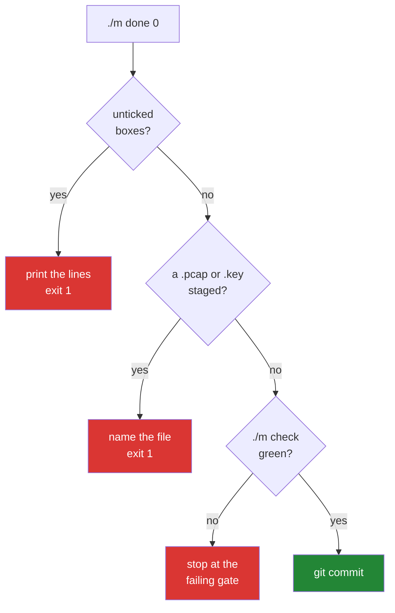

# 3.3 — The `done` gate, and why a checklist you can skip is decoration

## One-line answer

`./m done N` refuses to commit while any checkbox in that day's `CHECKLIST.md` is unticked,
any check is red, or a capture or key is staged — and a refusal is worth more than a
reminder, because a reminder relies on the one thing that is unreliable at the end of a long
day.

---

## The story

A door that locks behind you when you leave, and a sign on the door that says "remember your
keys".

The sign works most of the time. It works less well when you are carrying two bags and the
phone is ringing, which is exactly when you most need it to work. And the sign has been there
so long that you stopped reading it about a year ago.

The lock that will not close unless the keys are in your hand is a different kind of object.
It is more annoying. It is annoying at precisely the moments when the sign would have failed
— and that is not a coincidence, it is the entire value. You do not need help on the calm
days.

Notice, too, what the sign quietly does to you. Every time you walk past it and are fine, you
learn a little more firmly that the sign is not for you. The reminder trains you to ignore
the reminder.

---

## The idea in plain language

There are two ways to hold a standard.

**A reminder** describes what should happen. A checklist in a document, a note in a `README`,
a step in a process everybody agreed to. It costs nothing, it works when you are attentive,
and it fails silently — nothing records that you skipped it.

**A gate** makes the next step impossible until the standard is met. It costs something to
build, it is occasionally irritating, and it fails *loudly* or not at all.

The difference only shows up under pressure, which is when standards actually matter. At the
end of a long day, on the part you found hard, with the thing nearly working — that is when a
reminder loses and a gate holds.

`./m done N` is a gate, and it checks three things in a deliberate order:

1. **Is every box in `CHECKLIST.md` ticked?** It greps for `- [ ]` — an unticked markdown
   checkbox. Finding one, it prints the offending lines and exits non-zero.
2. **Is a capture or a key staged?** P9, checked on *every* day rather than once a phase,
   because the day it fails is the day it became permanent
   ([2.2](../02-skeleton/2.2-gitignore-before-secrets-exist.md)).
3. **Is `./m check` green?** Lint, format, lesson blocks, the plan, the tests, the depth
   contract.

Only then does it commit.

And now the honest part, which matters more than the mechanism: **the gate cannot tell whether
you actually did the thing.** You can tick a box you did not do. Nothing stops you, and no
script ever could.

That is not a flaw in the design; it is the boundary of what automation can hold. The gate
removes *forgetting* from the failure modes, and leaves *lying to yourself* — which is a much
smaller and more visible category, because it requires a decision rather than an oversight.
A checklist you can skip by accident is decoration. A checklist you can only skip on purpose
is a standard.

---

## Why Jāla needs it

- **P2 — one day, one commit**, and `docs/PROGRESS.md` records the hash. The gate is what
  makes a row in that ledger mean something rather than being a row somebody typed.
- **P11 — every day ends with a check that can go RED.** A check that cannot block anything
  is a check nobody runs twice.
- **P9 — captures and keys are never committed.** This is the last automated moment before a
  mistake becomes permanent, so the grep lives here.
- **Phase 16's gate is a stranger reproducing every headline number.** That only works if all
  152 commits were made under the same standard — and a standard applied on the days you felt
  like it is not a standard, it is a mood.

---

## The mechanism

The `done` branch of the dispatcher from [3.2](3.2-the-case-dispatcher.md):

```bash
done)
  [ -z "$DAY" ] && { echo "usage: ./m done <day>"; exit 1; }
  D="$(daydir "$DAY")"
  [ -n "$D" ] || { echo "no day folder for $DAY"; exit 1; }
  C="$D/CHECKLIST.md"
  if grep -q '^- \[ \]' "$C"; then
    echo "FAIL unticked boxes remain in $C"
    grep -n '^- \[ \]' "$C"
    exit 1
  fi
```

**Line by line:**

- `[ -z "$DAY" ] && { …; exit 1; }` — `-z` is "is this string empty?". No day number, no
  guessing: it refuses rather than defaulting to something plausible. A gate that guesses is
  a gate with an exception in it.
- `D="$(daydir "$DAY")"` — resolve `days/day-NNN-*` by number
  ([3.2](3.2-the-case-dispatcher.md)).
- `[ -n "$D" ] || { …; exit 1; }` — `-n` is "non-empty". `||` runs the block only if the test
  *failed*, which reads as "it must be non-empty, or else". Note this **cannot** be written
  with `&&` and `-z` and still be safe under `set -e` in every bash version — the `||` form
  is the idiom for a reason.
- `grep -q '^- \[ \]' "$C"` — search for an unticked checkbox. `-q` is **quiet**: no output,
  just an exit status, which is all an `if` needs. The pattern anchors to line start with
  `^`, then `- ` then a literal `[ ]` — the brackets are escaped because they are special in
  a regular expression.
- `if … then` rather than relying on `set -e` — this is exactly
  [3.1](3.1-set-euo-pipefail.md)'s trap: `grep` returning 1 means "found nothing", which here
  is the **good** case. Under bare `-e` the script would die on success. The status carries
  meaning, so it is tested rather than obeyed.
- `grep -n '^- \[ \]' "$C"` — the same search, now **without** `-q` and **with** `-n` for
  line numbers. **This is the part that makes the refusal useful rather than merely
  obstructive:** it prints exactly which boxes are unticked, so the message is a to-do list
  instead of a complaint.

The second and third gates:

```bash
  if git status --porcelain | grep -Eq '\.(pcap|pcapng|pem|key)$'; then
    echo "FAIL a capture or a key is staged. Never (P9):"
    git status --porcelain | grep -E '\.(pcap|pcapng|pem|key)$'
    exit 1
  fi
  "$0" check
  git add -A && git commit -m "day $(pad "$DAY"): complete"
```

**Line by line:**

- `git status --porcelain` — machine-readable status: a stable two-character code and a path
  per line. **Never parse the human-readable `git status`**, whose wording changes between
  versions; `--porcelain` is the interface that promises not to.
- `grep -Eq '\.(pcap|pcapng|pem|key)$'` — `-E` for alternation with `|`, `$` to anchor at the
  end so it matches extensions rather than any occurrence. The `\.` is an escaped literal dot.
- `"$0" check` — the script calling **itself** with a different argument. `$0` is this
  script's own path, so the gate runs the same `check` a human runs — there is no second,
  slightly different implementation to drift.
- `git add -A && git commit` — stage everything, and commit **only if staging succeeded**.
  This line is reached only when all three gates passed.
- `$(pad "$DAY")` — the three-digit day number, so commit messages sort correctly forever.



---

## When it breaks

**The refusal, which is the gate working:**

```text
$ ./m done 0
FAIL unticked boxes remain in days/day-000-toolchain-skeleton-driver/CHECKLIST.md
47:- [ ] `test_captures_are_ignored` — TODO(me) body implemented, test passes
62:- [ ] Broke `test_pins_are_exact` on purpose, watched it go red, changed it back
```

**What it says:** two boxes are unticked, on lines 47 and 62.
**What it means:** exactly that, and the message is a to-do list. Note it does not say "you
have not finished" — it says *which two things*. A refusal that does not tell you what to do
next is how people learn to work around gates rather than through them.

**The `-e` interaction, if you write the grep carelessly:**

```text
$ ./m done 0
$ echo $?
1
```

**What it means.** Silent failure with status 1 and no message. If the checklist grep is
written as a bare `grep -q '^- \[ \]' "$C"` on its own line rather than inside an `if`, then
under `set -e` the script *exits* when grep finds nothing — that is, when the checklist is
**complete**. The gate would refuse precisely the days that passed, and say nothing about
why. This is [3.1](3.1-set-euo-pipefail.md)'s `grep -q` trap, in the one place where it would
be most confusing, and it is why the code above spells out `if … then`.

**And the silent failure the gate cannot catch, stated plainly because pretending otherwise
would be dishonest.** You tick every box, including one you did not do:

```text
$ ./m done 0
OK all green
OK day 0 committed
```

**Nothing is wrong from the script's point of view, and the commit is a small lie.** The
depth contract cannot read your understanding, and `git` cannot tell a tested claim from an
asserted one. This is the boundary of automation, and it is the same boundary you meet again
in this curriculum every time a measurement is involved: a number in `docs/MEASUREMENTS.md`
with a seed and a repetition count is checkable; the claim that you actually ran five seeds
is not. **The ledger makes dishonesty deliberate and legible rather than impossible** — and
that is the most any tool can offer.

---

## In production

**This is a quality gate, and every serious engineering organisation has some version of
it**: required status checks before a merge, a protected branch, a pre-commit hook, a
deployment that will not proceed while a smoke test is red. The pattern is always the same —
convert an agreement people intend to keep into a mechanism that does not have bad days.

**Gates fail in two directions, and both are real.** Too weak and they are decoration. Too
strong and people route around them: `--no-verify`, a direct push to `main`, an emergency
override that becomes routine. **The health of a gate is measured by how often it is
bypassed, not by how strict it is** — and a gate bypassed weekly has already failed, it just
has not been removed yet. The design rule that follows: make the gate fast and make its
message actionable, because a slow gate with a vague error is one people will learn to skip.

**Where checklists genuinely change outcomes.** Aviation and surgery both adopted them for
the same reason and found the same result — the failures they prevent are not knowledge
failures, they are attention failures under load. The professional's version is that a
checklist is for the routine step you have done a thousand times, not for the hard step you
are concentrating on. That is why this day's checklist includes things as small as "read
`git status --porcelain` before staging": nobody forgets the hard part.

**What an operator does differently.** They write the gate's failure message for the person
who will read it at three in the morning. `FAIL unticked boxes remain` followed by the line
numbers is that; `Error: precondition not met` is not. The cost of a bad error message is
paid many times by people who are not the author.

**The review comment.** On a pull request adding a `--force` escape hatch to a release
script: *"Once this exists it becomes the normal path — I've seen it every time. If there's a
legitimate emergency case, let's make it log loudly and require a reason rather than a
flag."*

**The interview question.** *"How do you make sure the team follows a process?"* The weak
answer is documentation and reminders. The strong answer distinguishes the two mechanisms:
you automate what can be automated so it cannot be forgotten, you make the remainder visible
so skipping it is a recorded decision rather than an omission — and you accept out loud that
the last mile is judgement, because a process that pretends to remove judgement will be
routed around by the first person who needs to ship.

---

## Check yourself

```bash
grep -c '^- \[ \]' days/day-000-toolchain-skeleton-driver/CHECKLIST.md
```

That number is **how many boxes are still unticked** — which is exactly how many things stand
between you and `./m done 0`. It will be large right now, and watching it reach zero is the
day. Run it again after ticking one box and confirm it drops by one; a counter you have
watched move is one you believe.

**Answer out loud, without scrolling up:**

> State the difference between a reminder and a gate, and name the moment at which the
> difference actually matters. Then say what `./m done N` genuinely cannot check — and why
> that limitation makes the ledger in `docs/PROGRESS.md` more important rather than less.

---

**Next:** [3.4 — The depth contract, made mechanical](3.4-the-depth-contract-made-mechanical.md)
