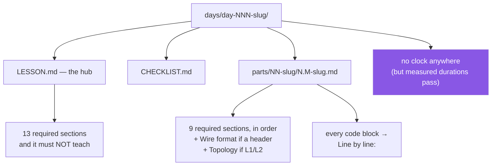

# 3.4 — The depth contract, made mechanical

## One-line answer

`./m depth` checks the half of the day format that a script *can* check — the folder names,
the numbering, the required sections, the unexplained code block, the missing wire-format
table, the smuggled-in time estimate — and is deliberately silent about whether any of the
writing is good.

---

## The story

A building inspector walks around a half-finished house with a clipboard.

They measure the gap between the stair treads. They check that there is a smoke alarm on each
floor, that the wiring is the right thickness, that the beam over the window is the size the
drawing says. Every item is something you can put a tape measure against, and at the end they
either sign it or they do not.

What the inspector does not do is tell you whether the house is nice to live in. Whether the
kitchen gets the morning light. Whether the room at the back is the right shape for what you
wanted it for. Those are real questions — they are, in fact, the questions you actually care
about — and there is no instrument for them.

Nobody thinks this makes the inspection pointless. The measurable things are measured
precisely *so that* the argument can be about the things that are not. A house that fails on
stair gaps does not get a discussion about the light in the kitchen.

---

## The idea in plain language

Plan §24 is the depth contract: what a day must contain. It has two halves and they need
different enforcement.

**The half a script can check** is structural, and it is genuinely long:

- a day folder named `day-NNN-<slug>` — three digits, then a slug;
- a `parts/` directory, because a day without one is not written;
- section folders named `NN-<slug>`, and every part *inside* its section folder;
- part filenames of the form `<section>.<subtopic>-<slug>.md`, with the folder number and the
  number before the dot agreeing;
- numbering that starts at 1 and has no gaps;
- the nine required part sections, present **and in contract order**;
- a `**Line by line:**` walkthrough after every code block that needs one;
- a `## Wire format` table in any part that shows offsets and field names;
- a `## Topology` section in any part that runs at tier L1 or L2;
- a `level` from three allowed values, a `tier` from four;
- a hub that does not teach, and whose map links every part on disk;
- **no reader-directed time estimate anywhere** (P17);
- a `CHECKLIST.md`.

**The half no script can check** is everything that makes the writing worth reading: whether
the story is honest, whether the explanation explains, whether the production section says
something a practitioner would recognise. Plan §24.9 lists those failure modes precisely so
they can be caught in review — *summary in place of explanation*, *splitting without
deepening*, *stopping at loopback* — and review means a person reading it.

Two design decisions in the checker are worth stating, because they are the difference
between a tool people use and a tool people disable.

**It must not produce false positives on the things this curriculum requires.** P17 bans time
estimates aimed at the reader's schedule. It emphatically does *not* ban measured durations —
an RTT, a retransmission timeout, a `TIME_WAIT` of twice the maximum segment lifetime, a
netem setting of `delay 40ms 5ms`, a p99. Networking is made of durations. So the clock rule
matches *pace language* and never a bare number with a time unit. These are the shapes it
looks for, quoted here as data rather than written as instructions:

```text
should take about N minutes     spend N minutes on this
a quick detour                  an N-minute read
duration: 2h                    N hours per day
```

The plan says this outright: **a false positive on a measured duration is a bug in the
checker, not a reason to delete the number.**

**It reads code blocks and prose differently.** The rule that traffic must name its
containment (§4.2) applies to what a reader is instructed to *run*, not to what a document
*discusses*. A part explaining what a ping is must not be accused of sending one. So the
traffic check looks only inside fenced code blocks — and it distinguishes a probe, which has
no business in an L0 part at all, from fetching a named resource, which §4.2 explicitly
permits.

---

## Why Jāla needs it

- **P16 — depth over density**, and §24.10 names this script as the enforcement. Without it,
  "one document per subtopic" degrades into a long page split six ways, which §24.9 calls
  *splitting without deepening*.
- **P17 — no clocks.** A time estimate is the edit that authorises every other compromise:
  once a day has a duration, the explanation is what gets trimmed to fit it.
- **P20 — wire formats are stated, never inferred.** A part that shows a byte offset and no
  table has created a bug it will not be around to fix, and offset bugs produce packets that
  are *silently discarded* rather than exceptions.
- **`docs/TRACKER.md` reports the part count of every day**, so a thin day is visible from
  the progress table alone. The checker and the tracker together make "is this day actually
  written?" a question with a mechanical answer.

---

## The mechanism

The whole thing hangs off two commands:

```bash
./m depth 0
./m depth
```

**Line by line:**

- `./m depth 0` — check one day, by number. Resolved through `daydir` from
  [3.2](3.2-the-case-dispatcher.md), so it finds the folder whatever the slug is.
- `./m depth` — every written day. This is the form `./m check` runs, because a day written
  three weeks ago can be broken by a rename today.

The structural core, in the shape the checker actually uses:

```python
PART_SECTIONS = [
    "One-line answer",
    "The story",
    "The idea in plain language",
    "Why Jāla needs it",
    "The mechanism",
    "When it breaks",
    "In production",
    "Check yourself",
]


def check_part_sections(found: list[str]) -> list[str]:
    """The nine unconditional sections, present and in contract order (§24.4)."""
    missing = [s for s in PART_SECTIONS if s not in found]
    if missing:
        return [f"missing required section(s): {missing}"]
    positions = [found.index(s) for s in PART_SECTIONS]
    if positions != sorted(positions):
        return ["sections out of contract order"]
    return []
```

**Line by line:**

- `PART_SECTIONS` — the contract as a list, in order. Having it as data rather than as
  branching code means the order *is* the definition, and changing the contract is editing
  one list.
- `missing = [...]` — a list comprehension collecting every absent section, **all of them,
  not the first**. An error message naming one missing section at a time turns one fix into
  four runs.
- `if missing: return` — report and stop. Checking the *order* of sections that are not all
  present would produce a confusing second error about a cause you already reported.
- `positions = [found.index(s) …]` — where each required section actually appears.
- `positions != sorted(positions)` — **the ordering test in one line.** If the required
  sections appear in contract order, their indices ascend. This is why the check is order-
  sensitive without needing to know anything about the sections in between: a part may add
  `## Wire format` and `## Topology`, and the nine required ones must still ascend around
  them.

And the rule that catches the most common real defect:

```python
def needs_walkthrough(lang: str, section: str) -> bool:
    """§24.4 rule 9 — every code block gets a `Line by line:` walkthrough."""
    if lang not in {"bash", "sh", "shell", "python", "py", "c"}:
        return False  # text, mermaid, console output, a capture excerpt
    return section not in {"When it breaks", "Check yourself"}
```

**Line by line:**

- The language set — only fences that carry code a reader must have walked through. A
  `mermaid` diagram or a `text` block of error output is not code.
- The section exclusion — §24.4 rule 9 exempts *"error output, a bare check command, a
  capture excerpt or a diagram"*, and those live in exactly these two sections. Encoding the
  exemption by section rather than by guesswork keeps the rule readable and keeps it honest:
  it exempts what the contract exempts and nothing else.
- Returning a `bool` rather than raising — this is a predicate, and the caller decides what a
  `True` means. Small, and it keeps the rule testable without a filesystem.



---

## When it breaks

**The most common failure, and it is usually a real defect:**

```text
$ ./m depth 12
  FAIL days/day-012-latency-decomposed/parts/02-bdp/2.1-the-pipe.md:88
       a python block in 'The mechanism' has no `**Line by line:**` walkthrough after it
       (§24.4 rule 9)

FAIL depth contract: 1 problem(s) across 1 day(s)
```

**What it means.** A code block was pasted and not explained. §24.4 is explicit that *an
unexplained line is a bug in the doc*, and this is the mechanical version of that sentence.
The fix is to write the walkthrough, never to delete the block.

**A numbering gap, which usually means a file was renamed and its neighbour was not:**

```text
  FAIL days/day-012-latency-decomposed/parts/02-bdp
       subtopic numbering must start at 1 with no gaps (§24.3) - got [1, 3]
```

**What it means.** There is a `2.1` and a `2.3` and no `2.2`. Either a part was deleted
without renumbering, or one was never written. Both are things a reader would hit as a broken
link, which is why the checker also verifies every relative link resolves.

**A hub that started teaching:**

```text
  FAIL days/day-012-latency-decomposed/LESSON.md
       the hub carries a `## Wire format` table - that belongs in a part (§24.5)
```

**What it means.** §24.5 says the hub orients and assembles and never teaches. This is the
most common drift in a long curriculum, because the hub is where you are when you notice
something is missing, and adding it there is the path of least resistance.

**And the failure mode of the checker itself, which is the one to watch for.** Suppose the
clock rule were written to match any number followed by a time unit:

```text
  FAIL days/day-012-latency-decomposed/parts/01-latency/1.3-queueing.md:64
       clock (P17): 'the measured RTT was 40 ms over five seeds'
```

**That is wrong, and it is wrong in the expensive direction.** The measured RTT is exactly
the kind of number this curriculum *requires* (P8), and a checker that fires on it teaches
the author to delete data to make a gate go green. §24.1 states the rule for this case
directly: **a false positive on a measured duration is a bug in the checker, not a reason to
delete the number.** The general lesson — and it is the same one as
[1.5](../01-toolchain/1.5-the-editor-and-the-interpreter-trap.md)'s two clocks — is that a
check which is wrong in a plausible-looking way is more dangerous than no check, because
people comply with it.

---

## In production

**Linters encode the rules a team stopped wanting to argue about.** The value is not that a
machine is a better judge — it is that structural questions get settled before review, so
review time goes to the questions that need a human. A pull request discussion about heading
order is a pull request discussion not about whether the explanation is correct.

**The failure mode is a rule people cannot satisfy honestly**, and it is worth naming because
it is common. When a check fires on something legitimate, the fastest fix is always to change
the *content* rather than the *rule* — delete the number, remove the section, add a
suppression comment. Do that a few times and the codebase has been shaped by the checker's
bugs. Mature teams treat a false positive as a bug report against the linter with the same
seriousness as a false negative, and this repository writes that into the plan.

**Documentation checks are less common than code checks and more valuable than they look.**
Broken links, stale examples and code blocks that no longer compile are the ordinary decay of
a large document set. `check_blocks.py` exists in this repository for exactly that reason, and
for a sharper one: `ruff format` reaches into Python fences inside markdown but **fails open**
on a block it cannot parse, so an unparseable lesson block would be green everywhere. A gate
that skips what it cannot handle is a gate with a hole in it, and the fix is a second gate
that fails *closed*.

**What a reviewer does with the time this buys.** They read for §24.9's list — is this a
summary pretending to be an explanation, does it stop at loopback, does it assume a day the
reader has forgotten, is every number attributable. Those are the questions that decide
whether a day is worth reading, and none of them are checkable.

**The review comment.** On a pull request adding a `# noqa` to silence a linter:
*"What's the rule complaining about? If it's a false positive let's fix the rule; if it's
real let's fix the code. A suppression with no comment is a third thing and it outlives
everyone."*

**The interview question.** *"What can't a linter catch?"* The answer that shows judgement
names the categories: whether the abstraction is right, whether the error handling is correct
for this failure mode, whether the code does what the requirement actually asked. And the
better answer adds the corollary — that this is *why* you automate the mechanical checks
aggressively, so that review attention is spent where it is the only available instrument.

---

## Check yourself

```bash
./m depth 2>&1 | tail -1
```

The last line is either `OK depth contract: N day(s), M parts` or a count of problems. **The
M is the number that matters** — it is how many part documents exist across every written
day, and it is the same number `docs/TRACKER.md` reports per day so a thin day is visible from
the progress table alone.

**Answer out loud, without scrolling up:**

> Name three things `./m depth` checks and two things it cannot. Then explain why the clock
> rule must never fire on `netem delay 40ms 5ms` — and say what an author would learn to do
> if it did.

---

**Next:** [4.1 — Namespaces need Linux, and what this machine actually reports](../04-the-linux-door/4.1-namespaces-need-linux.md)
