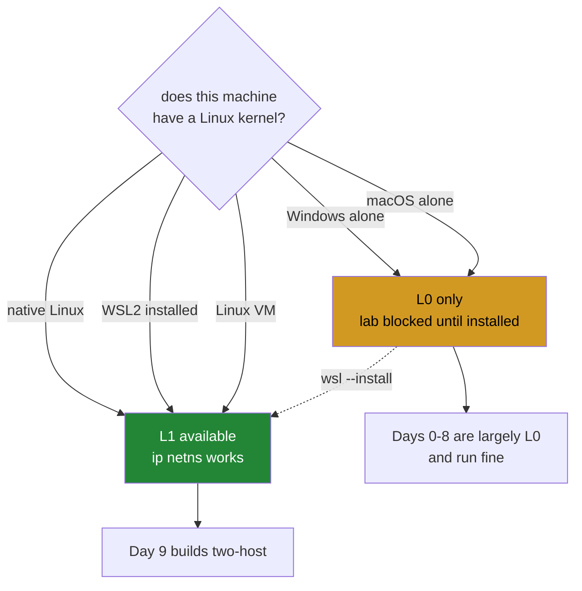

# 4.1 — Namespaces need Linux, and what this machine actually reports

> **This is the day's deliberate-failure part** (plan §24.8). It does not describe a failure;
> it **causes** one, on purpose, with the command printed — because P12 says you may not
> claim a fix for a failure you cannot reproduce on demand.

## One-line answer

The virtual lab this curriculum runs on is built from Linux network namespaces, which do not
exist on Windows or macOS — so today you run the command that will fail, read what it says,
and write down honestly whether this machine can host the lab.

---

## The story

You buy a bookshelf and start reading the instructions. Step one needs a hex key.

You do not own a hex key. You will not own one for a few days.

There are two ways this goes. In the first, you work that out at step one, put the panels back
against the wall, and order the tool. Annoying, and completely fine — nothing is wasted.

In the second, you skip ahead because the first few steps look like they only need a
screwdriver, and you get four steps in before you hit the one that will not go. Now you have
a half-built frame in the middle of the floor, you are not sure which of the four steps you
can undo, and you have spent an hour to arrive at exactly the information that was available
at the start.

The tool is missing either way. The only thing you chose was **when you found out** — and
finding out at step one costs nothing while finding out at step five costs everything you did
in between.

---

## The idea in plain language

Every day in this plan states a **tier**, and the tiers are the subject of
[4.2](4.2-the-four-tiers.md). The one that matters here is **L1 — the virtual lab**.

A **network namespace** is a Linux kernel feature. The kernel keeps one set of networking
state per namespace: its own network interfaces, its own routing table, its own firewall
rules, its own sockets. A process in one namespace cannot see another's. So one command —
`ip netns add h1` — creates something that behaves, from the network's point of view, like a
separate machine.

That is what makes this curriculum possible at zero budget. Two namespaces joined by a
**veth pair** — a virtual cable with an end in each — are two hosts on a link. Add a third
and a bridge and you have a switch to test against. Add `tc netem` and the link has 40 ms of
delay and 1% loss, which is a wide-area link on your laptop. Plan §4 calls this "an internet
on one laptop", and it is not a metaphor: the routing, the ARP, the TCP and the congestion
control are the real kernel implementations.

**Namespaces are a Linux feature, and Windows and macOS have no equivalent.** Not a slower
one, not a partial one — the mechanism is not there. The plan says this explicitly rather than
pretending otherwise, and there are three honest ways to get a Linux kernel:

- **Native Linux** — nothing to do.
- **WSL2 on Windows** — a real Linux kernel, free, from Microsoft. This is the route for this
  machine.
- **A free Linux virtual machine on macOS** — Apple silicon or Intel, any of the free
  hypervisors.

Note carefully what **is** possible without any of that. Tier **L0** is one host in user
space, and it is the majority of the early days: header codecs, checksums, CRC-32, parsers,
protocol state machines driven by recorded bytes, the pcap reader, and every piece of
arithmetic in the plan. Day 0 is L0. Days 1 through 8 are largely L0. The lab arrives on
**Day 9**, which closes `FOUND-14`.

So the door does not need to be open today. It needs to be **checked** today, so that "I
cannot run this" is discovered now rather than on Day 9 with a topology half-written.

---

## Why Jāla needs it

- **P10 — fail honestly.** A repository that quietly skipped the lab check and let you reach
  Day 9 believing you were ready would be doing the thing this principle exists to forbid.
- **P12 — reproduce the fault before you fix it.** This part *causes* the failure and prints
  the command, rather than describing it. That is the pattern every diagnostic day in this
  plan follows.
- **Plan §4 says Day 0 sets this up and states exactly what each host operating system can
  and cannot do.** This part is that sentence.
- **The Phase 0 gate depends on it.** As written, §23.1's Phase 0 gate asks for
  `./m lab up two-host` to ping — which Day 0 cannot satisfy, because namespaces are
  `FOUND-14` on Day 9. That conflict is logged as **A-001** in
  [`docs/CHANGELOG_PLAN.md`](../../../../docs/CHANGELOG_PLAN.md) rather than quietly worked
  around, which is what P14 requires.

---

## The mechanism

First, ask whether the tool exists at all:

```bash
command -v ip || echo "no ip binary on this machine"
```

**Line by line:**

- `command -v ip` — print the path of `ip` if it is a runnable command, and exit non-zero if
  it is not. This is the portable form; `which` is a separate program that is not present
  everywhere and behaves differently when it is.
- `|| echo …` — run the right-hand side **only if the left failed**
  ([2.5](../02-skeleton/2.5-the-venv-you-never-activate.md)). Together this is "tell me the
  path, or tell me plainly that there isn't one" — never silence, which would be
  indistinguishable from success.

`ip` is **iproute2**, the Linux networking toolkit. On a Linux machine it is already
installed and it is the tool that replaced `ifconfig`, `route` and `arp`; you will use it
every day from Day 9 onward.

Now cause the failure on purpose — the command, printed, as P12 requires:

```bash
./m lab up two-host
```

**Line by line:**

- `./m lab up <topology>` — the driver's lab branch from
  [3.2](../03-the-driver/3.2-the-case-dispatcher.md). It checks two things in order: whether
  this machine has namespaces at all, and only then whether the topology script exists.
- The order is deliberate. Reporting "no `lab/two-host.sh`" first would send you off to write
  a topology you still could not run — a true statement that leads somewhere useless, which
  is its own kind of dishonest error message.
- `two-host` does not exist yet either; it arrives on Day 9. Today the first check fires and
  the second is never reached.

**On this machine, on 2026-09-07, that command printed exactly this:**

```text
FAIL no network namespaces on this machine.
     L1 needs Linux. Native Linux, WSL2 on Windows, or a Linux VM.
     macOS and Windows have no namespace equivalent (plan §4).
```

and exited with status 1. The host is `MINGW64_NT-10.0-26200`, which is Git Bash's MSYS layer
on Windows 11 — a Unix-shaped shell on a Windows kernel. It gives you `bash`, `grep` and
`curl` ([1.2](../01-toolchain/1.2-git-and-the-shell.md)), and it gives you no Linux kernel,
which is precisely the distinction this part exists to make. `wsl.exe --status` on the same
machine reports that the Windows Subsystem for Linux is not installed.

The check the driver performs is two conditions:

```bash
have_netns() { command -v ip >/dev/null 2>&1 && ip netns list >/dev/null 2>&1; }
```

**Line by line:**

- `command -v ip >/dev/null 2>&1` — does the binary exist? Output discarded; only the exit
  status is wanted. `>/dev/null` throws away standard output and `2>&1` sends standard error
  to the same place, so the probe is silent either way.
- `&&` — and, **only if that succeeded**, the second condition.
- `ip netns list` — does the kernel actually support namespaces? The binary existing is not
  enough: `ip` can be present in an environment where the namespace subsystem is not
  available, and a probe that stopped at "the tool is installed" would report success on a
  machine that cannot do the work. **Testing the capability rather than the tool** is the
  same reflex as `sys.executable` in
  [1.1](../01-toolchain/1.1-why-one-tool-owns-the-environment.md): ask what will happen, not
  what ought to.

To open the door on Windows, in an **administrator** PowerShell — not Git Bash:

```text
wsl --install
```

That installs WSL2 with a default distribution and requires a restart. Afterwards, this
repository is used from *inside* the Linux environment, and `command -v ip` answers with a
path.



The amber box is not a failure state. It is an accurate description of a machine, and Days 0
through 8 run inside it without compromise.

---

## When it breaks

**The failure this part causes, reproduced above**, is the honest one: no kernel support, said
plainly, with the three ways to fix it.

**The failure that looks similar and is not** — a Linux machine where the tool is missing
rather than the capability:

```text
$ ip netns list
Command 'ip' not found, but can be installed with:
apt install iproute2
```

**What it means.** The kernel is fine; the userspace toolkit is not installed. `apt install
iproute2` and you are done. Distinguishing this from the previous failure is exactly why
`have_netns` tests both conditions rather than one — the fixes are completely different, and
a probe that conflated them would send a Windows user to `apt` and a Linux user to `wsl`.

**The one that catches almost everybody on Day 9**, and it is worth meeting now:

```text
$ ip netns add h1
Error: Peer netns reference is invalid.
open("/var/run/netns/h1"): Permission denied
```

**What it means.** Namespaces need `CAP_NET_ADMIN` — root, in practice. This is not a bug and
it is not something to design around silently: the plan's rule is that **no code may silently
require root**, and a day that needs a capability says which one, why, and what the
unprivileged version demonstrates instead. That is why `tests/` is unprivileged and offline
(plan §5), and why a test that genuinely needs a namespace is marked `root` and excluded from
the default gate — its *logic* is exercised by feeding recorded bytes through the codec
directly, with no kernel involved at all.

**And the silent one, which is the most expensive of the four.** Suppose the driver had no
namespace check and Day 9's topology script simply ran:

```text
$ ./m lab up two-host
$ echo $?
0
```

Success, and nothing built. Every `ip` command inside the script failed, each one printed to
standard error that nobody read, and the script exited zero because the *last* command
happened to succeed — which is
[3.1](../03-the-driver/3.1-set-euo-pipefail.md)'s missing `set -euo pipefail` exactly. You
would then measure a round-trip time across a topology that does not exist, and get a number.
**The number would be about loopback**, and loopback has no MTU problem, no reordering, no
middlebox and effectively no latency — it is a debugger, not a network (§24.9). That
measurement would look completely ordinary in a table, which is why the check is a gate at
the front rather than a comment in a document.

---

## In production

**"Which host can actually run this?" is a real engineering question, not a beginner's
one.** Container-based development, CI runners and local machines routinely differ in kernel
version, available capabilities and security policy. A test suite that needs `CAP_NET_ADMIN`
runs on a developer's laptop, fails on a hardened CI runner, and the failure message is about
a permission rather than about a design decision made months earlier.

**Capability checks belong at the start, and they belong in the tool.** The professional
pattern is a preflight: check every prerequisite, report **all** the missing ones at once, and
refuse to start. The anti-pattern is discovering prerequisites one at a time, four steps in,
with partial state on the floor — which is the bookshelf. Real deployment tooling does this
under the name "preflight checks" or "dry run", and the reason is identical: the cost of a
missing prerequisite is dominated by when you find out.

**Namespaces are not a teaching toy.** They are the mechanism underneath container
networking. When a container gets its own IP address, that is a network namespace and a veth
pair — exactly what Day 9 builds by hand. So the lab is not a simulation of production
networking; below Day 122's overlays and Day 126's fabrics, it is the same kernel objects
that a container platform manipulates. Being able to reason about them by hand is what
separates debugging a container network from restarting it.

**What an operator does differently.** They verify a capability by exercising it, not by
checking a version string or a package list. "The tool is installed" and "the operation
succeeds" are different claims, and only the second one is worth acting on — which is the
same argument as reading `ss -i` for a real congestion window rather than quoting a
remembered default (P8).

**The review comment.** On a pull request adding a test that creates a namespace without a
marker: *"This needs `CAP_NET_ADMIN` — it'll pass for you and fail on CI. Mark it `root` so
it's out of the default gate, and add an unprivileged test that feeds the recorded bytes
through the codec directly."*

**The interview question.** *"How would you test networking code without a network?"* The
answer they are listening for separates the **protocol logic** from the **transport**: a
header codec, a checksum and a state machine can all be driven by recorded bytes with no
socket in sight, and that separation is a design property you build in rather than a testing
trick you apply afterwards. The candidate who mentions namespaces for the integration layer
*and* pure functions for the protocol layer has understood the whole shape.

---

## Check yourself

```bash
./m lab 2>&1 | tail -1
```

That line reports whether this machine has namespaces, in words, right now. Write the answer
into today's checklist honestly — **"NOT available" is a correct answer and blocks nothing
until Day 9.** A checklist that records a capability you do not have is worth more than one
that records the capability you wish you had.

**Answer out loud, without scrolling up:**

> Say what a network namespace is and why two of them plus a veth pair are two hosts on a
> link. Then explain why `have_netns` tests `ip netns list` rather than stopping at
> `command -v ip` — and describe what would have gone wrong on Day 9 if `./m lab up` had no
> check at all and the topology script had no `set -euo pipefail`.

---

**Next:** [4.2 — The four tiers, and why Day 0 is L0](4.2-the-four-tiers.md)
