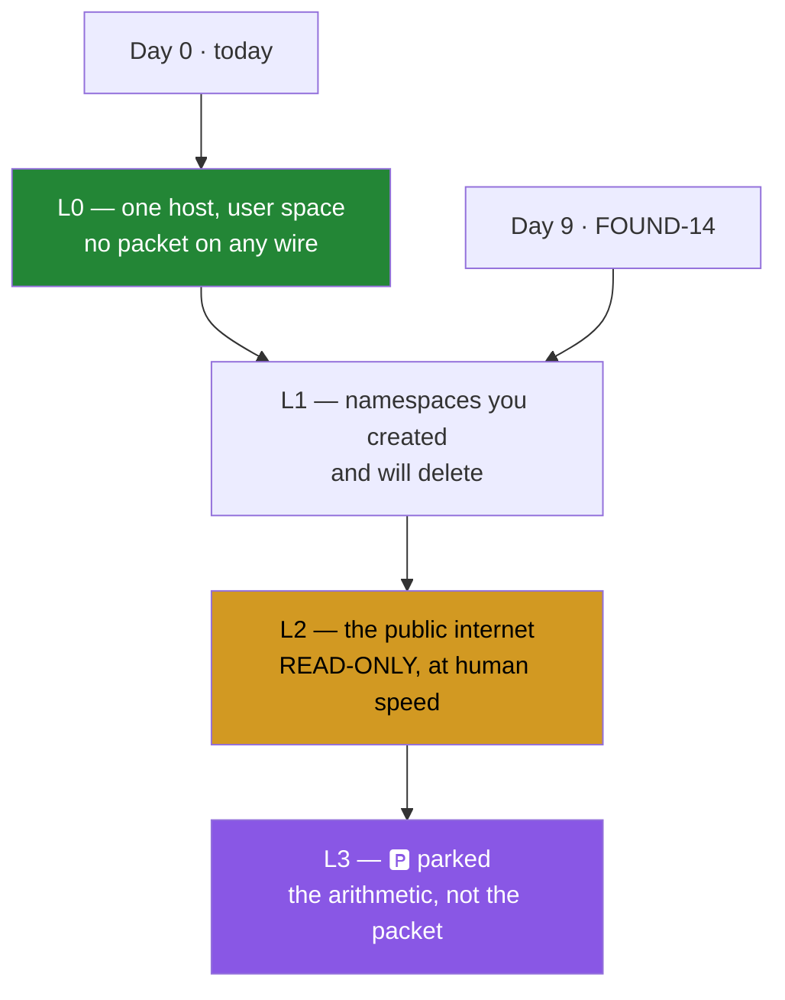

# 4.2 — The four tiers, and why Day 0 is L0

## One-line answer

Every day and every part of this curriculum declares one of four tiers — **L0** one host in
user space, **L1** the namespace lab, **L2** the public internet read-only, **L3** parked and
taught as arithmetic — and the tier is a statement about **where the packets go**, which is
why it is written down rather than assumed.

---

## The story

A driving instructor takes a learner through four places, in order, and never mixes them up.

The empty car park. Nothing to hit, nobody to hurt, and you can stall as many times as you
like. Then the quiet estate roads on a Sunday — real junctions, real give-way lines, real
consequences, but small ones. Then a dual carriageway with other traffic, where you are a
guest among people going about their day. And then the things you will only ever talk about:
what happens on ice, what a blowout at speed feels like, how a lorry's blind spot works.

The fourth category is the interesting one. You are not going to skid a car on ice to find
out. But "we will not practise that" is not the same as "we will not cover that" — you learn
the stopping distances, you learn why you steer into it, and you can reason about it properly
without ever having done it.

What makes the instructor good is not knowing four categories. It is **never letting the
learner find out which one they are in by accident.**

---

## The idea in plain language

The four tiers, and what each one costs if you are wrong about it:

| Tier | What it is | Where the packets go |
| --- | --- | --- |
| **L0** | one host, user space | nowhere — bytes through a function, no packet on any wire |
| **L1** | the virtual lab: `ip netns`, `veth`, bridges, `tc netem` | inside namespaces you created seconds ago and will delete afterwards |
| **L2** | the public internet, **read-only and gently** | a handful of requests, at human speed, to services that publish themselves for it |
| **L3** | 🅿️ parked | nowhere — it cannot be done at $0 or cannot be done legally, so the arithmetic is worked instead |

Three things about this table are worth more than the table.

**L0 is the default and the majority.** It is not a warm-up. A header codec, a CRC-32, a
checksum, a TCP state machine driven by recorded bytes, a pcap parser — all of these are L0,
and they are where most of the actual understanding gets built. "L0 is an answer; state it"
is a rule in the plan (§4.1) precisely because people treat the boring tier as an omission.

**L3 is not a gap.** A day that cannot run gets read *with the arithmetic worked*, so the
thing you did not run is still a thing you can size. You will not have an autonomous system
number and a block of address space, so you will not peer with a real network on Day 54. You
will still be able to work out what the routing table costs in memory and what a full table
means for a router's forwarding hardware — which is the part an interview probes anyway.

**The tier is a claim about blast radius, not about difficulty.** An L2 day can be trivially
easy and still needs stating, because "read-only and gently" is a promise about somebody
else's machine.

And that is the doorway to the rule that governs the rest of this plan. Plan §4.2 opens by
saying that every other curriculum's worst case is a wasted evening, and this one's worst case
is a criminal offence. From Day 1 onward — the ethics rule is `OPS-01`'s day, and the security
phase's `SEC-02` teaches it properly — every part that generates traffic **names the
namespaces it stays inside**. `./m depth` enforces the mechanical half of that: a part whose
code blocks run a probe at tier L0 fails, and a part that generates traffic at tier L1 without
naming a namespace fails.

Today's tier is **L0**, and it is worth saying why explicitly. Day 0 installs tools, writes
files, and runs a shell script. It downloads an installer over the public internet, which is
fetching a named resource and not probing anybody. **No part of today puts a packet on a wire
to observe or affect another machine.** That is what L0 means, and stating it is the habit
that makes Day 30's statement meaningful.

---

## Why Jāla needs it

- **Plan §4.1 requires every day's hub to state its tier**, and every part's frontmatter to
  carry one. `./m depth` rejects a tier outside `L0`, `L1`, `L2`, `L3`.
- **Plan §4.2's containment rule needs somewhere to attach.** "Traffic you generate stays
  inside your own namespaces" is only checkable if a part has declared what kind of traffic
  it generates.
- **The lab budget is denominated in namespaces, links and configured delay** — never in
  dollars and never in time. §6 of every hub is that budget, and the tier is its first line.
- **Day 1 closes `OPS-01`** — the repo as the network's memory — and the ethics rule is part
  of that day's subject. This part is the vocabulary Day 1 needs; it deliberately stops short
  of the rule itself.

---

## The mechanism

Every part declares its tier in frontmatter, next to its level:

```text
level: foundation
tier: L0
```

`level` is about the **reader** — `foundation`, `working`, `production`, and a day climbs.
`tier` is about the **packets**. They are independent: a `production`-level part can be L0
(this day's [3.3](../03-the-driver/3.3-the-done-gate.md) is), and a `foundation`-level part
can be L1.

The hub carries the day's overall tier and its lab budget, and the driver reports what the
machine can actually host:

```bash
./m lab
```

**Line by line:**

- With no subcommand, the lab branch prints its usage **and the namespace availability line**
  from [4.1](4.1-namespaces-need-linux.md). It is the one-line answer to "which tiers can this
  machine reach today?" — and on a machine with no Linux kernel the honest answer is L0 and
  L2 only.

The mechanical half of the containment rule, as `./m depth` implements it:

```python
PROBE_COMMANDS = [r"\bping6?\b", r"\btraceroute6?\b", r"\bnmap\b", r"\bhping3?\b"]
FETCH_COMMANDS = [r"\bcurl\b", r"\bwget\b", r"\bdig\b"]


def containment_problems(tier: str, code: str, text: str) -> list[str]:
    """§4.2 — a part that generates traffic names the namespaces it stays inside."""
    probes = [p for p in PROBE_COMMANDS if re.search(p, code)]
    fetches = [p for p in FETCH_COMMANDS if re.search(p, code)]
    out = []
    if probes and tier == "L0":
        out.append("tier L0 but a code block runs a probe")
    if (probes or fetches) and tier == "L1" and "netns" not in text:
        out.append("generates traffic at L1 but never names a namespace")
    return out
```

**Line by line:**

- Two lists, not one, because the plan draws the line in two places. A **probe** measures or
  interrogates somebody else's machine and has no business in an L0 part at all. A **fetch**
  retrieves a named resource, which §4.2 permits explicitly at L2, "read-only and gently" —
  and `curl`ing an installer on a setup day is not probing anyone.
- `re.search(p, code)` — searched against **code blocks only**, never prose. A part must be
  able to *discuss* a ping without being accused of sending one; what §4.2 governs is what the
  reader is instructed to run. Getting this wrong in the other direction would be worse than
  no check: an author who trips a false positive learns to delete the explanation.
- `"netns" not in text` — searched against the **whole document**, because the namespace is
  named in the `## Topology` section rather than in the command. The rule is "name your
  containment", not "put the word in the command".
- Returning a list rather than raising — the caller collects every problem across every part
  and prints them together, so one run is one fix list.



The amber is deliberate. L2 is the only tier where a mistake reaches a machine that does not
belong to you, which is why it is the one with an adverb attached — *read-only and gently* —
rather than just a name.

---

## When it breaks

**The checker refusing a mis-tiered part**, which is the mechanism working:

```text
  FAIL days/day-030-icmp/parts/02-echo/2.2-ping-by-hand.md
       tier L0 but a code block runs a probe (['\\bping6?\\b']). L0 is one host in
       user space - either the tier is wrong or the packet is (§4.1)
```

**What it means, and read the last clause carefully:** *either the tier is wrong or the packet
is.* Those are genuinely different bugs with different fixes. If the part really does build a
topology and send a ping inside it, the frontmatter should say `L1` and the part needs a
`## Topology` section naming the namespaces. If the part is meant to be pure arithmetic, the
ping does not belong in it. The error refuses to guess which, because guessing would
sometimes silently relabel a part that is putting packets somewhere.

**Traffic at L1 with no containment named:**

```text
  FAIL days/day-034-forwarding/parts/03-the-path/3.1-two-hops.md
       generates traffic (['\\bping6?\\b']) at tier L1 but never names a namespace.
       Every part that generates traffic names its namespaces (§4.2)
```

**What it means.** The part is honest about its tier and has not said where the packets are
contained. This is the rule that makes §4.2 mechanical rather than aspirational, and the fix
is a `## Topology` section — namespaces, links, addresses, netem settings, and the exact
`lab/<name>.sh` that builds it. A measurement without a topology is an anecdote (P9).

**And the silent one, which is the reason the tiers are declared rather than inferred.**
Imagine a part with no tier at all, running a command against a hostname:

```text
$ nmap -sS 203.0.113.0/24
Starting Nmap 7.94 ( https://nmap.org )
Nmap scan report for 203.0.113.7
Host is up (0.011s latency).
```

**Nothing failed. There is no error to read.** The command worked, the output looks like every
other successful command in the day, and the only thing that distinguishes this from a
legitimate lab exercise is **whose machines those addresses belong to** — which is not visible
anywhere in the output. Plan §4.2 rule 5 states the position plainly: in many jurisdictions,
port-scanning a host you do not own is a crime regardless of intent and regardless of whether
anything broke. The check is not a technical one and cannot be; it is the declared tier and
the named namespaces, written down before the command runs. **This is the one silent failure
in this curriculum whose cost is not a wasted evening.**

---

## In production

**"What is the blast radius?" is the first question asked before any change in a network**,
and the four tiers are a teaching-shaped version of it. In operations the same question has
different names — a change window, a canary, a maintenance mode, a staging environment — and
the same structure: work out in advance what the affected set is, and make the boundary
explicit rather than assumed. `OPS-08` is the day that treats this properly.

**Authorised testing is a paperwork discipline before it is a technical one.** Professional
penetration testing runs on a signed scope document naming the addresses, the time window and
the techniques permitted. The technical skills are the easy half; the part that makes it a
profession rather than an offence is the scope, and the reason it is written down is exactly
the silent failure above — a scan of an in-scope host and a scan of an out-of-scope host
produce identical-looking output.

**Test environments drift into production more often than anyone plans for.** A load
generator pointed at a staging hostname that now resolves to a production load balancer; a
config with a leftover address; a script copied from one environment to another with one line
unchanged. The professional defences are structural — separate credentials, separate
networks, addresses that cannot route between them — because "we were careful" has failed
often enough to be uninteresting.

**What an operator does differently.** They state the scope before they run the command, and
they prefer a tool that refuses an out-of-scope target over a tool that trusts them to type
carefully. The instinct being trained here is small and transfers completely: **before you
run something that generates traffic, say out loud where the packets are going.**

**The review comment.** On a pull request adding an integration test that resolves a public
hostname: *"This hits somebody else's DNS on every CI run — that's an external dependency and
it's traffic we don't own. Point it at a namespace, or record the response and replay it."*

**The interview question.** *"You've been asked to test whether a firewall rule works. What do
you check before you run anything?"* The technical answer comes second. The first answer is
scope: which addresses are in it, who authorised it, and in writing. A candidate who goes
straight to the command has told you which of the four tiers they think everything is.

---

## Check yourself

```bash
grep -rh '^tier:' days/day-000-toolchain-skeleton-driver/parts/ | sort | uniq -c
```

That prints **how many parts sit at each tier today** — and every one of them should say
`L0`, because nothing this day does puts a packet on a wire to observe or affect another
machine. Run the same command after Day 9 and the distribution will have changed; the
distribution is the curriculum's shape, read straight off the frontmatter.

**Answer out loud, without scrolling up:**

> Name the four tiers and say, for each, where the packets go. Then explain why L3 is not a
> gap in the curriculum — and why the silent failure in this part is the one whose cost is
> not a wasted evening.

---

**Next:** [5.1 — The check that must be able to go red](../05-first-commit/5.1-the-check-that-can-go-red.md)
