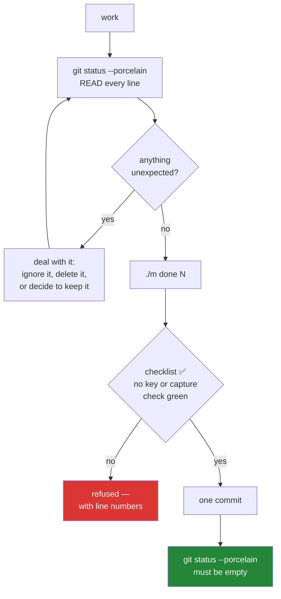

# 5.2 — The first commit, and reading a clean tree

## One-line answer

`git status --porcelain` prints one line per changed file and nothing else, and reading it
**before** you stage is the five seconds that stops a key, a capture or a stray scratch file
becoming permanent.

---

## The story

You are about to post a letter and you check the envelope.

Right address. Stamp on it. And — this is the bit — the *right thing inside it*. You open it
and look, because you printed two documents this morning and they are the same size and the
same colour, and once it goes in the box you cannot get it back.

Most of the time it is the right one. Checking takes five seconds and feels faintly silly.

The reason it is not silly is the asymmetry. If it is right, you lost five seconds. If it is
wrong, you cannot undo it — you have to phone somebody, explain, and hope. **The cost of
checking is small and fixed; the cost of not checking is small most of the time and
occasionally enormous**, and that combination is what makes a habit worth having rather than a
decision worth making each time.

---

## The idea in plain language

`git add -A` stages everything: modified files, new files, deleted files. It is the command
everybody uses because it is one keystroke and almost always right.

"Almost always" is doing real work in that sentence. `git add -A` stages what is *there*,
which includes anything you forgot about: a scratch file, a downloaded capture, a `.env` you
created to test something, an editor's backup. `.gitignore` catches the categories you
anticipated ([2.2](../02-skeleton/2.2-gitignore-before-secrets-exist.md)); it cannot catch the
ones you did not.

So the habit is one command before staging:

```text
git status --porcelain
```

**`--porcelain` is the machine-readable form**: a stable two-character status code, a space,
and a path. One line per file, no headings, no advice, no colour, and — this is the point —
**the format is guaranteed not to change between Git versions**. The human-readable
`git status` is a lovely thing to read and a terrible thing to build a habit on, because it
buries the file list in paragraphs of suggestion. When there are three changes the paragraphs
are fine. When there are sixty they are how a `.pcap` gets past you.

The codes you need, and there are only a few:

| Code | Means |
| --- | --- |
| `??` | untracked — Git has never seen this file |
| `A ` | added, staged |
| ` M` | modified, **not** staged |
| `M ` | modified **and** staged |
| `MM` | staged, then modified again |
| `D ` | deleted, staged |

Two columns, and the position carries the meaning: **the first column is the staging area,
the second is the working directory.** That is the three-area model from
[1.2](../01-toolchain/1.2-git-and-the-shell.md) shown as two characters, and once you read it
that way the codes stop needing memorisation.

The other half of a first commit is the message. This repository fixes the format —
`day NNN: <title> — closes <IDs>` — so 152 commits read as a curriculum rather than as 152
variations on "update". `./m done N` writes it, which means it cannot drift.

---

## Why Jāla needs it

- **P9 — captures and keys are never committed**, and this is the last human moment before a
  mistake becomes permanent. `./m done N` greps the staged set as a backstop
  ([3.3](../03-the-driver/3.3-the-done-gate.md)), but a backstop that fires is still a
  near miss.
- **P2 — one day, one commit.** The commit hash goes into `docs/PROGRESS.md`, so the row and
  the snapshot are the same fact recorded twice.
- **The phase gate reads history** (§25 item 8):
  `git log --all --name-only | grep -E '\.(pcap|pcapng|pem|key)$'` must return nothing, every
  phase. Things you never staged never appear there.
- **Phase 16's gate is a stranger cloning this repository and reproducing every number.** A
  clean tree at every commit is what makes that possible; a repository carrying a stray
  half-finished file at Day 0 carries it at Day 151.

---

## The mechanism

Look before you stage. Every time:

```bash
git status --porcelain
```

**Line by line:**

- `--porcelain` — the stable, parseable format described above. Read every line. On a first
  commit there will be many, and reading them is the deliverable of this part.
- **What you are looking for is not "is this correct" but "is there anything here I did not
  expect".** Those are different questions, and the second one is faster and catches more.

Confirm the two categories that must never appear:

```bash
git status --porcelain | grep -E '\.(pcap|pcapng|pem|key)$' || echo "clean: no captures, no keys"
```

**Line by line:**

- `grep -E` — extended regular expressions, so `|` means alternation.
- `\.` — an escaped literal dot. Unescaped, `.` matches any character, and the pattern would
  match far more than intended.
- `$` — anchor at end of line, so this matches **extensions** rather than any occurrence of
  the text anywhere in a path.
- `|| echo "clean: …"` — `grep` exits non-zero when it finds nothing, which here is the good
  case, so the `||` turns silence into an explicit statement. **Never let "found nothing" and
  "did not run" look the same** — that is [3.1](../03-the-driver/3.1-set-euo-pipefail.md)'s
  lesson and [5.1](5.1-the-check-that-can-go-red.md)'s exit-code-5 problem in one line.

Then let the gate do the rest:

```bash
./m done 0
```

**Line by line:**

- Refuses on an unticked checklist, prints the offending line numbers, refuses on a staged
  capture or key, runs `./m check`, regenerates the trackers, then stages and commits with the
  fixed message ([3.3](../03-the-driver/3.3-the-done-gate.md)). **You do not type
  `git commit` on a normal day** — the gate does, and that is what keeps the message format
  and the checks from being optional.

Afterwards, read what you actually made:

```bash
git log --stat -1
```

**Line by line:**

- `git log` — the history.
- `--stat` — show **which files changed and how much**, as a summary rather than a full diff.
  This is the "check the envelope" moment applied after the fact: on a first commit it is the
  complete inventory of what is now permanent.
- `-1` — just the most recent commit.

And confirm the tree is clean, which is the state every day should end in:

```bash
git status --porcelain | wc -l
```

**Line by line:**

- `wc -l` — count lines. **The answer must be `0`.** A non-zero number after `./m done` means
  something was created by the check itself — a regenerated tracker, a cache — and either it
  belongs in the commit or it belongs in `.gitignore`. A repository that is never quite clean
  trains you to ignore `git status`, which removes the only instrument this part is about.



---

## When it breaks

**The near miss, which is this part working:**

```text
$ git status --porcelain
 M pyproject.toml
?? tests/test_setup.py
?? ping-trace.pcap
```

**What it means.** Three files, and the third should not be there. It is untracked, so
`.gitignore` did not catch it — look again and the reason is visible: the rule covers
`captures/` and `*.pcap`, and this file **is** `*.pcap`, so if it is showing as `??` the
ignore file is not doing what you think. Either the rule has a typo or you are not in the
directory you assume. **This is the five seconds paying for itself**, and the fix is to
correct the rule rather than to delete the file quietly and move on.

**The gate catching what you missed:**

```text
$ ./m done 0
FAIL a capture or a key is staged. Never (P9):
?? ping-trace.pcap
```

The backstop fired. Good — and worth treating as a signal that the primary defence did not
work, rather than as a routine step. A backstop that fires regularly is a backstop that will
eventually be tuned out.

**The commit that goes wrong in the boring way:**

```text
$ git commit -m "day 000: complete"
On branch main
nothing to commit, working tree clean
```

**What it means.** Everything was already committed, or nothing was ever staged. Not an
error — Git is reporting a state. The confusing version is when you *expected* changes: it
usually means you edited files in a different directory, or the files are ignored. `git status
--porcelain` answers both immediately, which is why it is the first command in this part
rather than the last.

**And the silent one, which is why `--porcelain` rather than plain `git status`.** Suppose a
script parses the human-readable output:

```text
$ git status | grep "nothing to commit" && echo "tree is clean"
tree is clean
```

**Nothing failed, and the conclusion may be false.** The phrase "nothing to commit" appears in
Git's human output alongside other text, the wording has changed across versions, and it is
**localised** — on a machine with a non-English locale it does not appear at all, so the
`grep` finds nothing, the `&&` short-circuits, and the script silently skips its own check.
The check did not fail. It did not run. That is the same shape as
[5.1](5.1-the-check-that-can-go-red.md)'s exit code 5 and
[3.2](../03-the-driver/3.2-the-case-dispatcher.md)'s missing `*)` branch — **the absence of a
check produced the same evidence as a passing one** — and it is why `--porcelain` exists and
why `./m` uses it.

---

## In production

**Reviewing your own diff before you push is the cheapest quality control that exists**, and
the debugging statement left in, the commented-out block, the credential pasted into a test
fixture are all caught by the author in thirty seconds or by a reviewer in twenty minutes.
The habit that scales is `git diff --staged` before every commit; on a large change it is the
difference between a review that is about the change and a review that is about the noise
around it.

**Commit hygiene is an operational property.** During an incident, `git log` is read under
pressure by somebody who does not know the code. A history of small, well-described commits
supports `git bisect` and `git blame`; a history of large mixed commits does not, and the
symptom appears at the worst moment. This is the concrete, unsentimental argument for P2 —
`OPS-09` says a postmortem worth reading depends on a history worth searching.

**A repository that is never clean is a repository whose status is never read.** Build
artifacts, editor files, local configuration and generated output that are not ignored produce
permanent noise, and the human response is to stop looking. Then the one line that mattered
scrolls past with the forty that did not. The fix is unglamorous: ignore or commit every
generated file until `git status` is genuinely empty at rest — which is why this project
commits its regenerated trackers rather than leaving them dirty after every check.

**What an operator does differently.** They read the machine-readable output and script
against stable interfaces, never against human-facing text. `--porcelain`, `--json`, `-o
jsonpath` exist because human output is a user interface and user interfaces change. A script
that greps English is a script that breaks on an upgrade or on a colleague's laptop, and it
breaks by silently doing nothing.

**The review comment.** On a pull request containing an unrelated formatting change across
forty files: *"Can you split the reformat out? I can't see the actual change, and if we need
to revert this we'd revert both."*

**The interview question.** *"Walk me through what you do between finishing a change and
opening a pull request."* The answer they are listening for includes reading your own diff.
Candidates who go straight from "it works" to "push" are describing a workflow where the first
person to read the change is a reviewer — and that is where review time goes to waste on
things the author would have caught instantly.

---

## Check yourself

```bash
git status --porcelain | wc -l && git log --oneline | wc -l
```

The first number must be **0** — a clean tree. The second is **how many commits this
repository has**, which after today is 2: the one that was already here, and yours. Those two
numbers together are the definition of a finished day, and both are read off the repository
rather than remembered.

**Answer out loud, without scrolling up:**

> Read the code ` M` and the code `M ` and say what the difference is, in terms of the three
> areas. Then explain why a script should never grep `git status` for the phrase "nothing to
> commit" — and name the two ways that check can silently not run.

---

**This is the last part of Day 0.** Back to the hub: [`LESSON.md`](../../LESSON.md) — then
`./m done 0`.
