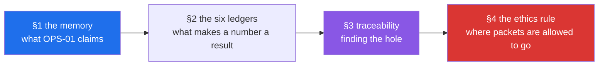

# Day 1 — bootstrap & the map: the repo as Jāla's memory

**Phase 1 · The ground** · Closes **`OPS-01`** — *the repo as the network's memory: ledgers,
ADRs and reproducible topologies.*

> **Yesterday:** one owner for the environment, a repository that refuses a key or a capture,
> a driver that refuses a half-finished day, and an honest answer about the lab.
> **Today:** the six ledgers that make a number quotable, the traceability check that finds a
> hole nothing else would notice, and the rule that governs every packet the next 150 days
> will send.
> **Tomorrow:** what a network actually is, and why it is built in layers — `FOUND-01` and
> `FOUND-02`.

> **Read this hub first**, then work through `parts/` in order. A day is a unit of subject,
> not of hours (P17). The definition of done is the checklist.

---

## §1 Where we are

A washing machine starts making a noise. Somebody in the flat sorts it out — finds a coin
wedged where it should not be, puts it back together. Eight months later it makes the noise
again, and that person has moved out.

Everything about the first repair is gone. Not the result — it worked for eight months — but
everything that would help now: which panel came off, that the noise starts on the spin cycle,
that there is a filter behind the bottom flap most people never open. The next person starts
from the noise, exactly where the first person started.

And for eight months that knowledge existed and was free. It just was not anywhere except in
one head.

That is `OPS-01`, and it is the first concept of the operations curriculum for a reason. A
network nobody wrote down is a network that exists only in the head of whoever built it — and
in this curriculum, that head is yours, 151 days from now, trying to remember what Day 26 did.

So today builds the memory, and it has three parts that are physically different things:

- **The ledgers** — seven append-only files recording what was done, installed, read, built,
  captured and measured. Six of them are the ones a day writes as it finishes; today is where
  you learn what each column is *for*, which is the difference between a number and a result.
- **The traceability check** — 248 concepts, each assigned to exactly one day, and a report
  that compares what the plan assigns against what each day claims. It is the only thing that
  can find a hole, because nothing fails when a topic is simply absent.
- **The rule that comes before every other rule** — traffic you generate stays inside
  namespaces you created. Stated today, on Day 1, because Day 21 causes a broadcast storm and
  Day 104 sits in the middle of a handshake, and a rule introduced on Day 20 arrives after the
  habits have formed.

There is a thread running through all three, and it is worth naming now because it is this
curriculum's whole shape: **the failures here are silent.** A number with no conditions does
not raise an error. A concept nobody taught does not fail a test. A scan of somebody else's
machine produces exactly the output a scan of your own machine produces. None of these announce
themselves — which is why the answer is always a written record made *before* the thing
happens, rather than a check afterwards.



---

## §2 The map

**What the section numbers mean today.** `OPS-01` is one concept with three faces — ledgers,
traceability, and the discipline that makes the record honest — so the sections are those
faces rather than sub-concepts: **1.x** what the claim is and how the files divide, **2.x** one
part per ledger, **3.x** the ID scheme and the check over it, **4.x** the rule that governs
every packet.

### Section 1 — the repo as memory

| Part | What it answers | Level | Tier |
| --- | --- | --- | --- |
| [1.1 The repo as the network's memory](parts/01-repo-as-memory/1.1-the-repo-as-the-networks-memory.md) | What does `OPS-01` actually claim, and what gets forgotten without it? | `foundation` | L0 |
| [1.2 Written by hand, or regenerated](parts/01-repo-as-memory/1.2-written-by-hand-or-regenerated.md) | Which files are history and which are projections — and why editing a projection changes nothing? | `working` | L0 |

### Section 2 — the six ledgers

| Part | What it answers | Level | Tier |
| --- | --- | --- | --- |
| [2.1 `PROGRESS.md`](parts/02-the-six-ledgers/2.1-progress-the-row-that-says-a-day-happened.md) | What is the difference between a day being written and a day being done? | `foundation` | L0 |
| [2.2 `PACKAGES.md`](parts/02-the-six-ledgers/2.2-packages-never-invent-a-version.md) | Why record the date a version was *read* rather than only the version? | `working` | L0 |
| [2.3 `SPECS.md`](parts/02-the-six-ledgers/2.3-specs-read-it-before-you-quote-it.md) | Why can reading an RFC carefully not tell you it has been superseded? | `production` | L2 |
| [2.4 `TOPOLOGIES.md`](parts/02-the-six-ledgers/2.4-topologies-a-script-not-a-sentence.md) | Why is a topology a script rather than a description? | `working` | L0 |
| [2.5 `CAPTURES.md`](parts/02-the-six-ledgers/2.5-captures-the-provenance-never-the-bytes.md) | Why does this repository commit the row and never the capture? | `production` | L0 |
| [2.6 `MEASUREMENTS.md`](parts/02-the-six-ledgers/2.6-measurements-what-turns-a-number-into-a-result.md) | What turns a number into a result, and why is one run not a measurement? | `production` | L0 |

### Section 3 — traceability, and the hole nothing else finds

| Part | What it answers | Level | Tier |
| --- | --- | --- | --- |
| [3.1 The ID scheme, and what "closed" means](parts/03-traceability/3.1-the-id-scheme-and-what-closed-means.md) | What are the three states an ID can be in, and which file decides? | `foundation` | L0 |
| [3.2 `scripts/trace.py`](parts/03-traceability/3.2-scripts-trace-py.md) | Why must the report read two independent sources to be worth anything? | `working` | L0 |
| 💥 [3.3 An open ID in a completed phase is a bug](parts/03-traceability/3.3-an-open-id-is-a-bug.md) | Break the decomposition three ways and watch the check find each one | `production` | L0 |

### Section 4 — 🛑 the rule that comes before every other rule

| Part | What it answers | Level | Tier |
| --- | --- | --- | --- |
| 🛑 [4.1 The rule before every rule](parts/04-the-ethics-rule/4.1-the-rule-before-every-rule.md) | Where are packets allowed to go, and why can no tool check it? | `foundation` | L0 |
| [4.2 Naming your containment](parts/04-the-ethics-rule/4.2-naming-your-containment.md) | Why is `## Topology` both a reproducibility record and a safety artifact? | `working` | L0 |
| 🅿️ [4.3 The line, and the arithmetic](parts/04-the-ethics-rule/4.3-the-line-and-the-arithmetic.md) | What is parked, and what makes reading about it worth anything? | `production` | L3 |

**💥 3.3 is this day's deliberate-failure part** (§24.8) — it injects three real breaks into the
ID decomposition, with the commands printed, rather than describing them (P12). **🛑 4.1** is
the ethics rule. **🅿️ 4.3** is parked material, taught with the arithmetic worked.

---

## §3 Setup — run this

Nothing is installed today. The ledgers are files, and the only new code is
`scripts/trace.py`, which is yours to write.

```bash
# --- section 1: confirm the memory is intact (parts 1.1-1.2) ---
ls docs/ && ls docs/adr/
./m tracker && git status --porcelain docs/ days/INDEX.md   # must be empty

# --- section 2: the six ledgers (parts 2.1-2.6) ---
tail -1 docs/PROGRESS.md
curl -sL https://www.rfc-editor.org/info/rfc793  | grep -i -A2 'obsoleted by'   # part 2.3
curl -sL https://www.rfc-editor.org/info/rfc9293 | grep -ci 'obsoleted by'      # 0 = current

# --- section 3: traceability, and breaking it on purpose (parts 3.1-3.3) ---
./m plan
# then the three injections in part 3.3 — cp the backup FIRST, restore on the same run

# --- section 4: the ethics rule (parts 4.1-4.3) ---
ip netns identify $$ || echo "HOST namespace — nothing hostile belongs here"

# --- closing ---
./m check
./m done 1
```

**No package is installed today**, so `docs/PACKAGES.md` gains no row. Runtime dependencies
are still `[]` — packages arrive on the day they are first used, after the hand-rolled version
exists (P3).

---

## §4 Build brief

One file is yours to write.

**`scripts/trace.py`** — the traceability report. Part
[3.2](parts/03-traceability/3.2-scripts-trace-py.md) gives the comparison and the reasoning;
part [3.1](parts/03-traceability/3.1-the-id-scheme-and-what-closed-means.md) gives the ID
scheme it operates on. It must:

- read the plan's day→ID assignment from `scripts/plan_check.py`;
- read each written day's own `ids:` frontmatter from `days/day-NNN-*/LESSON.md`;
- read which days are complete from `docs/PROGRESS.md` — **not** from the folder existing;
- report **matched**, **mismatched**, **open** and **closed**;
- regenerate `docs/TRACEABILITY.md`;
- exit non-zero on a mismatch, and on an open ID belonging to a completed phase.

```python
def compare(
    assigned: dict[int, list[str]], claimed: dict[int, list[str]], complete: set[int]
) -> dict[str, list[str]]:
    """Compare the plan's assignment against each written day's own frontmatter."""
    report: dict[str, list[str]] = {"open": [], "mismatched": [], "closed": []}
    # TODO(me): for each day the plan assigns IDs to —
    #   if the day is written and its claimed set differs from the assigned set,
    #     record a mismatch naming both sides;
    #   then file each assigned ID under "closed" or "open" depending on whether
    #   the day appears in docs/PROGRESS.md.
    raise NotImplementedError
```

And a test, in `tests/test_trace.py`, that can go RED:

```python
def test_open_id_in_completed_phase_is_a_bug() -> None:
    """§25 item 2 — an open ID from a completed phase must fail the check."""
    # TODO(me): build assigned/claimed/complete dicts by hand — no filesystem —
    # with one ID assigned to a day that is NOT in `complete`, and assert the
    # report puts it under "open".
    raise NotImplementedError
```

Three notes on the shape, with the reasoning in the parts rather than here: the inputs are
plain data so the function is testable without touching the disk (plan §5); `complete` is a
**separate** input from `claimed` because written and closed are different states — see
[3.1](parts/03-traceability/3.1-the-id-scheme-and-what-closed-means.md); and
`NotImplementedError` is the honest starting state, red because it is unwritten rather than
because something is broken.

---

## §5 The check that must be able to fail

Two checks today, and you watch both go red on purpose.

**The traceability test** starts red with `NotImplementedError`:

```bash
uv run python -m pytest tests/test_trace.py -v
```

**The decomposition check** is the day's 💥 part
([3.3](parts/03-traceability/3.3-an-open-id-is-a-bug.md)), and you break it three ways —
a hole, a duplicate, and a transposed digit — restoring on the same run each time. **What RED
looks like today** is a `PROBLEM:` line from `./m plan` naming the exact IDs, and on the third
injection it is **two** lines that are one bug:

```text
PROBLEM: IDs used but never declared: ['FOUND-21']
PROBLEM: IDs declared but never closed: ['FOUND-12']
```

Then confirm the restore: `./m plan` must end `OK - every declared ID is closed exactly once.`
**Run that.** A restore you did not verify is a restore you are assuming.

---

## §6 Lab budget

| | |
| --- | --- |
| **Tier** | **L0** overall, with one **L2** part (2.3, reading RFC info pages) and one **L3** part (4.3, parked) |
| **Topology** | none. The first is `two-host`, on Day 9 (`FOUND-14`). |
| **Namespaces** | 0 |
| **Links** | 0 |
| **netem** | none |
| **Traffic generated** | none. Part 2.3 fetches published documents from `rfc-editor.org` and `datatracker.ietf.org` — read-only and gently, a handful of requests at human speed (§4.2 rule 2). Nothing is scanned, probed or swept. |
| **Cost** | $0 |

`./m lab` still reports no namespaces on this machine
([Day 0, 4.1](../day-000-toolchain-skeleton-driver/parts/04-the-linux-door/4.1-namespaces-need-linux.md)),
and nothing today needs them.

---

## §7 Traps

- **Editing a generated file.** `docs/TRACKER.md`, `docs/CURRICULUM_INDEX.md`,
  `docs/TRACEABILITY.md` and `days/INDEX.md` are projections. Editing one changes nothing
  except how long the discrepancy stays hidden —
  [1.2](parts/01-repo-as-memory/1.2-written-by-hand-or-regenerated.md).
- **`>` instead of `>>` on a ledger.** One character, and the entire history is gone —
  [1.2](parts/01-repo-as-memory/1.2-written-by-hand-or-regenerated.md).
- **Citing RFC 793 for TCP.** It was obsoleted by RFC 9293 in 2022, and the section numbering
  differs. Checked live on 2026-09-07 —
  [2.3](parts/02-the-six-ledgers/2.3-specs-read-it-before-you-quote-it.md).
- **Fetching `rfc793.txt` to check whether it is current.** The document cannot say it has been
  superseded; it was frozen before its replacement existed. Only the info page knows —
  [2.3](parts/02-the-six-ledgers/2.3-specs-read-it-before-you-quote-it.md).
- **Forgetting `-L` on the info-page check.** Without it you fetch a redirect page and `grep`
  finds nothing — which reads as "not obsoleted". **The absence of a warning and the absence of
  a fetch look identical** — [2.3](parts/02-the-six-ledgers/2.3-specs-read-it-before-you-quote-it.md).
- **A number with no conditions.** 🅢 **Silent Failure #4 — *averaged away***. One run reported
  as a figure hides the variance and the outliers, and in networking the outliers are usually
  the finding. Five seeds minimum, warm-up discarded, p50/p95/p99 **with the spread**, never the
  best run — [2.6](parts/02-the-six-ledgers/2.6-measurements-what-turns-a-number-into-a-result.md).
- **Benchmarking a resolver without flushing.** 🅢 **Silent Failure #1 — *the cache answered,
  not the network***. The second `dig` never leaves the machine —
  [2.6](parts/02-the-six-ledgers/2.6-measurements-what-turns-a-number-into-a-result.md).
- **Breaking `plan_check.py` without copying it first.** It is the file every other check
  depends on. `cp` before `sed`, restore on the same run —
  [3.3](parts/03-traceability/3.3-an-open-id-is-a-bug.md).
- **Believing a green traceability report means a concept was taught.** It means an identifier
  matches an identifier. Nothing in this repository can read —
  [3.3](parts/03-traceability/3.3-an-open-id-is-a-bug.md).
- **🛑 Running anything that generates traffic without `ip netns exec`.** The output is
  identical either way, and there is no error to catch it —
  [4.1](parts/04-the-ethics-rule/4.1-the-rule-before-every-rule.md).

---

## §8 Verify before you code

This day was written **2026-09-07**. Every status below was resolved live on that date against
`https://www.rfc-editor.org/info/rfcNNNN` (P7).

| Document | Checked | Status found |
| --- | --- | --- |
| RFC 793 (TCP, 1981) | 2026-09-07 | **Obsoleted by RFC 9293** |
| RFC 9293 — *Transmission Control Protocol (TCP)* | 2026-09-07 | current, no "Obsoleted by" line |
| RFC 8312 (CUBIC) | 2026-09-07 | **Obsoleted by RFC 9438** |
| RFC 9438 | 2026-09-07 | current |
| RFC 7230 (HTTP/1.1) | 2026-09-07 | **Obsoleted by RFC 9110** |
| RFC 9110 — *HTTP Semantics* / RFC 9112 | 2026-09-07 | current |
| RFC 826 (ARP, 1982) | 2026-09-07 | current |

Also checked: <https://datatracker.ietf.org/api/v1/doc/document/rfc9293/?format=json> returns
document metadata as JSON, so a status check need not scrape HTML.

**These rows go into [`../../docs/SPECS.md`](../../docs/SPECS.md) as *resolved, not yet
quoted*.** None of them is quoted for a field offset today — that begins with the Ethernet
frame on Day 18 — and recording the status now is what §25's freshness check will be measured
against later.

---

## §9 Say it in an interview

> "The repository is the network's memory, and it's split into seven append-only ledgers and
> three generated projections that are never hand-edited. The one people underestimate is the
> measurements ledger: every number carries its topology, netem settings, seed, repetition
> count, hardware and spread, because a throughput figure without those isn't a weak result,
> it's not a result. Negative results get a row too — an optimisation that made things worse
> says so, in the same words it would have used if it had won. There's a traceability check
> comparing what the plan assigns against what each day's frontmatter claims, read from
> independent sources, because a report generated from one source always agrees with itself
> and therefore never finds anything. I broke the ID decomposition three ways on purpose to
> watch it fail — a hole, a duplicate and a transposed digit — because a check I've only seen
> pass is a fire door with an initialled card and a broken closer."

---

## §10 Done when

Every box in [`CHECKLIST.md`](CHECKLIST.md) is ticked and `./m check` is green — including
`./m trace`, which stops warning once `scripts/trace.py` exists. Then:

```bash
./m done 1
```

Day 2 opens the subject itself: what a network is, and why it is built in layers —
`FOUND-01` and `FOUND-02`.

---

## §11 Ledger & commit

**`docs/PROGRESS.md`** — append this row verbatim:

```text
| 1 | Bootstrap & the map — the repo as Jāla's memory | `OPS-01` | 14 | check green · depth green · plan green · trace green | 2026-09-07 | `<hash>` |
```

**`docs/SPECS.md`** — the rows resolved today. Status checked live; **none is quoted for a
field offset yet**:

```text
| RFC 9293 | Transmission Control Protocol (TCP) | Internet Standard | obsoletes RFC 793; **not obsoleted** | status only | 2026-09-07 | 1 |
| RFC 9438 | CUBIC for Fast and Long-Distance Networks | Proposed Standard | obsoletes RFC 8312; **not obsoleted** | status only | 2026-09-07 | 1 |
| RFC 9110 | HTTP Semantics | Internet Standard | obsoletes RFC 7230; **not obsoleted** | status only | 2026-09-07 | 1 |
| RFC 9112 | HTTP/1.1 | Internet Standard | with RFC 9110, replaces RFC 7230; **not obsoleted** | status only | 2026-09-07 | 1 |
| RFC 826 | An Ethernet Address Resolution Protocol | Internet Standard | **not obsoleted** | status only | 2026-09-07 | 1 |
```

**`docs/PACKAGES.md`** — no rows. Nothing was installed today.

**`docs/TOPOLOGIES.md`** — no rows. No topology exists; the first is `two-host` on Day 9.

**`docs/CAPTURES.md`** — no rows. No capture was taken.

**`docs/MEASUREMENTS.md`** — no rows. Day 1 makes no empirical claim and does not invent one so
the table looks started (P8, P10).

**`docs/CHANGELOG_PLAN.md`** — no new amendments. **A-001** and **A-002**, raised on Day 0,
remain open and still need ADRs.

**The commit** — written by `./m done 1`:

```text
day 001: Bootstrap & the map — the repo as Jāla's memory — closes OPS-01
```
