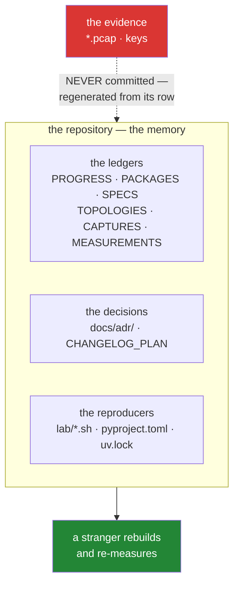

# 1.1 — The repo as the network's memory

## One-line answer

A network nobody wrote down is a network that exists only in the head of whoever built it —
so this repository keeps the ledgers, the decisions and the scripts that let a stranger
rebuild and re-measure everything in it, and that is what `OPS-01` means.

---

## The story

A washing machine starts making a noise. Somebody in the flat sorts it out — takes the panel
off, finds a coin wedged where it should not be, puts it back together. Fixed.

Eight months later it makes the noise again. That person has moved out.

Everything about the first repair is gone. Not the *result* — the machine worked for eight
months, so clearly something was done — but everything that would help now: which panel came
off, that the noise starts at the spin cycle rather than the wash, that there is a filter
behind the bottom flap most people never open. The next person starts from the noise, exactly
where the first person started, and spends the same afternoon.

And here is the part that stings. The first person *knew*. For eight months, the knowledge
existed and was free. It just was not anywhere except in one head, and heads leave.

A note taped inside the door saying "noise on spin = check the filter behind the bottom flap,
usually a coin" would have cost thirty seconds and saved the whole afternoon. It is not
sophisticated. It is just written down.

---

## The idea in plain language

`OPS-01` is the first concept of the operations curriculum, and it says: **the repository is
the network's memory.**

That sounds like a slogan, so here is what it actually claims. Three kinds of thing get
forgotten, and each has a specific cost when it goes:

**What was done, and when.** Six weeks later, "did we ever get the fragmentation day
working?" is either answerable in three seconds or it is an afternoon of re-reading. The
progress ledger answers it.

**Why it was done that way.** This is the expensive one. Every design carries decisions that
looked obvious at the time and look arbitrary later — an address plan, a timer value, a choice
of protocol. Without the reasoning, the next person either preserves it superstitiously
(nobody knows why, so nobody touches it) or removes it and rediscovers the original problem.
An **architecture decision record** — an ADR — is a short document saying what was decided,
what the alternatives were, and what made this one win.

**How to rebuild it and re-measure it.** A topology you built by typing fourteen commands is
one you cannot rebuild. A number you measured once, without recording the conditions, is one
you cannot defend. Both become anecdotes the moment the terminal window closes.

So the repository holds three kinds of memory, and they are physically different things:

| Kind | Where it lives | What it answers |
| --- | --- | --- |
| **the ledgers** | `docs/PROGRESS.md` and six others | what was done, installed, read, built, captured, measured |
| **the decisions** | `docs/adr/`, `docs/CHANGELOG_PLAN.md` | *why* it is like this, and what else was considered |
| **the reproducers** | `lab/*.sh`, `pyproject.toml`, `uv.lock` | how to build it again and get the same answer |

And there is a fourth thing that is not on that list on purpose, because it is the point of
the whole curriculum's ethics: **the evidence is not in the repository.** A packet capture is
regenerated from its provenance row, never committed. That is `2.5`'s subject, and it is the
one place where "write everything down" is deliberately not the rule.

The sentence that makes this concrete, and it is the standard the rest of Day 1 is measured
against:

> **A stranger clones this repository, rebuilds the lab, and reproduces every headline
> number.**

That is Phase 16's gate — the last phase, Day 148 onward. It is written down now, on Day 1,
because a repository that can pass it on Day 151 is one that has been passing it all along. It
is not something you add at the end.

---

## Why Jāla needs it

- **This is Day 1's only curriculum ID.** `OPS-01` closes here, and the six ledgers and
  `scripts/trace.py` in the rest of this day are what closing it consists of.
- **P9 — a measurement without a topology, a seed, a repetition count and a hardware line did
  not happen.** That principle is unenforceable without somewhere for those to live.
- **P14 — if reality changes, the plan is amended first.** Day 0 already raised two amendments
  ([`docs/CHANGELOG_PLAN.md`](../../../../docs/CHANGELOG_PLAN.md)) rather than quietly coding
  around them. That file only works if writing to it is a habit from the start.
- **152 days is long enough that Day 26 is genuinely forgotten by Day 124** (§24.9). The
  repository is what you consult instead of your memory, and the memory you are compensating
  for is your own.

---

## The mechanism

Look at what the memory currently consists of:

```bash
ls docs/ && echo "--- decisions ---" && ls docs/adr/
```

**Line by line:**

- `ls docs/` — the ledgers plus the plan. Seven files are written by hand and append-only;
  three are regenerated and must never be hand-edited, which is
  [1.2](1.2-written-by-hand-or-regenerated.md)'s whole subject.
- `ls docs/adr/` — the decision records. Right now there is only a template, and that is the
  honest state: Day 0 raised two amendments but neither has been decided yet.

Read the memory's current summary:

```bash
./m status
```

**Line by line:**

- `./m status` — one line: the last completed day, how many are complete, how many are
  written. It is computed from `docs/PROGRESS.md` and from what is on disk, so it cannot
  disagree with reality — which is exactly the property a memory needs. A status you type by
  hand is a status that drifts.

And the check that the memory is honest about itself:

```bash
./m tracker && git status --porcelain docs/ days/INDEX.md
```

**Line by line:**

- `./m tracker` — regenerate `docs/TRACKER.md`, `docs/CURRICULUM_INDEX.md` and
  `days/INDEX.md` from the day map and from what is actually on disk.
- `git status --porcelain docs/ days/INDEX.md` — did regenerating them **change** anything?
  If it did, the committed versions were stale, which means somebody read a projection that
  no longer matched its source. **A generated file that has drifted is worse than no generated
  file**, because it is confidently wrong, and this two-command pair is how you find out.



---

## When it breaks

**The commonest failure, and it produces no error at all.** You read a number from your own
notes six weeks later:

```text
throughput: 94 Mbit/s
```

**What it says:** a throughput.
**What it means:** almost nothing. Over which topology? With what delay and loss configured?
One run or five? Which seed? On what hardware? Warm cache or cold? Without those, the number
cannot be compared with the next number you measure, cannot be defended if somebody
disagrees, and cannot be reproduced by anyone including you. **It is not a weak result. It is
not a result** — and P8 is blunt about it: a number recalled is a rumour.

**The decision that gets reverted because nobody wrote down why:**

```text
$ git log --oneline -1 -- lab/two-host.sh
a3f91c2 simplify: drop the MTU line, seems unnecessary
```

**What it means.** Somebody removed a line whose purpose was not recorded, and the commit
message says "seems unnecessary" — which is an honest statement of what they knew. Two weeks
later a transfer hangs for large payloads and nobody connects the two. The original decision
was correct and undocumented, and undocumented is functionally the same as absent. This is
what an ADR prevents, and it is why the template asks for **alternatives considered**: a
decision with no recorded alternatives is one nobody can safely revisit.

**And the silent one, which this curriculum is unusually exposed to.** A generated file that
was edited by hand:

```text
$ ./m tracker
wrote docs/TRACKER.md, docs/CURRICULUM_INDEX.md
$ git diff --stat docs/TRACKER.md
 docs/TRACKER.md | 14 +++++-------
```

**Nothing failed.** But fourteen lines changed on a regeneration, which means the committed
version said something the sources do not. Somebody edited a projection — probably to fix
something that looked wrong — and for however long it sat there, anybody reading it got an
answer that no source supports. **A projection that disagrees with its source is the same
shape as Silent Failure #1**: something answered, and it was not the thing you thought you
were asking. The defence is that regenerating is part of `./m done`, so drift lasts at most
one day.

---

## In production

**"The repo is the memory" is how real infrastructure teams work**, and it has a name:
infrastructure as code. The network's actual configuration lives in version control, changes
go through review, and the running system is reconciled against the committed state. The
alternative — a device configured by hand at some point by somebody who has since left — is
the washing machine, and every organisation that has run networks for a decade has a device
nobody dares touch.

**ADRs solve a specific, recurring failure.** Six months on, a design constraint looks like an
arbitrary choice, and the two available responses are both bad: cargo-cult it, or remove it
and rediscover the problem in production. A one-page record saying *"we chose this because the
alternative had this failure; here is the measurement"* converts an inheritance into a
decision the next person can actually make. The format matters far less than the existence.

**Runbooks are the memory in its most operational form.** `OPS-12` is the day this becomes a
deliverable: a document that lets somebody who did not build the system diagnose it at three
in the morning. The test of a runbook is not whether it is comprehensive — it is whether a
stranger can follow it under pressure, which is why Phase 16's gate is phrased around a
stranger rather than around completeness.

**What an operator does differently.** They write the note *while* they are inside the
machine, not afterwards. Documentation written later is documentation that omits exactly the
detail that was obvious in the moment and impossible to recover — which flap, which panel,
which of the four cables. The professional habit is to keep the ledger open while working, and
this is why every day in this plan ends with its ledger rows pasted verbatim rather than
summarised.

**The review comment.** On a pull request changing a timer value:
*"What made 3 seconds the right number? If it was measured, let's get the topology and the
seed in `MEASUREMENTS.md`; if it was a judgement call, an ADR — otherwise the next person has
to redo the reasoning to touch this line."*

**The interview question.** *"You've joined a team and inherited a network nobody documented.
Where do you start?"* The answer that shows experience does not start with a diagram tool. It
starts with what is *reproducible*: what is in version control, what can be rebuilt from it,
and what exists only on a running box. That third category is the risk register, and naming it
is the first useful piece of work — because it is the part that disappears when a machine
does.

---

## Check yourself

```bash
ls docs/*.md | wc -l && ./m status
```

The first number is **how many documents currently make up this repository's memory**. The
second line says where that memory thinks you are. Both are read off the disk rather than
recalled, which is the entire habit this part is about.

**Answer out loud, without scrolling up:**

> Name the three kinds of memory this repository keeps and give an example of each. Then say
> which single category of file is deliberately **not** kept — and explain why writing down
> how to regenerate it is better than keeping it.

---

**Next:** [1.2 — Written by hand, or regenerated](1.2-written-by-hand-or-regenerated.md)
