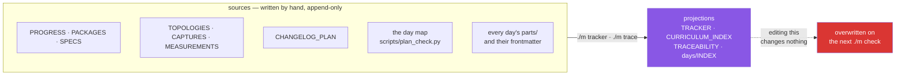

# 1.2 — Written by hand, or regenerated — and never confusing the two

## One-line answer

Seven files in `docs/` are append-only history written by the day that made them, and three
are projections regenerated from those seven — editing one of the three only means the next
`./m check` silently overwrites you.

---

## The story

A shop with a stock book and a whiteboard.

The stock book is written in as things arrive: date, what came, how many, who signed for it.
Nobody rubs anything out. If a delivery was wrong, you write another line saying so — the
mistake stays, and the correction sits under it, and that is how you can still work out what
happened in March.

The whiteboard by the door says what is low and needs ordering. Somebody copies it off the
stock book each morning, and it is genuinely useful — you can see at a glance what to do
today without reading forty pages.

Then one morning somebody notices the whiteboard says twelve boxes of something and there are
clearly only three. So they rub out the twelve and write three.

They have fixed nothing. The stock book still says twelve, so tomorrow's copy will say twelve
again. And for the rest of today, the board and the book disagree, and anybody who trusts the
board is working from a number that no record supports. The correct move — write a line in the
book — takes the same amount of effort and is the only one that lasts.

**The whiteboard was never the record. It was a view of the record**, and the moment you edit
a view you have created a second, unsupported truth.

---

## The idea in plain language

This repository has both kinds of file, and telling them apart is the whole of this part.

**Seven are written by hand and append-only.** They are the stock book. A day writes its rows
as it finishes, and rows are never removed or rewritten — a mistake is corrected by a later
row, so the history of what you believed is preserved alongside what turned out to be true.

| File | What each row records |
| --- | --- |
| `PROGRESS.md` | one completed day. **The last row is where we are.** |
| `PACKAGES.md` | every install: package or tool, version, and the date it was **read live** |
| `SPECS.md` | every specification, **before** it is quoted, with its obsoleted-by status |
| `TOPOLOGIES.md` | every lab topology, and the committed script that rebuilds it |
| `CAPTURES.md` | every capture's provenance — never the capture |
| `MEASUREMENTS.md` | every number, with topology, netem, seed, repetitions, hardware, spread |
| `CHANGELOG_PLAN.md` | every amendment to the plan (P14) |

**Three are regenerated and must never be hand-edited.** They are the whiteboard.

| File | Generated by | From |
| --- | --- | --- |
| `docs/TRACKER.md` | `./m tracker` | the day map + what is on disk |
| `docs/CURRICULUM_INDEX.md` | `./m tracker` | the day map |
| `docs/TRACEABILITY.md` | `./m trace` | every day hub, checked against §23 |
| `days/INDEX.md` | `./m tracker` | every part's own frontmatter |

Now the property that makes the second group safe to rely on, and it is worth stating
carefully because it is easy to get backwards:

> **Every line in a projection is *copied* from a source. Nothing in one is written
> independently of the file it came from.**

That is why a projection may stand in for reading its source — it cannot invent a requirement
the source does not contain. `./m brief N` is the same idea applied to the plan: rather than
opening a 120 KB document to find two rows, it prints those two rows verbatim with their
source path.

And the limit on that, which matters more than the permission:

> **A projection may replace a *lookup*. It may never replace a *judgement*.**

Plan §24 is the depth contract, §6 is the five silent failures, §4.2 is the ethics rule. Those
are prose that decides whether a day is good enough, and they are read in full every time. If
you are ever choosing between loading fewer tokens and reading the depth contract, read the
depth contract.

**Why append-only rather than editable?** Because the thing you want six weeks later is often
what you *believed* at the time, not only what was true. A measurement that was later shown to
be contaminated by a warm cache is more useful with both rows than with the wrong one deleted
— the second row is the finding. P10 says fail honestly, and an editable ledger is an
invitation to tidy away the failures, which are the interesting part.

---

## Why Jāla needs it

- **`OPS-01` is *ledgers*, ADRs and reproducible topologies**, and a ledger you can edit is not
  a ledger. This distinction is what makes the other twelve parts of today mean anything.
- **P10 — fail honestly.** *"An optimisation that made throughput worse says so."* That row
  survives only if rows are not rewritten.
- **`./m done N` regenerates the projections before committing**, so drift lasts at most one
  day. That only works if nobody has hand-edited one in the meantime.
- **Phase 16's gate is a stranger reproducing every headline number.** They will read
  `MEASUREMENTS.md`. If a row was tidied, they will reproduce something that does not match,
  and the repository will have lied to them without anyone intending it.

---

## The mechanism

Regenerate the projections and ask whether anything moved:

```bash
./m tracker && git diff --stat docs/TRACKER.md docs/CURRICULUM_INDEX.md days/INDEX.md
```

**Line by line:**

- `./m tracker` — runs `scripts/tracker.py` and `scripts/parts_index.py`. **Both together**,
  always: they are projections of the same tree, and letting one be refreshed without the
  other is how a generated file starts lying.
- `git diff --stat <files>` — how many lines changed in each. **The answer should be zero
  lines** on a clean repository. Any change means the committed version disagreed with its
  sources, which is exactly the whiteboard-versus-book failure.

Prove a projection really is copied rather than composed:

```bash
grep -n 'OPS-01' docs/CURRICULUM_INDEX.md && grep -rn 'OPS-01' scripts/plan_check.py | head -3
```

**Line by line:**

- The first `grep` finds the row in the generated index. The second finds where that text
  actually lives — in the day map, which is the source. **Reading the same string in both
  places is the demonstration**: the index did not describe `OPS-01`, it copied it.
- `head -3` — trim, because the ID appears in both the curriculum list and the day
  assignment.

The header every projection carries, so nobody has to remember which kind a file is:

```text
> **Do not edit this file by hand.** It is regenerated by `./m tracker` from the day map in
> `scripts/plan_check.py` and from what is actually on disk under `days/`. Every cell is
> copied; nothing here is written independently of its source.
```

That paragraph is written by the generator itself, which means it cannot fall out of date and
cannot be removed by editing the file — the next regeneration puts it back. **A warning that
is regenerated along with the thing it warns about** is the only kind that survives.

And the append-only half, in the shape every day uses:

```bash
cat >> docs/PACKAGES.md <<'EOF'
| `scapy` | `==2.7.0` | 2026-10-14 | 18 | compare the hand-built Ethernet frame against a library (P3) |
EOF
```

**Line by line:**

- `>>` — **append**, not `>`. A single `>` truncates the file and rewrites it from empty, and
  on a ledger that is the whole history gone. The two characters are the difference between
  adding a row and losing every previous one.
- The heredoc is quoted (`<<'EOF'`) so `$` and backticks inside stay literal — the row
  contains backticks around the package name, and an unquoted heredoc would try to run them
  as a command.
- The row itself carries **the date the version was read live**, not the date it was written.
  That distinction is P6's, and [2.2](../02-the-six-ledgers/2.2-packages-never-invent-a-version.md)
  is about why.



---

## When it breaks

**Editing a projection, which fails by producing no error whatsoever:**

```text
$ ./m tracker
wrote docs/TRACKER.md, docs/CURRICULUM_INDEX.md
last completed: day 0 (day-000-toolchain-skeleton-driver) · 1/152 complete · 2 written
wrote days/INDEX.md (32 parts)

$ git diff --stat docs/TRACKER.md
 docs/TRACKER.md | 6 +++---
```

**What it means.** Six lines changed on a regeneration, so the committed version said
something the sources do not. Your edit is gone, and — worse — for however long it sat there,
anybody reading `TRACKER.md` got a number that no source supports. There is no error to catch
this; the only signal is the diff, which is why `./m done` regenerates before committing.

**Truncating a ledger with one wrong character:**

```text
$ cat > docs/MEASUREMENTS.md <<'EOF'
| M-014 | 72 | two-host | delay 40ms 5ms | 7 | 5 | iperf3 3.16 | … |
EOF
$ wc -l docs/MEASUREMENTS.md
1 docs/MEASUREMENTS.md
```

**What it means.** `>` instead of `>>`. The file is now one line long and every previous
measurement is gone. Recoverable from Git if it was committed — `git checkout HEAD -- <file>`
— and gone if it was not. This is the practical argument for committing every day rather than
at the end of the week.

**And the silent one, which is this repository's specific exposure.** A hand-edited projection
that happens to look plausible:

```text
$ grep 'TRANS-17' docs/CURRICULUM_INDEX.md
| `TRANS-17` | Nagle's algorithm and delayed ACK | Day 64 | yes |
```

**Nothing failed, and the row may be wrong.** If somebody edited this file to correct a day
number they believed was mistaken, the index now says 64 while the day map says something
else — and the index is the file people actually read, because it is the convenient one. The
projection has become an independent claim, which is precisely what the "every cell is copied"
property was supposed to guarantee it could never be. **The check that catches it** is the
first command in this part: regenerate, then diff. A projection that changes when regenerated
was not a projection.

---

## In production

**Generated artifacts are checked in or not — and both are defensible, but the failure mode of
"checked in and hand-edited" is the worst of the three.** Committing them means a reader gets
them without running a tool, at the cost of needing regeneration to be part of the workflow.
Not committing them means they cannot drift, at the cost of needing the tool. Committing them
*and* letting people edit them means the repository contains two contradictory answers with no
indication which is which.

**The defence in real projects is CI, not discipline.** A pipeline step that regenerates and
fails if anything changed makes drift a build failure rather than a discovery. It is three
lines and it converts an entire class of "the docs are wrong" into an immediate, attributable
error. This repository does it in `./m done`; a team would do it on every pull request.

**Append-only is a strong pattern well beyond documentation.** Event logs, audit trails,
double-entry bookkeeping and Git itself all work this way, for the same reason: the
*sequence* of what was believed is information you cannot reconstruct from the final state. A
correction that overwrites the mistake destroys the evidence of the mistake, and in an
incident the mistake is the thing you are looking for.

**What an operator does differently.** They check the provenance of a number before acting on
it. "Which system produced this, from what, and when?" is the first question about a dashboard
figure, and a figure that cannot answer it is treated as a hint rather than as data. That is
the same reflex as reading pytest's platform line, and the same reflex as `ss -i` over a
remembered default — **prefer output that names its own conditions.**

**The review comment.** On a pull request whose diff includes a change to a generated file:
*"`TRACKER.md` is generated — this edit will be reverted by the next run. If the number is
wrong, the bug is in the source or in the generator; which is it?"*

**The interview question.** *"Should generated files be committed?"* There is no single right
answer, and saying so is the strong response. What the question is actually testing is whether
you can name the trade-off — reader convenience against drift — and whether you know the
mitigation, which is a CI check that regeneration produces no diff. A candidate who has been
bitten by a stale generated file answers this in one sentence.

---

## Check yourself

```bash
./m tracker >/dev/null && git status --porcelain docs/ days/INDEX.md | wc -l
```

That number must be **0**. It is how many generated files disagreed with their sources — and
zero is the only acceptable answer, because any other number means somebody has been reading a
whiteboard that nobody has copied from the book.

**Answer out loud, without scrolling up:**

> Name the seven append-only ledgers and the three projections, and say which command
> regenerates each projection. Then explain the difference between a projection replacing a
> *lookup* and a projection replacing a *judgement* — and name the three sections of the plan
> that are never projected.

---

**Next:** [2.1 — `PROGRESS.md`, the row that says a day happened](../02-the-six-ledgers/2.1-progress-the-row-that-says-a-day-happened.md)
