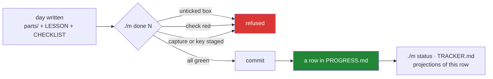

# 2.1 — `PROGRESS.md`, the row that says a day happened

## One-line answer

One row per completed day, appended by `./m done N` after the checklist is ticked and the
checks are green — and **the last row is where we are**, which is a fact the repository holds
rather than one you remember.

---

## The story

You are reading a long book over several months, and you keep losing your place.

You try remembering the page number. That works until the evening you are tired, and then you
are somewhere in a twenty-page range, re-reading things that feel half-familiar — which is
worse than re-reading things that feel new, because you skim them and take nothing in.

A bookmark solves it completely, and the reason it solves it is not that it is clever. It is
that **the bookmark is in the book**. It cannot get separated from the thing it refers to. You
do not have to trust your memory of it, you do not have to write it down somewhere else, and
when you open the book the answer is simply there.

The second thing a bookmark does is quieter and more useful. It settles arguments with
yourself. "I think I got to the part where…" is a negotiation; a bookmark is not.

---

## The idea in plain language

`docs/PROGRESS.md` is the bookmark, and it holds one row per **completed** day:

```text
| Day | Title | IDs closed | Parts | Gates | Date | Commit |
```

Seven columns, each of which answers a question somebody actually asks:

- **Day** and **Title** — what was covered.
- **IDs closed** — which curriculum concepts this day is responsible for. Day 0 has `—`
  because it closes none; Day 1 has `OPS-01`. This column is what makes
  [3.1](../03-traceability/3.1-the-id-scheme-and-what-closed-means.md)'s traceability check
  possible.
- **Parts** — how many part documents. **This is the thin-day detector**: a day claiming to
  cover TCP's state machine in three parts is visible from the table alone (§24.10).
- **Gates** — which checks were green.
- **Date** and **Commit** — when, and the exact snapshot. The hash is what lets you go and
  look.

Three properties matter more than the columns.

**It is append-only.** Rows are added; nothing is rewritten. If a day turns out to have been
wrong, a later row says so. That is P10 — fail honestly — applied to the ledger itself, and it
is why a row is not a status you update but an event you record.

**The last row is authoritative.** Not the tracker, not your memory, not what the day folders
on disk suggest. Written days and completed days are different things: a day can be fully
written and not done, because `./m done N` refuses until the checklist is ticked. Right now
Day 1 is written and not complete, and the ledger says so by not having a row for it.

**Nothing writes to it except finishing a day.** `./m done N` appends after the gate passes
([Day 0, 3.3](../../../day-000-toolchain-skeleton-driver/parts/03-the-driver/3.3-the-done-gate.md)).
So a row is *evidence that the gate ran*, not a claim that somebody typed. That is the whole
reason the ledger is trustworthy, and it is also exactly why the gate's limitation matters: it
can tell that the boxes are ticked, and not whether they are true.

And one mechanical consequence that surprises people: **`/day-jala N` refuses to generate day
N unless the last row is day N−1.** The ledger is not only a record, it is an input. Skipping
a day is prevented by the file rather than by intention.

---

## Why Jāla needs it

- **P2 — one day, one commit.** The `Commit` column is the join between the ledger and the
  history, so a row can always be turned back into the exact state of the repository.
- **`scripts/tracker.py` reads this file to decide what counts as complete.** `./m status`
  and `docs/TRACKER.md` are both projections of it
  ([1.2](../01-repo-as-memory/1.2-written-by-hand-or-regenerated.md)), so the ledger is the
  source and everything else is a view.
- **Phase gates require every day in the phase to have its row with gates green** (§25 item
  1). A phase cannot be declared finished from memory.
- **P19 — the day count is derived.** If a day splits, the plan is amended and the ledger
  shows both halves. The count moves, and the record of it moving is here and in
  `CHANGELOG_PLAN.md`.

---

## The mechanism

Read where you are, which is the file's main job:

```bash
tail -1 docs/PROGRESS.md
```

**Line by line:**

- `tail -1` — the last line. **That is the answer to "where am I?"** — not a computed summary,
  not a scan of the day folders, just the last row of an append-only file. The simplicity is
  the point: a mechanism with one moving part has one way to be wrong.

The row Day 0 appended, and the shape every day follows:

```text
| 0 | Toolchain, skeleton and the `./m` driver | — | 18 | check green · depth green · plan green · no key or capture in git | 2026-09-07 | `<hash>` |
```

Reading it column by column: day 0, its title, **no IDs closed** (Day 0 is the Foundry and
closes none), 18 parts, the four gates that were green, the date, and the commit hash.

Appending is one command, and the `>>` is load-bearing:

```bash
cat >> docs/PROGRESS.md <<'EOF'
| 1 | Bootstrap & the map — the repo as Jāla's memory | `OPS-01` | 14 | check green · depth green · trace green | 2026-09-07 | `<hash>` |
EOF
```

**Line by line:**

- `>>` — **append.** A single `>` truncates the file to empty and writes one line, taking
  every previous day with it
  ([1.2](../01-repo-as-memory/1.2-written-by-hand-or-regenerated.md)).
- `<<'EOF'` — quoted heredoc, so the backticks around `OPS-01` stay literal instead of the
  shell trying to execute them as a command.
- The `Parts` column is a real count, not an estimate. `./m depth` prints it, and
  `docs/TRACKER.md` shows it per day so a thin day is visible in the progress table.

How the tracker reads it — and why the parser is deliberately dull:

```python
def completed_days(text: str) -> set[int]:
    """Day numbers with a row in the append-only progress ledger (§26)."""
    out: set[int] = set()
    for line in text.splitlines():
        m = re.match(r"^\|\s*(\d{1,3})\s*\|", line)
        if m:
            out.add(int(m.group(1)))
    return out
```

**Line by line:**

- `re.match(r"^\|\s*(\d{1,3})\s*\|", line)` — a row is a line starting with a pipe, then
  optional space, then **one to three digits**, then another pipe. Anchored with `^` so prose
  elsewhere in the file cannot masquerade as a row.
- `\d{1,3}` — one to three digits, because the plan runs to 151. It also means the header row
  (`| Day |`) and the separator (`| --- |`) do not match, so no special-casing is needed —
  the pattern excludes them by being specific rather than by listing exceptions.
- `set[int]` rather than a list — a day appearing twice is a bug, and a set makes the count
  honest either way. The `int` conversion means `007` and `7` are the same day, which matters
  because folder names are zero-padded and ledger rows are not.
- Returning the set rather than the last row — the caller asks `max()` for "where are we" and
  membership for "is day N done", and both are cheaper questions than re-parsing.



---

## When it breaks

**The generator refusing to go out of order**, which is the ledger being used as an input:

```text
$ /day-jala 3
FAIL day 3 is not writable: the last row in docs/PROGRESS.md is day 0.
     Day 3 is writable only when the last row is day 2.
     Never skip, merge or reorder a day without an ADR (plan §25).
```

**What it means.** Exactly what it says. Note it names the ADR route rather than only
refusing — a gate that blocks with no legitimate path forward is one people route around.

**The row that was typed rather than earned:**

```text
$ tail -1 docs/PROGRESS.md
| 4 | Headers, addresses and the five words | `FOUND-05`, `FOUND-06`, `FOUND-07` | 11 | ✅ | 2026-09-18 | `—` |
```

**What it means.** The `Gates` column says a tick and the `Commit` column says nothing. A row
with no hash was not written by `./m done N`, because that command commits and then records
the hash — so this row is a claim rather than evidence. The tick is the tell: the gates column
is supposed to name *which* checks were green, and a symbol names none of them.

**And the silent one, which is the reason `./m done` and not a text editor.** Suppose a day is
completed and the row is simply forgotten:

```text
$ ./m status
last completed: day 0 (day-000-toolchain-skeleton-driver) · 1/152 complete · 5 written
```

**Nothing failed.** Four days are written on disk and the ledger records one as complete.
`./m status` is not wrong — it is faithfully reporting the ledger, which is what it is for —
but a reader now believes four days of work does not exist. Worse, `/day-jala 5` will refuse,
and the refusal will look like a bug in the tool rather than a gap in the record. **The
projection and the source disagree in the one direction nobody checks**, because a missing row
produces no diff, no error and no output. The defence is structural: the row is written by the
same command that makes the commit, so forgetting it requires deliberately not using the
driver.

---

## In production

**Every operations team has this file under some name**, and the ones that do not have it
spread across a chat history. A change log, a deployment record, a run register: one row per
thing that happened, appended when it happened, never edited. The value shows up during an
incident, when the question is "what changed recently?" and the answer needs to arrive in
seconds rather than after four people compare recollections.

**The join between a record and a commit hash is what makes it actionable.** A row saying "we
deployed on Tuesday" is trivia; a row carrying the exact revision lets you diff Tuesday
against Monday and read what actually changed. This is why the `Commit` column exists here and
why deployment systems record artifact digests rather than version labels — a label can be
reused, and a hash cannot.

**Written and done are different states, and conflating them is a real failure.** A ticket
board where "in progress" means anything from "opened the file" to "shipped and verified"
stops carrying information, and estimates built on it are estimates built on noise. This
repository draws the line mechanically: written means the folder exists, done means the gate
passed and there is a row. `docs/TRACKER.md` shows both, in different columns, on purpose.

**What an operator does differently.** They write the record *at the moment of the change*,
not afterwards, and they automate it wherever possible so that skipping it takes more effort
than doing it. A log written from memory at the end of the week is a log with the interesting
detail missing — which one of the four things was done first, and what the error said before
somebody fixed it.

**The review comment.** On a pull request adding a completion row by hand:
*"This row has no commit hash — was `done` actually run, or was the row added separately? If
the gate didn't run, the row is asserting something we haven't checked."*

**The interview question.** *"How does your team know what's currently deployed?"* The weak
answer is a person or a chat channel. The strong answer names a system of record and, more
tellingly, explains how it cannot drift — because it is written by the deployment itself
rather than by somebody remembering to update it afterwards. That is the same property as
`./m done N` writing the row, and it is the only version that survives a busy week.

---

## Check yourself

```bash
grep -c '^| [0-9]' docs/PROGRESS.md && tail -1 docs/PROGRESS.md
```

The number is **how many days are complete** — not written, complete. The line under it is
where this repository says you are. Both come from the same append-only file, which is why
they cannot disagree with each other.

**Answer out loud, without scrolling up:**

> Explain the difference between a day that is *written* and a day that is *complete*, and say
> which file is authoritative for the second. Then say what the `Parts` column is for besides
> counting — and why a row with an empty `Commit` column is a claim rather than evidence.

---

**Next:** [2.2 — `PACKAGES.md`, and never inventing a version](2.2-packages-never-invent-a-version.md)
