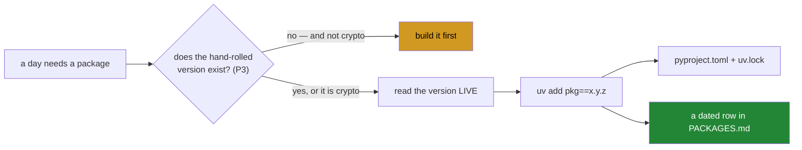

# 2.2 — `PACKAGES.md`, and never inventing a version

## One-line answer

Every package and every system tool gets a row carrying the exact version **and the date that
version was read live from the index or from the tool itself** — because a version recalled
from memory is a guess wearing the costume of a fact.

---

## The story

Someone asks you how much the bus fare is. You say one eighty.

You are not lying and you are not careless — it was one eighty the last time you paid, and
that was recent enough to feel current. But it went up in April, and the person you told is
now standing at the machine with the wrong coins.

The awkward part is that you gave the answer with the same confidence you would have given the
right one. There was nothing in your voice to warn them, because from the inside a remembered
fact and a current fact feel identical. That is the whole problem: **you cannot tell, from
inside your own head, which of your facts have expired.**

"I think it went up recently, let me check the sign" is a worse-sounding answer and a better
one. It carries its own uncertainty, and it takes ten seconds to resolve.

---

## The idea in plain language

P6 says **never invent a version**. This ledger is where that rule becomes checkable.

A row is not "which version we use". It is a claim of the form:

> *On this date, I asked the index, and it said this.*

That extra clause — the date, and the fact that it was **read** rather than **recalled** — is
what turns the row from a preference into evidence. Six months later somebody can ask whether
the pin is stale, and "read on 2026-09-07" answers it. "We use 0.16.6" does not.

The ledger covers two categories, and they are looked up differently:

**Python packages**, read from the index:

```text
curl -s https://pypi.org/pypi/<pkg>/json | python -c "import sys,json;print(json.load(sys.stdin)['info']['version'])"
```

**System tools**, which come from the distribution and never from a download (plan §5), read
from the tool:

```text
<tool> --version
```

That second category is unusual and it is specific to this subject. Most projects record only
their language packages. This one depends on `ip`, `ss`, `tcpdump`, `tshark`, `dig`, `nft`,
`tc` and `socat` — and **their behaviour and their defaults differ between versions and
between distributions**. A day that reports what `tc -s qdisc` printed has made a claim about
a particular `tc` on a particular kernel, and without the version the claim cannot be
reproduced or challenged.

Two rules travel with this ledger and are easy to state:

**A package arrives on the day it is first used, never in advance.** So the file grows slowly
and every row has a reason attached. Today's runtime dependency list is still empty.

**Except for cryptography, the package arrives only after the hand-rolled version exists**
(P3). `scapy` does not appear before the Ethernet frame has been built by hand on Day 18;
`dnspython` does not appear before the resolver does. The one carve-out is cryptographic
primitives, which you never write — you import them, name the algorithm, and cite the RFC
section that specifies its use.

---

## Why Jāla needs it

- **P6 is one of the twenty principles**, and this ledger is its enforcement. A pin with no
  dated row is a pin nobody can audit.
- **P3's comparison days are only evidence if the version is fixed.** Day 18 diffs your frame
  against `scapy`'s; Day 88 diffs your resolver against `dnspython`'s. "It disagreed with the
  library" is a finding about a *named* library at a *named* version, or it is a shrug.
- **P8's measurements name their tool and version.** `docs/MEASUREMENTS.md` has a
  `Tool + version` column, and it is filled from here.
- **The freshness check runs every phase** (§25 item 9): has a breaking release landed, has a
  flag been removed? That check needs to know what you pinned and when you last looked.

---

## The mechanism

Look a version up rather than recalling it:

```bash
curl -s https://pypi.org/pypi/ruff/json \
  | python -c "import sys,json; print(json.load(sys.stdin)['info']['version'])"
```

**Line by line:**

- `curl -s` — fetch quietly; the output is being piped, so a progress meter would be noise.
  This is tier **L2**: the public internet, read-only and gently — a single request to a
  service that publishes exactly this for exactly this purpose.
- `https://pypi.org/pypi/<pkg>/json` — the index's metadata endpoint. It returns a JSON
  document describing the package.
- `python -c` — parse it here rather than reaching for `grep`. A version string in raw JSON is
  easy to match *nearly* correctly and get a different field.
- `json.load(sys.stdin)` — read the document from the pipe.
- `['info']['version']` — the **latest released version**, named explicitly. Naming the path
  into the document is why this is a lookup and not a guess: if the shape changes, this raises
  a `KeyError` instead of silently printing something else.

For a system tool, ask the tool:

```bash
uv --version && git --version && bash --version | head -1
```

**Line by line:**

- Each program reports its own version. **Read them off; do not assume the version your
  distribution "usually" ships** — that is exactly the bus fare.
- `bash --version | head -1` — bash prints several lines of licence text after the version, so
  the first line is the answer and the rest is noise.

Then write the row, appending:

```bash
cat >> docs/PACKAGES.md <<'EOF'
| `ruff` | `==0.16.6` | 2026-09-07 | 0 | linter + formatter; the first two gates of `./m check` (dev group) |
EOF
```

**Line by line:**

- `>>` — append; `>` would destroy the ledger
  ([1.2](../01-repo-as-memory/1.2-written-by-hand-or-regenerated.md)).
- The third column is **the date the version was read**, not the date the row was written. On
  a day where you look something up and use it immediately these are the same, and they will
  not always be — when you re-verify a pin later, the date moves and a new row goes in.
- The last column says **why this day needed it**, which is what stops the file becoming a
  list of things somebody installed once.

And what to do when a lookup fails, which P6 is explicit about:

```bash
# TODO(curl -s https://pypi.org/pypi/dnspython/json | python -c "import sys,json; print(json.load(sys.stdin)['info']['version'])")
```

**Line by line:**

- A `TODO` containing **the exact command that would resolve it** — never a guessed version
  with a note to check later. The difference matters: a guess placed in a file is
  indistinguishable from a fact a week later, and a `TODO` carrying its own lookup command
  costs the next person nothing to resolve.



---

## When it breaks

**The version that does not exist, which is the loud and lucky case:**

```text
$ uv add "scapy==2.7.1"
  × No solution found when resolving dependencies:
  ╰─▶ Because there is no version of scapy==2.7.1 and your project depends on
      scapy==2.7.1, we can conclude that your project's requirements are
      unsatisfiable.
```

**What it means.** A version was recalled rather than read, and it happens not to exist. This
is the **good** failure — it stops immediately and costs a lookup. The dangerous version of the
same mistake is a number that does exist and is not the one you meant.

**The flag that was removed under you**, which is what the freshness check exists to catch:

```text
$ tc qdisc add dev veth0 root netem delay 40ms 5ms 25%
Error: Specified qdisc kind is unknown.
```

**What it means.** Either the `sch_netem` module is not present, or this `tc` does not accept
what you typed. **What it does not mean** is that your topology is wrong — and that distinction
is only available if you know which `tc` and which kernel you are on, which is what the system
tools half of this ledger records. Without a row, this is an hour of debugging a topology that
was never the problem.

**And the silent one, which is the whole reason the date column exists.** A pin that is not
wrong, and not current:

```text
$ grep dnspython pyproject.toml
    "dnspython==2.6.1",
$ grep dnspython docs/PACKAGES.md
| `dnspython` | `==2.6.1` | 2026-10-30 | 88 | compare the hand-rolled resolver (P3) |
```

**Nothing failed, and nothing will.** The package installs, the tests pass, and the pin is
eight months old. It may have had a security advisory; a behaviour you rely on may have been
fixed as a bug. There is no error to catch this — the only signal is the **date**, read
deliberately at a phase gate. This is why the row records when you looked rather than only
what you found: a pin without a date cannot be stale, because staleness is not expressible.

---

## In production

**Dependency inventory is a security control, and it is the input to answering an advisory.**
When a vulnerability lands against a package three levels down the tree, the questions are "are
we affected, where, and at what version?" A lockfile answers the machine half; a ledger like
this answers the human half — *why* the package is there and which component would break if it
were removed. Organisations formalise this as a software bill of materials, and the ones that
cannot produce one discover it during an incident.

**Pinning without updating is its own failure mode**, and it is worth being honest that this
ledger creates the risk it manages. A repository with exact pins and no upgrade discipline
accumulates known vulnerabilities and eventually cannot upgrade at all, because ten
simultaneous major bumps is a project rather than a task. The professional resolution is pins
*plus* automation — a bot that opens one pull request per bump, so upgrades are small,
frequent and tested. Pins buy reproducibility; the automation buys currency; skipping either
one costs you the other.

**System tool versions matter more in networking than almost anywhere else.** Kernel defaults
change between releases — a congestion control algorithm, a queue discipline, an initial
window, a timer. A measurement taken on one kernel and quoted on another is a measurement about
a machine that no longer exists. This is why P8 says to read defaults off the running system
with `sysctl`, `ss -i`, `ip route show` or `tc -s qdisc`, and to **say which kernel**.

**What an operator does differently.** They record the version at the moment of the
observation, in the same breath as the observation. "Throughput was X" and "throughput was X
on `iperf3 3.16`, kernel 6.8.0" are different claims, and only the second survives contact
with somebody who measured something different.

**The review comment.** On a pull request adding a pinned dependency with no ledger row:
*"Where did this version come from? If it was read from the index, let's have the row with the
date — otherwise in six months nobody can tell whether it's deliberate or just what was current
when you wrote it."*

**The interview question.** *"How do you decide which version of a dependency to use?"* The
answer that shows judgement covers three things: read what is current rather than recall it,
check it has a build for your platform and interpreter, and pin it exactly with a record of
when and why. The follow-up is usually about upgrades, and the honest answer names the tension
above — reproducibility and currency pull in opposite directions, and the resolution is
automation rather than willpower.

---

## Check yourself

```bash
grep -c '^| `' docs/PACKAGES.md && grep -o '20[0-9][0-9]-[0-9][0-9]-[0-9][0-9]' docs/PACKAGES.md | sort -u
```

The first number is **how many things this repository has installed**. The dates under it are
**every distinct day on which a version was actually looked up** — and every row must carry
one. A row with no date is a bus fare.

**Answer out loud, without scrolling up:**

> Explain why the ledger records the date a version was *read* rather than the date the row
> was written, and what question that lets somebody ask six months later. Then say why this
> project records system tool versions as well as package versions — and give a networking
> example where the tool version changes what a measurement means.

---

**Next:** [2.3 — `SPECS.md`, and reading it before you quote it](2.3-specs-read-it-before-you-quote-it.md)
