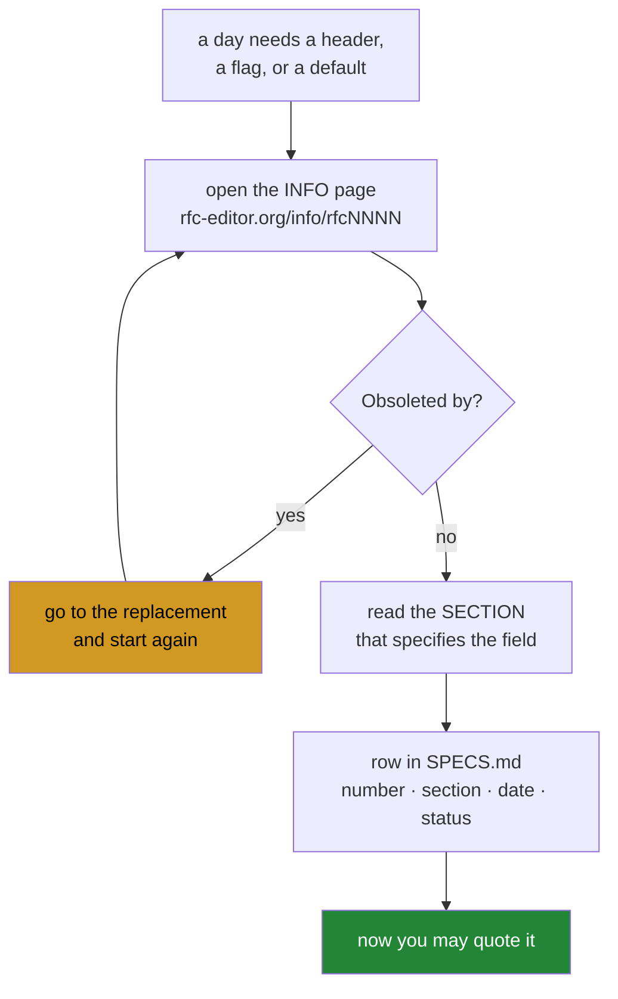

# 2.3 — `SPECS.md`, and reading it before you quote it

## One-line answer

A row goes into this ledger **before** a specification is quoted, and it records whether the
document has been **obsoleted** — because a citation to a superseded standard points a reader
at text that has been replaced, with the same confident section number as a correct one.

---

## The story

You look up a recipe in a magazine at the dentist's, photograph the page, and cook from it
that weekend. It works.

Two years later you cook it again from the photo and it comes out wrong. You check everything
— oven, timings, the flour — and it takes you a while to notice the small line at the top of
the page: *"corrected version overleaf."* The issue you photographed had a mistake in the
quantities, and the correction was printed on the next page, which you never took.

Your photo is not a bad photo. It is a perfect record of a page that has been superseded. And
the reason it took you a whole afternoon is that a wrong page and a right page **look exactly
the same** — same typeface, same confident tone, same numbers in the same places. There is no
signal in the artefact itself. The only place the correction exists is in the thing you did
not look at.

---

## The idea in plain language

Internet protocols are defined in **RFCs** — documents published by the IETF, numbered
sequentially and, crucially, **never edited after publication**.

That last property is the one that catches people. An RFC is not updated in place. When a
protocol changes, a *new* RFC is published, and the old one is marked **"Obsoleted by"**. The
old document stays exactly where it was, at its old URL, with its old section numbers, looking
completely authoritative — because it *was* authoritative, until it was not.

So "the RFC says" is not a citation. A citation is a number, a section, and a statement that
you checked its status on a date.

Three cases catch almost everybody, and all three were verified live for this document:

| Commonly quoted | Actually current | Verified |
| --- | --- | --- |
| RFC 793 (TCP) | **RFC 9293** — *Transmission Control Protocol (TCP)* | 793 is marked "Obsoleted by RFC 9293" |
| RFC 8312 (CUBIC) | **RFC 9438** | 8312 is marked "Obsoleted by RFC 9438" |
| RFC 7230 (HTTP/1.1) | **RFC 9110** *HTTP Semantics* + **RFC 9112** *HTTP/1.1* | 7230 is marked "Obsoleted by RFC 9110" |

All three checked on **2026-09-07** against `https://www.rfc-editor.org/info/rfcNNNN`.

RFC 793 is the sharpest example because it is still, by a wide margin, the thing people cite
for TCP — it is in slide decks, textbooks and interview answers. It was published in 1981 and
obsoleted in 2022. A day quoting "RFC 793 §3.9" sends its reader to a document whose section
numbering does not match the current specification at all, and the reader has no way to know.

Note the third row is not a simple replacement: HTTP/1.1 was **split** into semantics
(RFC 9110) and messaging (RFC 9112). So the right citation depends on what you are claiming —
a status code is semantics, a chunked transfer encoding is messaging. "Obsoleted by" told you
the old one is dead; it did not tell you which of the two replaces it for your purpose. Only
reading does that.

So the ledger's columns are:

```text
| Number | Title | Status | Obsoletes / obsoleted by | Sections read | Resolved | Day |
```

**`Sections read`** is the column that does the most work. It is the difference between "I
have heard of RFC 9293" and "I read §3.1 and the field offsets in this document come from
it". P7 is explicit: every wire-format detail is verified against the specification, **read
that day**, and the document names the RFC and the section.

---

## Why Jāla needs it

- **P7 — never invent an API, and never invent a wire-format detail.** The principle, quoted
  as written:

  ```text
  Never invent an API - or a header field, a flag, a default, or a byte offset.
  A header diagram remembered from a slide is how an offset goes wrong, and a wrong
  offset produces a packet that is silently discarded, not an exception.
  ```
- **P20 — wire formats are stated, never inferred.** Every `## Wire format` table names the
  RFC and section next to it. Those citations come from here.
- **The phase gate checks this ledger** (§25 item 7): every specification read in the phase has
  a row, and **none of them is marked obsoleted** by a document the plan does not know about.
- **The freshness check asks whether an RFC has been obsoleted since you cited it** (§25 item
  9). An errata may also have been filed against text you quoted. Both need a `Resolved` date
  to be measured against.

---

## The mechanism

Check a document's status before quoting it:

```bash
curl -sL https://www.rfc-editor.org/info/rfc793 | grep -i -A2 'obsoleted by'
```

**Line by line:**

- `curl -sL` — quiet, and **follow redirects**. The `-L` matters here: the info URL redirects,
  and without it you get a redirect page containing no status at all — which would read as
  "no obsoleted-by line found", i.e. as a false all-clear.
- `/info/rfcNNNN` — the **info page**, not the document. The document itself does not say it
  has been superseded, because it was frozen before its replacement existed. **This is the
  whole trap**: fetching `rfc793.txt` and reading it carefully tells you nothing about whether
  it is current.
- `grep -i -A2 'obsoleted by'` — case-insensitive, and print the **2 lines after** the match,
  because the replacement's number is on a following line rather than the matching one.

On **2026-09-07** that command reports RFC 793 as obsoleted by **RFC 9293**. The same check
against `rfc9293` finds no "Obsoleted by" line at all, which is what current looks like.

For a machine-readable answer, the datatracker exposes metadata as JSON:

```bash
curl -s "https://datatracker.ietf.org/api/v1/doc/document/rfc9293/?format=json" \
  | python -c "import sys,json; d=json.load(sys.stdin); print(d['name'], d['pages'], 'pages')"
```

**Line by line:**

- The datatracker is the IETF's own document database, and it publishes an API rather than
  requiring you to scrape a page. **Preferring a published interface over parsing HTML** is
  the same instinct as `git status --porcelain` over `git status`: human pages change layout,
  interfaces promise not to.
- `d['name']` and `d['pages']` — named fields, so a change in the document's shape raises a
  `KeyError` rather than silently printing something else.

Then write the row, **before** the specification is quoted anywhere:

```bash
cat >> docs/SPECS.md <<'EOF'
| RFC 9293 | Transmission Control Protocol (TCP) | Internet Standard | obsoletes RFC 793, 879, 6093, 6691; **not obsoleted** | §3.1 header format | 2026-09-07 | 55 |
EOF
```

**Line by line:**

- `>>` — append, never `>`.
- The `Obsoletes / obsoleted by` column carries **both directions**. Knowing 9293 obsoletes
  793 is what lets a reader recognise a stale citation elsewhere; knowing it is *not* itself
  obsoleted is the claim that expires and needs re-checking at the next phase gate.
- `Sections read` — **§3.1**, not "the whole thing". A row claiming to have read a
  ninety-page document is a row nobody believes, including you in six months.
- The last column is the day that will quote it, which for TCP's header is Day 55.



The loop back from the amber box is the part people skip. A replacement can itself have been
replaced.

---

## Topology

**Tier L2 — the public internet, read-only and gently.** This part fetches published
documents from `rfc-editor.org` and `datatracker.ietf.org`, which exist to be read. No
namespace is involved, no packet is sent to any host that has not published itself for this
purpose, and the whole interaction is a handful of requests at human speed (plan §4.2 rule 2).

There is **no lab topology** and there is nothing to tear down. The reason this part is L2
rather than L0 is that it reaches a machine that is not yours — which is exactly the kind of
thing plan §4.1 requires a part to say out loud rather than leave implied.

| | |
| --- | --- |
| Namespaces | none |
| Links | none |
| netem | none |
| Hosts contacted | `www.rfc-editor.org`, `datatracker.ietf.org` — published document servers |
| Requests | one per specification checked, by hand |

---

## When it breaks

**The obsoleted document, said plainly by the info page:**

```text
$ curl -sL https://www.rfc-editor.org/info/rfc8312 | grep -i -A2 'obsoleted by'
Obsoleted by:
RFC 9438
```

**What it means.** Anything you were about to cite from RFC 8312 about CUBIC should come from
RFC 9438 instead. This is the ledger working: the check happened before the quotation, so
nothing had to be un-written.

**The one that looks like an all-clear and is not:**

```text
$ curl -s https://www.rfc-editor.org/info/rfc793 | grep -i 'obsoleted by'
$ echo $?
1
```

**Nothing found, exit 1 — and RFC 793 is definitely obsoleted.** The `-L` is missing, so
`curl` fetched a redirect page rather than the info page, and `grep` searched a document that
never contained the answer. **The absence of a warning and the absence of a fetch produced
identical output**, which is the same shape as
[Day 0's 3.1](../../../day-000-toolchain-skeleton-driver/parts/03-the-driver/3.1-set-euo-pipefail.md)
pipeline problem. If you script this check, `set -o pipefail` and a test for an empty response
are not optional.

**And the silent one, which is the reason this part is `production` level.** You quote a
superseded document, correctly:

```text
The TCP header's data offset field is at byte 12, per RFC 793 §3.1.
```

**Nothing is wrong with that sentence's mechanics.** There is a real RFC 793, it has a §3.1,
and it does describe the TCP header. A reader who follows the citation lands on a real page
that looks authoritative. The only problem is that the current specification is RFC 9293, and
a reader who then cites *your* document has propagated a dead reference — and for a field
whose offset happens not to have changed, **nothing will ever break to tell either of you.**
That is the failure this ledger exists for: not a wrong fact, but a correct fact resting on a
document nobody should be reading any more, decaying quietly until the day it disagrees.

---

## In production

**Reading the specification rather than a summary is what separates an engineer who can debug
a protocol from one who can only use it.** Blog posts, textbook diagrams and answers on forums
are compressions, and compression drops the edge cases — which are exactly what you are looking
at when something is broken. The clause you need at three in the morning is invariably the one
a summary left out.

**The `MUST` / `SHOULD` / `MAY` vocabulary is normative and precise.** `MUST` is a requirement;
`SHOULD` means there may be valid reasons to do otherwise, and you had better understand them;
`MAY` is optional. Interoperability arguments are usually settled by finding the right one of
those three words, and a great deal of real-world protocol behaviour lives in `SHOULD` — which
is why two conforming implementations can disagree. Day 6 (`FOUND-10`, `FOUND-11`) is where
this is taught properly.

**Errata are a second layer of staleness.** A published RFC can have verified errata — reported
mistakes with agreed corrections — and they do not change the document text. Checking the
errata page for a section you are about to implement is the professional habit, and it is
exactly the "corrected version overleaf" line from the story.

**What an operator does differently.** They cite by number and section when raising a bug with
a vendor, and they check the status first. "Your implementation is wrong" is an opinion;
"RFC 9293 §3.8.6 says the receiver `MUST` do this, and here is a capture showing it does not"
is a bug report that gets fixed. The capture and the citation together are the entire argument.

**The review comment.** On a pull request implementing a header parser:
*"This cites RFC 793 — that's been obsoleted by 9293 since 2022 and the section numbering
differs. Please re-check the offsets against the current document and update the ledger row."*

**The interview question.** *"Which RFC defines TCP?"* It sounds like trivia and it is not.
Almost everyone says 793. The candidate who says *"9293 now — it obsoleted 793 in 2022 and
folded in the updates from 1122, 6093 and 6691"* has demonstrated the habit this whole ledger
is about: they check what is current instead of repeating what they learned. The follow-up —
*"how would you know?"* — has one answer, and it is the info page.

---

## Check yourself

```bash
curl -sL https://www.rfc-editor.org/info/rfc793 | grep -ci 'obsoleted by' && \
curl -sL https://www.rfc-editor.org/info/rfc9293 | grep -ci 'obsoleted by'
```

Two numbers: **1 and 0**. The first document is superseded and says so; the second is current
and has no such line. That difference is the entire mechanism, and you just read it off the
publisher rather than being told it.

**Answer out loud, without scrolling up:**

> Explain why fetching `rfc793.txt` and reading it carefully cannot tell you it has been
> superseded, and name the page that can. Then say why the `Sections read` column is more
> useful than the RFC number alone — and what makes a citation to an obsoleted RFC a *silent*
> failure rather than a loud one.

---

**Next:** [2.4 — `TOPOLOGIES.md`, and why a topology is a script](2.4-topologies-a-script-not-a-sentence.md)
