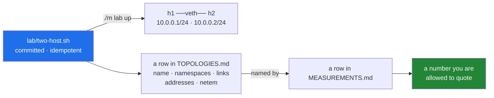

# 2.4 — `TOPOLOGIES.md`, and why a topology is a script

## One-line answer

"Two hosts connected through a router" is a sentence; a topology is a **committed, idempotent
script** that builds it plus a row naming its namespaces, links, addresses and netem settings
— and every measurement names a topology by that row or it is an anecdote.

---

## The story

Somebody gives you directions to their house over the phone. Left at the pub, past the school,
it is the one with the blue door.

You get there. It works.

Six months later you try to go again from memory and it falls apart, because the pub has
changed its name, and "past the school" turns out to have meant a particular gap between two
buildings that is obvious when someone is telling you and invisible when they are not. You
end up phoning again.

Now imagine that the first time, instead of directions, they had sent you a pin on a map.
Six months later it still works. Not because a pin is cleverer than directions, but because
**a pin does not depend on the world staying the way it was when the directions were given**,
and it does not depend on you and them meaning the same thing by "past the school".

The difference that matters is not detail. The directions were quite detailed. The difference
is that a pin can be **followed identically twice**, and directions cannot.

---

## The idea in plain language

A **topology** is the shape of a network: which machines exist, what connects them, what
addresses they have, and what the links do to traffic.

In this curriculum a machine is a **network namespace**, a link is a **veth pair** — a virtual
cable with an end in each namespace — and the impairment on a link is **`tc netem`**, which
adds configured delay, loss, reordering or duplication. Those are the three nouns, and Day 9
builds the first topology out of them (`FOUND-14`).

Plan §4.1 states the rule flatly:

> **Every L1 day is a script, not a sequence of instructions.** A topology you built by typing
> fourteen commands is a topology you cannot rebuild.

The reason is not tidiness. It is that a network built by typing has **no definition**. If you
measured something on it and somebody asks what the delay was, the honest answer is "whatever
I typed", and you cannot check. If you retype it tomorrow and get a different number, you
cannot tell whether the change is in your code or in your typing. **A result needs a fixed
denominator**, and the script is it.

Two properties are required of every `lab/<name>.sh`:

**Committed.** It is in the repository, so it travels with the results it produced.

**Idempotent.** Running it twice produces no error and the same end state. This is `OPS-03`,
and it matters more than it sounds: the second run is what happens when a previous run failed
halfway, or when you are not sure whether the topology is up. A script that only works from a
clean slate is a script you have to think about before running, and a script you have to think
about is one you will run wrong under pressure.

Then the ledger row, which is what makes a *measurement* meaningful:

```text
| Name | Script | Namespaces | Links | Address plan | netem | Day |
```

`docs/MEASUREMENTS.md` names a topology by the `Name` column **and by nothing else**. So a
number is attached to a row, the row is attached to a script, and the script rebuilds the
thing. That chain is what P9 means by *a measurement without a topology is an anecdote* — and
the chain has no weak link that a person has to remember.

**Reuse before you invent.** Before adding a topology, read the table. A second, nearly
identical topology is two things to maintain and one more way for two results to stop being
comparable — and "why is Day 72's throughput different from Day 68's?" is a very expensive
question when the answer is a link speed nobody noticed differed.

---

## Why Jāla needs it

- **`OPS-01` is ledgers, ADRs and *reproducible topologies*.** This is the third of those
  three, and the one that is specific to networking.
- **P9 — a measurement without a topology, a seed, a repetition count and a hardware line did
  not happen.** The `Name` column is the join.
- **The phase gate rebuilds every topology used in the phase** (§25 item 5):
  `./m lab down && ./m lab up <name>`, twice, with the second run producing no error. That is
  `./m lab verify`, and an idempotent script is the only kind worth committing.
- **Phase 16's gate is a stranger rebuilding the lab and reproducing every headline number.**
  A stranger has no phone to call.

---

## The mechanism

The ledger is empty today and says so, because nothing has been built:

```bash
grep -c '^| ' docs/TOPOLOGIES.md
```

**Line by line:**

- `grep -c '^| '` — count lines starting with a pipe and a space. It counts the header and
  separator rows too, so the answer today is small and non-zero; what matters is that **no
  topology row exists**, and the file says why in prose: namespaces are `FOUND-14`, which the
  plan closes on Day 9.

The shape a topology script takes, and every line of it is a decision — this is Day 9's
material, shown here so the *ledger* makes sense:

```bash
#!/usr/bin/env bash
set -euo pipefail

ip netns add h1 2>/dev/null || true
ip netns add h2 2>/dev/null || true
ip link add veth-h1 type veth peer name veth-h2 2>/dev/null || true
```

**Line by line:**

- `set -euo pipefail` — without it a failed `ip link add` leaves a half-built topology and the
  script still reports success, and every measurement taken afterwards is a measurement of
  something you cannot describe
  ([Day 0, 3.1](../../../day-000-toolchain-skeleton-driver/parts/03-the-driver/3.1-set-euo-pipefail.md)).
- `ip netns add h1` — create a namespace named `h1`. This is the "machine".
- `2>/dev/null || true` — **this pair is what makes the script idempotent.** On a second run
  the namespace already exists and `ip` writes an error to standard error and exits non-zero;
  under `set -e` that would abort. Discarding the message and forcing success means "make sure
  this exists" rather than "create this". Note the tension with `set -e` that
  [Day 0's 3.1](../../../day-000-toolchain-skeleton-driver/parts/03-the-driver/3.1-set-euo-pipefail.md)
  described: the status here carries meaning — *already present* — so it is handled rather than
  obeyed.
- `ip link add ... type veth peer name ...` — create the virtual cable. **A veth is always
  created as a pair**; you name both ends in one command, and they are two ends of one link
  rather than two independent objects.

And the row that goes with it:

```bash
cat >> docs/TOPOLOGIES.md <<'EOF'
| `two-host` | `lab/two-host.sh` | 2 (`h1`, `h2`) | 1 (veth pair) | 10.0.0.1/24, 10.0.0.2/24 | none | 9 |
EOF
```

**Line by line:**

- The `Namespaces` column **names them**, not just counts them. `2` tells you the size;
  `h1`, `h2` is what a later part's `## Topology` section and the §4.2 containment rule
  actually refer to.
- The `netem` column says **`none`** rather than being left blank. An empty cell is ambiguous
  between "no impairment" and "nobody wrote it down", and those are very different when you
  are comparing two results.
- The `Address plan` column is the addresses, in full. `10.0.0.0/24` is
  [documentation-safe private space](https://www.rfc-editor.org/info/rfc1918) and, more to the
  point, it is inside namespaces that route nowhere.

Prove idempotence, which is the property the ledger is claiming:

```bash
./m lab verify two-host
```

**Line by line:**

- `lab verify` — tears down, brings up, brings up **again**, and reports. The second `up` is
  the whole test: if it errors, the script is not idempotent and the row is a promise the file
  cannot keep.
- It is deliberately **not** part of `./m check`, because it needs root and Linux — putting it
  in the commit gate would make the gate unrunnable on the machine it guards. That is
  amendment **A-002** in
  [`docs/CHANGELOG_PLAN.md`](../../../../docs/CHANGELOG_PLAN.md).



---

## When it breaks

**The script that is not idempotent, caught by the second run:**

```text
$ ./m lab verify two-host
Error: Peer netns reference is invalid.
RTNETLINK answers: File exists
```

**What it means.** The first `up` succeeded, the second hit an object that already exists and
had no `|| true` to absorb it. **This is `OPS-03` failing**, and the fix is in the script, not
in your habits — "remember to tear down first" is exactly the kind of instruction that works
until the evening it does not.

**The half-built topology, which is worse than a failed one:**

```text
$ ./m lab up two-host
Cannot find device "veth-h2"
$ ip netns list
h1
h2
```

**What it means.** The namespaces exist and the link does not. If the script lacked
`set -euo pipefail` it would have carried on, configured addresses on a device that is not
there, and exited zero. You would then have two namespaces that cannot reach each other, and
a `ping` that fails for a reason that looks like a routing problem rather than a missing cable.
**Reproduce this deliberately** before you trust a topology script — that is P12, and it is
[3.3](../03-traceability/3.3-an-open-id-is-a-bug.md)'s pattern applied to the lab.

**And the silent one, which is why the `netem` column may never be blank.** Two measurements,
six weeks apart, on "the same" topology:

```text
| M-011 | 68 | two-host | delay 40ms 5ms | 3 | 5 | iperf3 3.16 | … | 94.1 Mbit/s ± 1.2 |
| M-019 | 74 | two-host | delay 40ms 5ms | 3 | 5 | iperf3 3.16 | … | 61.7 Mbit/s ± 0.9 |
```

**Nothing failed, and the conclusion is probably wrong.** Both rows name `two-host`, both name
the same netem, same seed, same repetitions, same tool. So the obvious reading is that
whatever changed between Day 68 and Day 74 cost you a third of your throughput — and if the
script was edited in between without a new topology row, the real cause is that `two-host` on
Day 74 is not the same network as `two-host` on Day 68. **The name matched and the thing did
not.**

The defence is the same one Git uses: a topology's identity should be its *content*, so a
changed script gets a new row and, if the change is material, a new name. The check that
catches it in practice is `git log -- lab/two-host.sh` alongside the two measurement dates —
which is only possible because the script is committed.

---

## In production

**This is infrastructure as code, and it is how networks are actually run now.** Device
configuration lives in version control, changes go through review, and the running network is
reconciled against the committed state. The alternative — a router configured by hand at some
point by somebody who has left — is the phone directions, and every organisation that has run
networks for a decade has at least one box nobody dares touch.

**Idempotence is the central idea of configuration management**, and it is worth naming
properly because it is not obvious. A script that says *"make sure this exists"* can be run at
any time, from any state, including halfway through a previous failed run. A script that says
*"create this"* can only be run from one state, so somebody has to know which state they are
in — under pressure, at three in the morning, which is precisely when they will not. Every
serious configuration tool is built around this distinction.

**Test environments that drift from production are a permanent industry problem**, and the
cause is always the same: the environment was built by hand, or built from a script that has
since been edited without versioning. A performance result from a test environment that
differs from production in one queue length is not a conservative estimate — it is a number
about a different network, and it will be quoted in a capacity plan.

**What an operator does differently.** They treat "can I rebuild this from scratch right now?"
as a routine question with a demonstrated answer, not an assumption. The exercise of actually
tearing down and rebuilding — a game day — is the only thing that distinguishes a script that
works from a script that worked once, and it is the same reasoning as
[Day 0's 5.1](../../../day-000-toolchain-skeleton-driver/parts/05-first-commit/5.1-the-check-that-can-go-red.md):
a mechanism you have never exercised is a mechanism you are hoping about.

**The review comment.** On a pull request adding a benchmark result:
*"Which topology, and is its script committed at the revision you ran? The number's fine but I
can't reproduce it or compare it to last month's without the row."*

**The interview question.** *"How do you make sure your test environment matches production?"*
The answer that shows experience admits it never fully does, then names what you do about it:
build both from the same committed definition, enumerate the known differences explicitly, and
qualify results by those differences rather than presenting them as unconditional. A candidate
who claims the environments are identical has not looked hard enough.

---

## Check yourself

```bash
ls lab/*.sh 2>/dev/null | wc -l && grep -c '^| `' docs/TOPOLOGIES.md
```

Two numbers, and today both are **0**: no topology scripts and no topology rows. **They must
stay equal for the whole curriculum** — a script with no row is a network nobody can cite, and
a row with no script is a promise the repository cannot keep.

**Answer out loud, without scrolling up:**

> Explain what idempotent means for a topology script and why `2>/dev/null || true` after
> `ip netns add` is the line that provides it. Then say why the `netem` column may never be
> left blank — and describe the failure where two measurements name the same topology and are
> not about the same network.

---

**Next:** [2.5 — `CAPTURES.md`, the provenance and never the bytes](2.5-captures-the-provenance-never-the-bytes.md)
