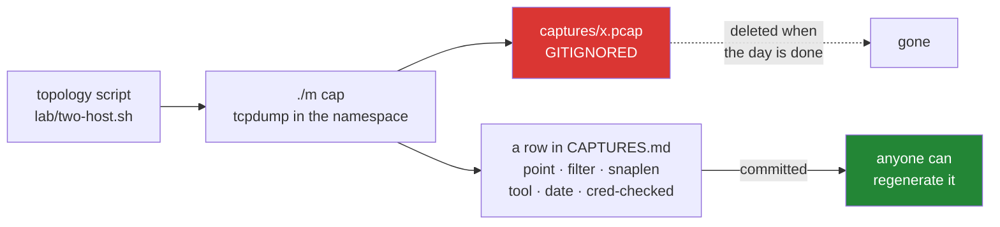

# 2.5 — `CAPTURES.md`, the provenance and never the bytes

## One-line answer

A packet capture is a recording of real traffic that may contain credentials, so this
repository commits the **row that lets you regenerate it** — topology, capture point, filter,
tool, date, and whether it was checked for credentials — and never the capture itself.

---

## The story

A shop puts a camera above the till.

It is there for one reason: if the till is short at the end of the day, somebody can look at
the tape and work out what happened. Completely reasonable, and it does that job well.

What the camera also records, all day, is every customer's hands. Their card. Their PIN, if
they do not cover the pad. The person who came in twice and stood at the back for a while. The
thing somebody said quietly to the person on the till, which is on the tape whether or not it
was meant for anyone else.

None of that was the point. All of it is on the tape.

So the shop that has thought about this keeps the tape for a set number of days and then wipes
it, keeps it locked, and does not copy it onto a laptop to look at later. Not because the
camera was a mistake — it was not — but because **a recording made for one purpose contains
everything else that was happening at the same time**, and once it is copied somewhere it is
no longer a decision anybody controls.

---

## The idea in plain language

A **packet capture** is a file — a `.pcap` or `.pcapng` — holding the actual bytes that
crossed a link, timestamped. It is the ground truth of networking, and the plan says so:
`FOUND-13` is *a capture is the ground truth*, and Day 8 reads one end to end.

It is also, by construction, a recording of real traffic. Depending on where and what you
captured, that file can hold:

- a session cookie or a bearer token from an HTTP request;
- a password, in plain text, from any protocol that predates TLS;
- the internal hostnames and addresses of a private network — a map, essentially;
- somebody else's traffic entirely, if the capture was taken anywhere shared.

So P9 draws the line in a place that surprises people coming from ordinary software:

> **The repository holds what *reproduces* a capture, never the capture.**

`captures/`, `*.pcap` and `*.pcapng` are gitignored from Day 0
([Day 0, 2.2](../../../day-000-toolchain-skeleton-driver/parts/02-skeleton/2.2-gitignore-before-secrets-exist.md)).
What is committed is the row:

```text
| File | Topology | Capture point | Filter | Snaplen | Tool + version | Date | Day | Credential-checked |
```

Three columns are worth explaining because they are the ones that make a capture
*reproducible* rather than merely described:

**Capture point.** Which interface, in which namespace. This matters enormously and is
routinely omitted. The same exchange looks different captured at the sender, at the receiver,
or on the bridge in between — a packet that was dropped in the middle appears at one point and
not the other, and that difference is frequently the entire finding.

**Filter.** What `tcpdump` was told to keep. A capture taken with a filter is a *subset*, and
a reader who does not know the filter cannot tell the difference between "that packet never
happened" and "that packet was filtered out". This is a silent-failure generator all on its
own.

**Snaplen.** How many bytes of each packet were stored. The default in older tools truncated
packets, so a capture could hold every header and no payload — and a payload that is absent
because of a snaplen looks exactly like a payload that was empty.

And the last column, which is not a formality:

**Credential-checked.** Whether somebody actually looked. `SEC-22` is the concept, and the
column exists because "there probably were not any credentials in it" is not a check. It is
also why the answer is recorded per capture rather than assumed once for the repository.

The rule that follows from all of this, and it is the opposite of the usual instinct: **do not
keep the capture.** Regenerate it from the row when you need it again. The topology is a
committed script ([2.4](2.4-topologies-a-script-not-a-sentence.md)) and the filter is in the
row, so regeneration is cheap — which is exactly what makes deleting it affordable.

---

## Why Jāla needs it

- **P9 — captures and keys are never committed**, and the phase gate checks history rather
  than the working tree (§25 item 8):
  `git log --all --name-only | grep -E '\.(pcap|pcapng|pem|key)$'` must return nothing. It is
  checked **every phase**, because the day it fails is the day it became permanent.
- **`./m done N` refuses if a capture is staged** — a backstop behind the ignore rules.
- **Every capture excerpt in a day names how it was produced** (plan §27.1) — command, filter,
  capture point, topology. Those come from here.
- **Day 8 reads the first capture end to end**, and `SEC-22` is the day the credential
  question is taught properly. The habit has to exist before the first `.pcap` does.

---

## The mechanism

Take a capture through the driver, which puts it somewhere ignored:

```bash
./m cap h1 veth-h1 first-icmp
```

**Line by line:**

- `./m cap <topology> <iface> <name>` — runs `tcpdump` inside the named namespace, on the named
  interface, writing to `captures/<name>.pcap`.
- `captures/` is **gitignored**, so the file cannot be staged by an absent-minded `git add -A`.
  Putting the output somewhere safe by default is better than remembering to be careful.
- The driver **prints a reminder** that the `docs/CAPTURES.md` row is written by hand, the same
  day, including the credential check. A tool that silently produced an unrecorded artefact
  would be training the wrong habit.

What that runs underneath, and every flag is a decision that shows up in the row:

```bash
ip netns exec h1 tcpdump -i veth-h1 -s 0 -w captures/first-icmp.pcap 'icmp'
```

**Line by line:**

- `ip netns exec h1` — run the command **inside namespace `h1`**. Without this, `tcpdump`
  captures on the host's interfaces, which is a completely different network and — on a shared
  or work machine — is other people's traffic. This is the §4.2 containment rule expressed as a
  command prefix.
- `-i veth-h1` — the **capture point**. One interface, named. Goes in the row.
- `-s 0` — **snaplen zero means "the whole packet"**. Modern `tcpdump` defaults to full
  capture, but stating it explicitly is the difference between knowing the payload is complete
  and assuming it. A truncated payload and an empty payload look the same in a viewer.
- `-w captures/first-icmp.pcap` — write the raw file rather than printing a decoded summary.
  The decode is a rendering; the file is the evidence.
- `'icmp'` — the **filter**, quoted so the shell does not touch it. This capture contains ICMP
  and nothing else, and that fact must be in the row or a reader will conclude no TCP was
  present.

Then the row, written the same day:

```bash
cat >> docs/CAPTURES.md <<'EOF'
| `first-icmp.pcap` | `two-host` | `veth-h1` in netns `h1` | `icmp` | 0 (full) | tcpdump 4.99.4 | 2026-09-20 | 9 | yes — lab-only traffic, no credentials present |
EOF
```

**Line by line:**

- The `Capture point` column names **both** the interface and the namespace. `veth-h1` alone is
  ambiguous — a veth pair has two ends and they see different things.
- `Snaplen 0 (full)` — written out, because `0` on its own reads like "nothing captured".
- The credential column is a **sentence, not a tick**. "yes — lab-only traffic" records what
  was checked and why the answer is what it is; a tick records that somebody's hand moved.

Confirm nothing has leaked, which is the phase gate's command:

```bash
git log --all --name-only | grep -E '\.(pcap|pcapng|pem|key)$' || echo "clean: no capture or key has ever been committed"
```

**Line by line:**

- `git log --all --name-only` — every file touched by **every commit on every branch**, not
  just the current tree. A capture deleted last week is still in history and this finds it.
- `|| echo "clean: …"` — `grep` exits non-zero when it finds nothing, which here is the good
  case. Turning that into an explicit sentence means **"found nothing" and "did not run" do not
  look the same** — the same reasoning as
  [Day 0's 5.2](../../../day-000-toolchain-skeleton-driver/parts/05-first-commit/5.2-the-first-commit.md).



---

## When it breaks

**The gate catching a staged capture:**

```text
$ ./m done 9
FAIL a capture or a key is staged. Never (P9):
?? captures/first-icmp.pcap
```

**What it means.** The backstop fired, which is good — and it is worth treating as a signal
that the primary defence did not work, rather than as a routine step. If a file under
`captures/` is showing as untracked rather than ignored, the ignore rule has a problem.

**The one that is not recoverable by being careful:**

```text
$ git log --all --name-only | grep -E '\.pcap$'
captures/api-debug.pcap
```

**What it says:** a capture is in this repository's history.
**What it means:** if that capture contains a token, **the token is disclosed and must be
rotated** — not deleted from history and hoped about. History rewriting stops it spreading
further, but if the repository was ever pushed, cloned or forked, other copies exist and you
cannot reach them. This is the same argument as
[Day 0's 2.2](../../../day-000-toolchain-skeleton-driver/parts/02-skeleton/2.2-gitignore-before-secrets-exist.md),
and it is why the check runs every phase rather than once.

**And the silent one, which is specific to captures and catches careful people.** A capture
taken with a filter, read six weeks later:

```text
$ tcpdump -r captures/handshake.pcap | head -3
14:22:09.114 IP 10.0.0.1.44112 > 10.0.0.2.80: Flags [S], seq 1829301, win 64240
14:22:09.115 IP 10.0.0.2.80 > 10.0.0.1.44112: Flags [S.], seq 88213, win 65160
14:22:09.115 IP 10.0.0.1.44112 > 10.0.0.2.80: Flags [.], ack 88214, win 64240
```

**Nothing failed, and the file may be lying to you by omission.** A three-packet handshake and
then nothing — so either the connection stalled, which would be a finding, or the capture was
taken with a filter like `tcp[tcpflags] & tcp-syn != 0` that kept only the handshake. **Those
two situations produce an identical file**, and the only thing that distinguishes them is the
`Filter` column in the ledger.

The same trap applies to snaplen: a payload absent because of truncation looks exactly like an
empty payload. This is Silent Failure territory of the purest kind — the evidence is
self-consistent and incomplete, and it will not raise anything. **The check that catches it is
reading the row before reading the capture**, every time, which is only possible if the row
exists.

---

## In production

**Captures are routinely mishandled, and usually by people being helpful.** A `.pcap` attached
to a support ticket to "show the problem" typically carries session cookies, internal
hostnames and the shape of a private network. Mature organisations treat sharing one as a
disclosure decision: there is a redaction step, a retention limit, and a rule against copying
captures onto laptops. Tools exist to rewrite addresses and strip payloads, and the fact that
they exist at all tells you how often the raw file is the wrong thing to send.

**Where you capture is a design decision with legal weight.** On a shared network you collect
other people's traffic, which is a privacy question before it is a technical one — plan §4.2
rule 3 is explicit that your employer's network and your university's network are not your
lab. In this curriculum the answer is structural: capture inside namespaces you created, where
the only traffic is traffic you generated.

**Storage and retention are real constraints at scale.** Full packet capture on a busy link
produces enormous volumes, so production deployments capture selectively — a rolling buffer, a
filter, sampled flow records instead of packets — and each of those choices trades away
evidence you might later want. Knowing what your capture *excluded* is as important as knowing
what it contains, which is the `Filter` column again, in an environment where getting it wrong
costs a re-run of an incident.

**What an operator does differently.** They record the capture's conditions in the same breath
as taking it, and they distrust any capture whose provenance they do not know. A `.pcap`
handed over with no filter, no capture point and no timestamps is a file you can look at, not
evidence you can reason from — and the professional response is to ask how it was taken before
spending an hour reading it.

**The review comment.** On a pull request attaching a capture to a bug report:
*"Please don't commit the pcap — put the reproduction in the ledger row instead. And has this
been checked for credentials? It was taken on the staging ingress, so it'll have session
cookies in it."*

**The interview question.** *"You have a capture that shows the request going out and no
response. What do you check first?"* The answer they want is about the capture before it is
about the network: where was it taken, and what filter was applied? A response missing from a
capture taken at the sender with a filter on the destination port is not a missing response —
it is a missing capture. Candidates who go straight to routing have skipped the cheaper
question.

---

## Check yourself

```bash
git log --all --name-only | grep -cE '\.(pcap|pcapng|pem|key)$'
```

That number must be **0**, forever. It is how many captures or keys have ever been committed
to this repository, across every branch and every commit that has ever existed — and unlike
most checks in this curriculum, it is one where the correct value never changes and a single
non-zero result cannot be undone.

**Answer out loud, without scrolling up:**

> Say what this repository commits instead of a capture, and name three columns of the row
> that make regeneration possible. Then explain why a capture taken with a filter and a
> connection that genuinely stalled produce the same file — and which column is the only thing
> that tells them apart.

---

**Next:** [2.6 — `MEASUREMENTS.md`, and what turns a number into a result](2.6-measurements-what-turns-a-number-into-a-result.md)
