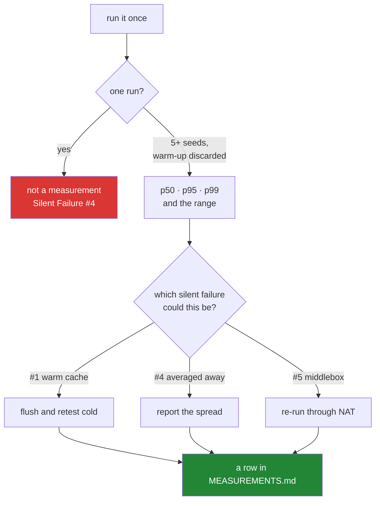

# 2.6 — `MEASUREMENTS.md`, and what turns a number into a result

## One-line answer

A number becomes a result when it carries its topology, its netem settings, its seed, its
repetition count, its tool version, a hardware line and **its spread** — and one run reported
as a single figure is Silent Failure #4 with a table around it.

---

## The story

Someone tells you the bus takes twenty minutes.

You get the bus. It takes thirty-five. You are late, and you are also confused, because the
person who told you was not guessing — they get that bus regularly.

Both things are true. They get it at half past six in the morning and it takes twenty minutes.
You got it at half past eight, and at half past eight it takes thirty-five and sometimes
fifty. Neither of you was wrong about the number. The number was just never the whole answer,
because it was **one measurement of a thing that varies**, reported as though it were a
property of the bus.

And notice what the useful version sounds like: *"twenty at six-thirty, more like thirty-five
in the rush, and once it took nearly an hour when the road was shut."* That is longer, less
satisfying, and actually usable. The spread is not a caveat on the number. The spread **is**
the answer.

---

## The idea in plain language

P8 says **never invent a number**, and it says something sharper too: this is the rule you are
most likely to break. Not by lying — by reporting a real measurement without the conditions
that make it mean anything.

Every empirical claim in this curriculum is one of exactly three things:

1. **measured here** — with topology, netem settings, seed, repetitions, hardware and date;
2. **specified** — RFC number and section, checked current
   ([2.3](2.3-specs-read-it-before-you-quote-it.md));
3. **cited** — a named paper, venue and year.

Anything else is a rumour, and the tell is a hedge: *"typically"*, *"usually"*, *"around"*,
*"on the order of"*. If you catch yourself writing one of those in front of a number, that is
a rumour with a hedge in front of it.

So the row is long on purpose:

```text
| ID | Day | Topology | netem | Seed | Reps | Tool + version | Hardware | Result (with spread) | Outcome |
```

Four of those columns are the ones people leave out, and each has a specific failure attached:

**Seed.** Anything involving randomness — loss patterns, reordering, a load generator's
choices — must be seeded, or the run cannot be repeated. `tc netem loss 1%` drops different
packets each time; without a seed you cannot ask "was that the same run?"

**Reps.** **One run is not a measurement.** The plan's minimum is five seeds, warm-up
discarded, and a transfer longer than slow start — because a short transfer measures TCP's
ramp-up rather than the link.

**Hardware.** A throughput figure is partly a fact about a CPU. The same topology on a
different machine gives a different number, and a row without a hardware line cannot be
compared with anyone else's.

**Result *with its spread*.** p50, p95, p99 — or at minimum a mean and a range across seeds.
**Never the best run.** This is Silent Failure #4, *averaged away*, and it is the one this
ledger is shaped around: a single figure hides both the variance and the outliers, and in
networking the outliers are usually the finding. A p99 that is ten times the p50 is a queueing
story that a mean erases completely.

And one column that exists because of P10:

**Outcome — including "no significant difference".** An optimisation that made throughput
worse gets a row, in the same words it would have used if it had won. A ledger that only
records wins is a ledger that has been curated, and a curated record of experiments is worth
very little.

Before writing any row, plan §6 asks one more thing: **name which of the five silent failures
you ruled out, and how.** A throughput number taken from a warm cache, over loopback, through
a middlebox that rewrote the flow is a number about none of the things you think it is about.

---

## Why Jāla needs it

- **P8 is the principle the plan says you are most likely to break**, and this is where it is
  either enforced or quietly abandoned.
- **P10 — fail honestly.** *"A topology that would not converge is reported as not converging.
  An optimisation that made throughput worse says so."*
- **The phase gate requires a row for every measurement in the phase** (§25 item 6), carrying
  topology, netem, seed, repetitions and hardware. **A measurement without a row did not
  happen.**
- **Phase 14 is entirely about this** — Days 133 to 140, *numbers you are allowed to quote* —
  and its gate is that every claim carries its conditions and the warm-cache contamination
  check is clean. This ledger is what that phase fills.

---

## The mechanism

The file is empty today, and says why rather than pretending otherwise:

```bash
tail -2 docs/MEASUREMENTS.md
```

**Line by line:**

- `tail -2` — the last two lines, which are prose rather than a row: nothing has been measured
  yet, and Day 1 does not invent a number so the table looks started. **An empty ledger that
  explains itself is more trustworthy than a populated one**, because it demonstrates that
  rows are only added when something happened.

Read the hardware line off the machine rather than recalling it:

```bash
uname -srm && nproc 2>/dev/null && cat /proc/meminfo 2>/dev/null | head -1
```

**Line by line:**

- `uname -srm` — kernel name, **release** and machine architecture. The kernel release is the
  one that matters most here: kernel defaults change between versions, and a congestion
  control result is partly a statement about a kernel.
- `nproc` — how many processing units the machine reports. A throughput result on one core and
  on eight is a different result.
- `head -1` of `/proc/meminfo` — total memory. Both of the last two are Linux-only, hence the
  `2>/dev/null` so the line does not fail noisily on a machine that has neither — the honest
  outcome on a host with no Linux kernel
  ([Day 0, 4.1](../../../day-000-toolchain-skeleton-driver/parts/04-the-linux-door/4.1-namespaces-need-linux.md)).

Read a default off the running system rather than quoting one:

```bash
sysctl net.ipv4.tcp_congestion_control net.core.rmem_max 2>/dev/null
```

**Line by line:**

- `sysctl <key>` — print a kernel parameter's **current** value. P8 is explicit that a timer
  default, an MTU, a buffer size or a queue length is *read off the running system*, and the
  document says which system and which kernel.
- These two in particular decide what a throughput measurement even means: which congestion
  control algorithm is active, and how large a receive buffer the kernel will allow. **A
  default is a fact about a build, not about a protocol** — it differs between distributions
  and between kernel versions.

Then the row, appended:

```bash
cat >> docs/MEASUREMENTS.md <<'EOF'
| M-001 | 72 | `two-host` | delay 40ms 5ms, loss 1% | 1..5 | 5 | iperf3 3.16 | 8-core x86_64, kernel 6.8.0 | p50 61.4, p95 58.9, p99 55.1 Mbit/s (range 54.8-62.0) | CUBIC beat Reno by 8% at p50; overlapping at p99 |
EOF
```

**Line by line:**

- `M-001` — a stable identifier, so a day document can cite the row rather than repeating the
  number. A number quoted in two places will eventually disagree with itself.
- `Seed 1..5` and `Reps 5` — five distinct seeds, stated. Not "several".
- The `Result` column gives **three percentiles and a range**. Notice the p99 is worse than
  the p50 by a visible margin — that gap is the queueing behaviour, and a mean would have
  erased it.
- The `Outcome` column states the comparison **and its limit**: overlapping at p99 means the
  8% headline does not hold in the tail. Writing the limit down is P10; omitting it is how a
  modest result becomes a claim.



---

## When it breaks

**The number with no conditions, which produces no error at all:**

```text
throughput: 94 Mbit/s
```

**What it means:** almost nothing. Which topology, what delay and loss, one run or five, which
seed, what hardware, warm or cold? It cannot be compared with the next number, defended if
somebody disagrees, or reproduced by anyone including you. P8 is blunt: **it is not a weak
result, it is not a result.**

**The best run, reported as the result:**

```text
$ for i in 1 2 3 4 5; do iperf3 -c 10.0.0.2 -t 10 | tail -3 | head -1; done
[  5]  0.00-10.00 sec  73.1 MBytes  61.3 Mbits/sec  receiver
[  5]  0.00-10.00 sec  71.8 MBytes  60.2 Mbits/sec  receiver
[  5]  0.00-10.00 sec  88.4 MBytes  74.1 Mbits/sec  receiver
[  5]  0.00-10.00 sec  72.0 MBytes  60.4 Mbits/sec  receiver
[  5]  0.00-10.00 sec  71.2 MBytes  59.7 Mbits/sec  receiver
```

**What it means.** Five runs, and one of them is 74 while the other four cluster near 60. The
temptation is to report 74 — it is a real number, it really happened, and it is the one that
makes your change look good. **Reporting it alone is Silent Failure #4**, and the honest row
says p50 60.4 with a range of 59.7 to 74.1 and notes that one run was an outlier worth
investigating. The outlier is more interesting than the headline: something let that run go
faster, and finding out what is a better day's work than the average.

**And the silent one, which is #1 wearing a benchmark's clothes.** Two runs, back to back:

```text
$ time dig @10.0.0.2 example.test
;; Query time: 41 msec

$ time dig @10.0.0.2 example.test
;; Query time: 0 msec
```

**Nothing failed and the second number is not about the network.** The resolver cached the
answer, so the second query never left the machine — and a benchmark loop that ran a hundred
iterations would report a mean of roughly 0.4 ms and be measuring memory. This is Silent
Failure #1, *the cache answered, not the network*, and the check is the one plan §6 names:
**flush and retest cold** — `ip neigh flush all`, a fresh resolver cache, a new connection
rather than a reused one. A measurement row is expected to say which of the five you ruled out
and how, and this is why the column is not decorative.

---

## In production

**Percentiles rather than averages is the single most transferable idea here.** Mean latency
is close to useless for user-facing systems: it is dominated by the many fast requests and
tells you nothing about the tail, and the tail is what people experience as "the site is
slow". Serious engineering organisations state objectives in percentiles — p99 under some
bound — and the reason is that a mean can improve while p99 gets worse, which means the
average can go the right way while every complaint gets louder.

**Warm-up and cache effects contaminate almost every naive benchmark.** Just-in-time
compilation, page cache, DNS cache, ARP cache, TCP slow start, connection pools — all of them
make the first run different from the tenth, and which one you want depends on what you are
claiming. The professional habit is to state it: cold or warm, and how you achieved it.

**Reproducibility is what makes a performance claim reviewable.** A benchmark that cannot be
re-run is an assertion, and the pattern in mature teams is a committed harness — the script,
the environment definition, the seed, the exact command — so a reviewer can disagree with your
conclusion by running your experiment rather than by arguing about it. That is what the
combination of `TOPOLOGIES.md` and this ledger is for.

**Recording negative results is a discipline that pays back unevenly and enormously.** Most
optimisations do not work. A team that only records the ones that did will re-attempt the
failures every eighteen months, because nothing in the repository remembers that it was tried.
"We measured this and it made no significant difference" is a genuinely valuable row, and P10
requires it.

**What an operator does differently.** They ask "compared to what?" before accepting any
performance number, and they treat an unqualified figure in a capacity plan as a risk rather
than as data. Capacity planning from measured data rather than vendor sizing is `OPS-10`, and
the difference between the two is precisely the columns in this row.

**The review comment.** On a pull request claiming a performance improvement:
*"What's the spread across runs, and how many? A single number that's 8% better could easily
be run-to-run variance — and if p99 moved the other way, that's the one users will notice."*

**The interview question.** *"You changed something and throughput went up 10%. How confident
are you?"* The answer that shows judgement asks about variance before claiming the win: how
many runs, what is the spread, do the distributions overlap, was the warm-up discarded, and
was anything else different between the two conditions. A candidate who reports a single
before-and-after pair has told you they have not yet been burned by run-to-run noise.

---

## Check yourself

```bash
grep -c '^| M-' docs/MEASUREMENTS.md
```

That number is **how many results this repository is allowed to quote** — today, zero, and
correctly so. Nothing has been measured, and no number was invented to make the table look
started. From Day 12 onward the count climbs, and every increment carries a topology, a seed,
a repetition count and a spread.

**Answer out loud, without scrolling up:**

> Name the four columns people leave out and give the specific failure attached to each. Then
> explain why "no significant difference" gets a row — and describe how a `dig` benchmark can
> report a mean of almost zero while telling you nothing about the network.

---

**Next:** [3.1 — The ID scheme, and what "closed" means](../03-traceability/3.1-the-id-scheme-and-what-closed-means.md)
