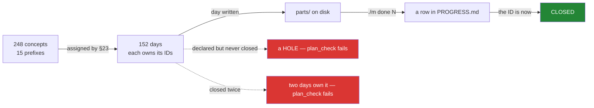

# 3.1 — The ID scheme, and what "closed" means

## One-line answer

The curriculum is 248 numbered concepts across fifteen prefixes, each assigned to exactly one
day, and a concept is **closed** when the day that owns it is complete — which makes "have we
covered fragmentation?" a question with a mechanical answer instead of an opinion.

---

## The story

You are packing to move house, and you do it the sensible way: fill a box, write on it what is
inside, carry on.

Thirty boxes later you are in the new place looking for the kettle. You know you packed it.
You can picture packing it. And now you are opening boxes labelled "kitchen bits", "misc" and
"kitchen misc", which between them could mean anything.

The labels were not the problem — you did label them. The problem is that "did I pack the
kettle?" and "which box is the kettle in?" are different questions, and box labels only answer
the second one, badly. There is no way to look at thirty boxes and know whether something is
in one of them.

The version that works is a numbered list on a sheet of paper: every item you own, and next to
it the box it went into. Now "did I pack the kettle?" is one glance, "which box" is the same
glance, and — the part that actually saves you — **anything with no box number next to it is
still in the old house.**

---

## The idea in plain language

Every concept in this curriculum has an **ID**: a prefix and a two-digit number.

```text
FOUND-04    LINK-15    NET-24    TRANS-17    OPS-01
```

The prefix names one of fifteen curricula, each covering one layer or one theme:

| Prefix | Subject | Count |
| --- | --- | --- |
| `FOUND` | foundations & the model | 14 |
| `PHY` | the physical layer & signalling | 12 |
| `LINK` | the link layer & switching | 22 |
| `NET` | the network layer & addressing | 24 |
| `ROUTE` | routing | 18 |
| `TRANS` | transport & TCP | 24 |
| `CONG` | congestion control & queueing | 14 |
| `SOCK` | the socket API & concurrency | 12 |
| `DNS` | naming & DNS | 12 |
| `APP` | application protocols | 20 |
| `SEC` | security, TLS & trust | 22 |
| `WIRE` | wireless & mobility | 10 |
| `DC` | datacenter, cloud & overlays | 18 |
| `PERF` | performance & measurement | 14 |
| `OPS` | operations & discipline | 12 |

That is **248 concepts**, and each is assigned to **exactly one** day by the plan's day map.
Not "covered on" — *assigned to*. One day owns it, and that day's hub lists it in frontmatter.

The word that carries the weight is **closed**:

> A concept is **closed** when the day that owns it appears in `docs/PROGRESS.md` — which
> means its checklist was ticked and its checks were green.

So there are three states, and they are genuinely different:

- **assigned** — the plan says day N owns it. True from the start.
- **written** — day N's folder exists with its parts. Visible on disk.
- **closed** — day N has a row in the progress ledger. Only `./m done N` can do this.

`OPS-01` is assigned to Day 1, Day 1 is written, and `OPS-01` is **not closed** — because this
day is not finished yet. That distinction is not pedantry; it is the difference between the
box being labelled and the kettle being in it.

Now the property that makes the whole scheme worth having, and it is checked mechanically:

> **Every declared ID is closed exactly once. No more, no fewer.**

Not zero times — a concept nobody teaches is a hole. Not twice — a concept taught on two days
means two days both think they own it, and neither will be complete. `scripts/plan_check.py`
verifies this and **refuses to run** if it fails, which is why P19 says the day count is an
*output*: 152 is what came out of splitting 248 concepts at idea boundaries, not a target
somebody picked.

And the phase-level rule that this all exists to support:

> **An open ID in a completed phase is a bug.**

That is [3.3](3.3-an-open-id-is-a-bug.md)'s subject, and it is the only thing that stops a
curriculum quietly shipping with a gap in it.

---

## Why Jāla needs it

- **`OPS-01` is closed by this day**, and this part is how you know what that sentence means.
- **`/day-jala N` closes exactly the IDs the plan assigns to day N** — no more, no fewer. A day
  that grabs an extra concept steals it from the day that was going to teach it properly.
- **P19 — the day count is derived, not chosen.** If a day turns out to hold two ideas, it is
  split by ADR and the total moves. The ID decomposition is the thing the count is derived
  *from*.
- **`docs/CURRICULUM_INDEX.md` answers "where do I learn `TRANS-17`?"** — which is the "which
  box" question, and it only works because every concept has exactly one answer.

---

## The mechanism

Verify the decomposition. This is `./m plan`, and it is a gate in `./m check`:

```bash
./m plan
```

**Line by line:**

- `./m plan` — runs `scripts/plan_check.py`, which checks that every declared ID is closed
  exactly once, that day numbers are contiguous from 0, and that no day closes an ID that was
  never declared. **It prints the day count as an output**, which is P19 made literal: the
  number in the plan's title is a result, not a claim.

The check itself, which is short because the property is simple:

```python
def verify(declared: set[str], used: Counter[str]) -> list[str]:
    """Every declared ID is closed exactly once (P19)."""
    problems = []
    dupes = [i for i, c in used.items() if c > 1]
    if dupes:
        problems.append(f"IDs used more than once: {sorted(dupes)}")
    unknown = sorted(set(used) - declared)
    if unknown:
        problems.append(f"IDs used but never declared: {unknown}")
    missing = sorted(declared - set(used))
    if missing:
        problems.append(f"IDs declared but never closed: {missing}")
    return problems
```

**Line by line:**

- `Counter[str]` rather than a set — a set would silently collapse a duplicate, and a duplicate
  is exactly one of the three bugs being looked for. **The data structure has to be able to
  represent the failure**, or the check cannot find it.
- `c > 1` — an ID assigned to two days. Both days will claim to close it and the second one is
  wrong.
- `set(used) - declared` — an ID a day claims that the curriculum never defined. Usually a
  typo, and a typo here silently leaves the *real* ID unclosed.
- `declared - set(used)` — the hole: a concept nobody teaches. **This is the one that would
  otherwise be invisible**, because nothing fails when a topic is simply absent — you would
  only discover it by finishing the curriculum and noticing you cannot do something.
- Returning a list of all three rather than raising on the first — one run gives the complete
  picture, which matters when a renumbering has broken several at once.

Ask where a concept is taught:

```bash
grep -n 'TRANS-17' docs/CURRICULUM_INDEX.md
```

**Line by line:**

- The index is a **projection** of the day map
  ([1.2](../01-repo-as-memory/1.2-written-by-hand-or-regenerated.md)), regenerated by
  `./m tracker`. Every cell is copied, so it cannot invent an assignment the plan does not
  contain — which is the only reason it is safe to consult instead of reading the plan.

And read a day's own claim, from its frontmatter:

```bash
grep -m1 '^ids:' days/day-001-bootstrap-and-the-map/LESSON.md
```

**Line by line:**

- `grep -m1 '^ids:'` — the first line starting with `ids:`, which is the hub's frontmatter
  declaration. `-m1` stops at the first match so a mention later in the document cannot be
  confused for the declaration.
- **This is the day's claim about itself**, and `./m trace` is what compares it against the
  plan's assignment ([3.2](3.2-scripts-trace-py.md)). Two independent statements that must
  agree — which is the whole idea of traceability.



---

## When it breaks

**The hole, which is what this check exists to find:**

```text
$ ./m plan
PROBLEM: IDs declared but never closed: ['NET-19', 'NET-20']
```

**What it means.** Two concepts are defined in the curriculum and no day teaches them. Nothing
else in the repository would ever notice — there is no test that fails when a topic is absent,
and you would find out by reaching Day 151 and discovering you cannot do something the plan
promised. This is the "still in the old house" case.

**The duplicate:**

```text
$ ./m plan
PROBLEM: IDs used more than once: ['LINK-15']
```

**What it means.** Two days both claim it. In practice one of them will teach it properly and
the other will assume it was already covered — or, worse, both will teach it thinly, each
believing the other is doing the depth. The fix is an ADR, because moving a concept between
days changes the plan (§25).

**The typo, which is the sneaky one:**

```text
$ ./m plan
PROBLEM: IDs used but never declared: ['TRANS-71']
PROBLEM: IDs declared but never closed: ['TRANS-17']
```

**What it means.** Two problems that are one problem: somebody transposed the digits. Note the
check reports **both halves** — the invented ID and the abandoned one — which is what makes
the cause obvious at a glance. A check that reported only the unknown ID would have you
hunting for a concept that does not exist.

**And the silent one, which is the reason "closed" is defined by the ledger rather than by the
folder.** A day that is written but not done:

```text
$ ls days/ | wc -l
5
$ grep -c '^| [0-9]' docs/PROGRESS.md
1
```

**Nothing failed.** Four days exist on disk with full `parts/` directories, and one has a
progress row. If "closed" meant "the folder exists", those four days' IDs would count as
covered — and they might contain unticked checklists, red checks, or a part that was started
and abandoned. **A folder is evidence that work began; a ledger row is evidence that the gate
passed.** Conflating them would make the traceability report confidently wrong, which is worse
than having no report, because people act on it.

---

## In production

**This is requirements traceability, and it is old, unglamorous and load-bearing.** In
regulated engineering — aviation, medical devices, automotive — every requirement carries an
identifier, and there is a matrix showing which design element implements it and which test
verifies it. Auditors read the matrix. The reason the practice survives is that "did we
implement all of it?" is otherwise unanswerable on any system large enough to matter.

**The same shape appears everywhere without the formality.** A ticket number in a commit
message, a spec section referenced in a design document, a test named after the behaviour it
protects. All of them are answering "is this thing covered, and where?" — and all of them
degrade the same way, by drifting out of date until nobody trusts them and everybody greps
instead.

**Coverage checks find absences, which is the hard direction.** Most testing tells you
something present is wrong. Very little tells you something is missing — and missing
requirements are the expensive failure, because they survive every review by simply not being
in the room. A check that enumerates what *should* exist and compares it to what does is one
of the few mechanisms that catches this class.

**What an operator does differently.** They keep the identifier stable and let the location
move. A concept assigned to Day 34 that later splits into Days 34 and 35 keeps its ID; the ID
is the identity, and the day is where it currently lives — the same relationship as the day
number and its folder slug (§24.2). Identifiers that encode their location have to be renamed
whenever anything moves, and things move.

**The review comment.** On a pull request adding a day that closes an extra concept:
*"This closes `NET-19` as well, but the plan assigns that to Day 41 — so Day 41 will now have
nothing to teach, and `plan_check` will fail on the duplicate. If it genuinely belongs here,
that's an ADR."*

**The interview question.** *"How do you know your test suite covers the requirements?"* Line
coverage is the answer that misses the point, because it measures the code you wrote rather
than the requirements you were given — a requirement nobody implemented has no lines to cover
and scores perfectly. The strong answer describes a mapping in both directions, and names the
direction that is hard: finding the requirement with nothing pointing at it.

---

## Check yourself

```bash
./m plan 2>&1 | grep -E 'concept IDs|days|OK'
```

Three lines: **how many concepts the curriculum declares**, **how many days they decompose
into**, and whether every one is closed exactly once. The day count is printed as an *output*
of the check, which is P19 in one line of terminal output — nobody chose 152.

**Answer out loud, without scrolling up:**

> Name the three states an ID can be in and say which file distinguishes the last two. Then
> explain why `plan_check.py` uses a `Counter` rather than a set — and why "declared but never
> closed" is the failure that nothing else in the repository would ever catch.

---

**Next:** [3.2 — `scripts/trace.py`, and the report that compares two claims](3.2-scripts-trace-py.md)
