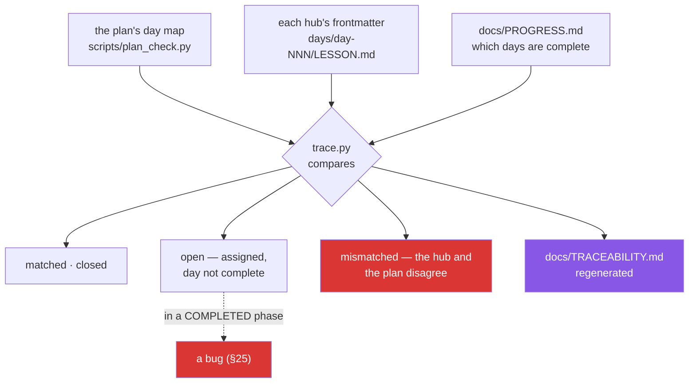

# 3.2 — `scripts/trace.py`, the report that compares two claims

## One-line answer

`./m trace` reads what each day's hub *says* it closes and compares it against what the plan
*assigns* to that day, then regenerates `docs/TRACEABILITY.md` — and the whole value is that
those are two independent statements which must agree.

---

## The story

Two people are unloading a van. One reads names off a delivery note; the other looks in the
back and says what is actually there.

That is slower than one person glancing in the van and saying "looks about right", and it is
the only version that finds anything. Because the failure you are looking for is not a missing
box — you would probably spot that. It is the box that is *there* and is not on the note, and
the box that is *on the note* and is not there, and both of those are invisible to a person
doing one job.

The reason two lists work is not that two people are more careful. It is that the lists were
made **at different times, by different people, for different reasons**. When they agree, the
agreement means something. When one person makes both lists from the van, they always agree
and the agreement is worth nothing.

---

## The idea in plain language

There are two independent statements about which concepts a day closes.

**What the plan assigns.** The day map in `scripts/plan_check.py` says day 1 owns `OPS-01`.
This was decided when the curriculum was decomposed, before any day was written.

**What the day claims.** `days/day-001-bootstrap-and-the-map/LESSON.md` has `ids: ["OPS-01"]`
in its frontmatter. This was written when the day was written.

`scripts/trace.py` compares them, day by day, and reports four things:

- **matched** — the day claims what the plan assigns. The normal case.
- **claimed but not assigned** — the day is teaching a concept somebody else owns.
- **assigned but not claimed** — the plan expects it here and the day does not mention it.
- **open** — assigned to a day that is not yet complete.

The last category is the useful one, because it is where the rule lives:

> **An open ID in a completed phase is a bug.**

A phase is a run of days with a gate at the end (§25). If Phase 1 is declared finished and
`FOUND-11` is still open, then either a day was skipped, or a day was marked complete without
actually closing what it owed. Both are real problems, and neither produces any other symptom.

Two things worth being precise about.

**This is different from `./m plan`.** `plan_check.py` checks the *plan against itself* — is
the decomposition internally consistent, is every ID assigned exactly once. It never looks at
`days/`. `trace.py` checks the *plan against the repository* — did the days that were written
actually do what they were assigned. One is a consistency check on a design; the other is a
check that the implementation matches it.

**`docs/TRACEABILITY.md` is a projection.** It is regenerated, never hand-edited
([1.2](../01-repo-as-memory/1.2-written-by-hand-or-regenerated.md)). Editing it to make a red
line go away changes nothing except how long the discrepancy stays hidden.

And the honest note: **`scripts/trace.py` does not exist yet.** It is this day's build brief —
you write it, from this document. `./m trace` currently says so out loud rather than passing
silently, because a check that quietly does nothing is worth less than no check (P10).

---

## Why Jāla needs it

- **`OPS-01` is traceability**, alongside ledgers and reproducible topologies. This script is
  the mechanical half.
- **The phase gate requires no open IDs from this or any earlier phase** (§25 item 2). That
  question needs an answer that is computed rather than believed.
- **`/day-jala N` reads `docs/TRACEABILITY.md` before generating a day**, and treats an open ID
  from a completed phase as a bug to report rather than paper over.
- **`./m check` runs `./m trace`.** A drift between the plan and the days becomes visible on
  the next commit rather than at the phase gate, which is the difference between a small fix
  and an archaeology exercise.

---

## The mechanism

Run it, and read what it says today:

```bash
./m trace
```

**Line by line:**

- `./m trace` — the driver's branch. Because `scripts/trace.py` is not written yet, it prints
  a **warning naming the day that owes it** rather than exiting zero in silence. The
  distinction matters: a gate that passes because it did nothing is the same failure shape as
  [Day 0's exit-code-5 problem](../../../day-000-toolchain-skeleton-driver/parts/05-first-commit/5.1-the-check-that-can-go-red.md).

The driver's branch, which is four lines and one decision:

```bash
trace)
  if [ -f scripts/trace.py ]; then
    uv run python scripts/trace.py
  else
    echo "WARN scripts/trace.py not written yet - it is Day 1's build brief (OPS-01)"
  fi
  ;;
```

**Line by line:**

- `[ -f scripts/trace.py ]` — does the file exist? A plain existence test, so the repository
  can be honest about its own incompleteness rather than pretending.
- The `else` branch prints **`WARN` and the reason**, and — importantly — does **not** exit
  non-zero. Until Day 1 is done, a missing `trace.py` is the correct state of the repository,
  not a failure. Saying so out loud is P10; exiting 1 would make `./m check` red for a day that
  has not happened yet, and a permanently red gate is a gate people stop reading.

What you are building — the comparison, which is the whole script in essence:

```python
def compare(
    assigned: dict[int, list[str]], claimed: dict[int, list[str]], complete: set[int]
) -> dict[str, list[str]]:
    """Compare the plan's assignment against each written day's own frontmatter."""
    report: dict[str, list[str]] = {"open": [], "mismatched": [], "closed": []}
    for day, ids in sorted(assigned.items()):
        mine = set(claimed.get(day, []))
        theirs = set(ids)
        if day in claimed and mine != theirs:
            report["mismatched"].append(
                f"day {day}: hub claims {sorted(mine)}, plan assigns {sorted(theirs)}"
            )
        for cid in sorted(theirs):
            (report["closed"] if day in complete else report["open"]).append(cid)
    return report
```

**Line by line:**

- Three inputs, from three different places: the plan's day map, each hub's frontmatter, and
  `docs/PROGRESS.md`. **Three independent sources is what makes the comparison meaningful** —
  a script that derived two of them from the same file would always agree with itself.
- `set(...)` on both sides — order in a frontmatter list does not matter, so comparing sets
  rather than lists avoids reporting a difference that is only cosmetic.
- `if day in claimed and mine != theirs` — only compare when the day is **written**. An
  unwritten day is not mismatched, it is pending, and reporting it as a mismatch would fill the
  report with 150 lines of noise on Day 1.
- `day in complete` — from the progress ledger, **not** from the folder existing. That is
  [3.1](3.1-the-id-scheme-and-what-closed-means.md)'s distinction: written and closed are
  different states, and using the folder here would be the silent failure that part described.
- Returning a dict of lists rather than printing — the caller renders the report *and* decides
  the exit status, and a function that returns data is one a test can drive without a
  filesystem (plan §5).



---

## When it breaks

**Today's honest output:**

```text
$ ./m trace
WARN scripts/trace.py not written yet - it is Day 1's build brief (OPS-01)
```

**What it means.** The check does not exist, and the repository says so, names what owes it,
and does not pretend. When you have written the script this line disappears and is replaced by
a report.

**The mismatch, which is what the script is for:**

```text
$ ./m trace
MISMATCH day 34: hub claims ['NET-11', 'NET-12'], plan assigns ['NET-11']
FAIL 1 day disagrees with the plan
```

**What it means.** Day 34's hub claims an extra concept. Either the day genuinely taught
`NET-12` — in which case the day that was supposed to own it now has nothing, and this needs an
ADR — or somebody added an ID to frontmatter that the day does not actually cover, which is
worse, because the traceability report will then say `NET-12` is closed when nothing teaches
it.

**And the silent one, which is the reason this script exists at all.** A day marked complete
whose hub quietly dropped an ID:

```text
$ grep '^ids:' days/day-034-forwarding/LESSON.md
ids: ["NET-11"]

$ ./m plan
OK - every declared ID is closed exactly once.
```

**Both of those pass, and a concept is missing.** `./m plan` is checking the *plan* — the day
map still assigns `NET-11` and `NET-12` to day 34, and internally that is consistent. The hub
only claims one of them. Nothing in `plan_check.py` looks at `days/` at all, so the
decomposition is perfect and the repository does not implement it.

This is exactly the two-list situation from the story: **one list checked against itself always
agrees.** The gap between "the plan is consistent" and "the days did what the plan says" is
invisible to any check that reads only one of them, and it is the gap `trace.py` covers.

---

## In production

**A traceability matrix is a standard deliverable in regulated engineering** — aviation,
medical devices, automotive — precisely because "did we build all of it?" is otherwise
unanswerable on a system of any size. The regulated industries formalised it because the cost
of a missing requirement there is measured in something other than money, but the mechanism is
general and the failure it catches is the same everywhere.

**The important property is independent sources.** A report generated from one source will
always be self-consistent and will therefore never find anything. This is the same reason a
test that asserts what the code does is worthless, the same reason double-entry bookkeeping
records every transaction twice, and the same reason a checksum computed by the sender is
verified by the receiver rather than by the sender again. **Agreement is only evidence when the
two things could have disagreed.**

**Reports drift out of date and then get ignored, which is the real failure mode.** A
traceability document maintained by hand is wrong within weeks and is then worse than nothing,
because people either trust it and are misled or learn to skip it and lose the check. The only
version that survives is generated, regenerated on every build, and failing the build when it
disagrees — which is why this one is a projection and why `./m check` runs it.

**What an operator does differently.** They ask what the report *cannot* see. `trace.py`
compares an ID in frontmatter against an ID in a plan; it cannot tell whether the day's parts
actually teach the concept. A day could claim `NET-12`, pass every check, and contain four
paragraphs of nothing. **The mechanical check bounds the problem; it does not solve it** — which
is the same honest limit as
[Day 0's depth contract](../../../day-000-toolchain-skeleton-driver/parts/03-the-driver/3.4-the-depth-contract-made-mechanical.md)
and [Day 0's done gate](../../../day-000-toolchain-skeleton-driver/parts/03-the-driver/3.3-the-done-gate.md).

**The review comment.** On a pull request that adds an ID to a hub's frontmatter without
adding a section:
*"The frontmatter now claims `NET-12` but there's no part covering it — trace will go green
and the concept still isn't taught. Either write the section or leave the ID with the day that
owns it."*

**The interview question.** *"How do you verify that an implementation matches its
specification?"* The answer that shows judgement is about independence: the check must read
both artefacts, and it must be automated so it runs on every change rather than at a review
somebody schedules. The follow-up worth volunteering is the limit — a matching identifier
proves the mapping exists, not that the implementation is correct, and conflating those is how
a green traceability report accompanies a broken system.

---

## Check yourself

```bash
./m trace 2>&1 | tail -1
```

Today that line names the script that does not exist yet and the day that owes it. After you
write it, the same command prints **how many IDs are closed and how many are open** — and the
open count is the number that has to be zero at every phase gate.

**Answer out loud, without scrolling up:**

> Explain the difference between what `./m plan` checks and what `./m trace` checks, and name
> the failure that only the second one can find. Then say why the report must be generated
> from three independent sources — and what `trace.py` still cannot tell you about a day.

---

**Next:** [3.3 — An open ID in a completed phase is a bug](3.3-an-open-id-is-a-bug.md)
