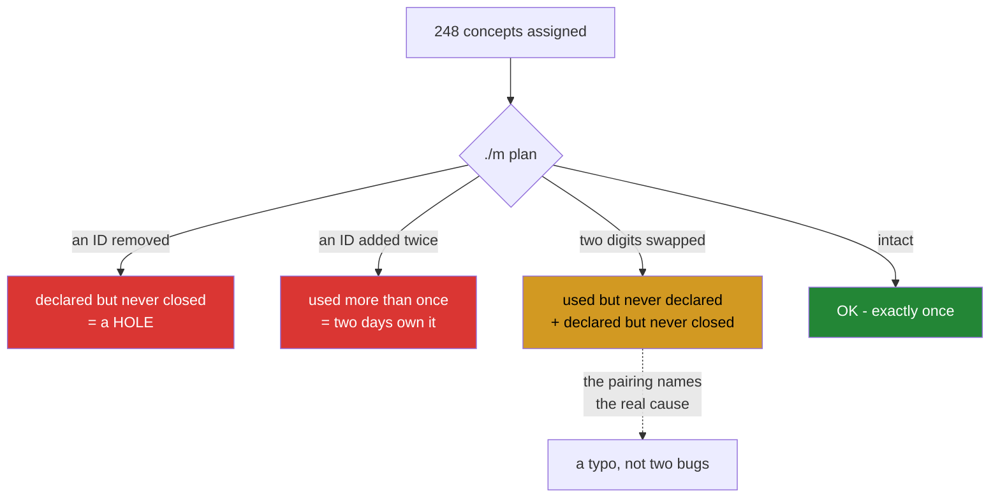

# 3.3 — An open ID in a completed phase is a bug

> **This is Day 1's deliberate-failure part** (§24.8). It does not describe the three ways a
> curriculum can develop a hole — it **causes** each one, with the command printed, because
> P12 says you may not claim a fix for a failure you cannot reproduce on demand.

## One-line answer

A concept assigned to a day in a phase that has been declared finished, and still not closed,
means either a day was skipped or a day was marked done without doing what it owed — and today
you break the decomposition three ways on purpose to watch the check find each one.

---

## The story

A fire door with a sign saying it is checked monthly, and a card behind glass with initials in
every box going back two years.

Somebody eventually notices the door does not actually close on its own. The closer has been
broken for a while — long enough that the paint has cracked where it sits open.

Every box on that card is initialled. Nobody forged anything and nobody was lazy in a way they
would recognise; what happened is that checking became **initialling the card**, gradually,
over about eighteen months, because the door had never been broken before so there was nothing
to find, and a check that never finds anything stops feeling like a check.

The card is not evidence that the door works. It is evidence that somebody came past with a
pen. And the only way anyone would ever know the difference is by testing the door — which is
a different activity from reading the card, and is the one nobody was doing.

---

## The idea in plain language

The rule, from plan §25:

> **A phase is green only when `scripts/trace.py` shows no open IDs from this or any earlier
> phase.**

An **open** ID is one the plan assigns to a day that is not yet complete
([3.1](3.1-the-id-scheme-and-what-closed-means.md)). Open is normal — most IDs are open right
now. What is not normal is an open ID in a phase somebody has declared finished, and there are
exactly three ways to get one:

**A day was skipped.** The plan assigns the concept; no day closes it. Nothing else in the
repository notices, because there is no test that fails when a topic is simply absent.

**A day claimed it and did not teach it.** The hub's frontmatter lists the ID, `trace.py` sees
a match, and the parts do not cover it. This is the initialled card.

**A day was marked complete with the box ticked and the work not done.** The gate cannot tell
([Day 0, 3.3](../../../day-000-toolchain-skeleton-driver/parts/03-the-driver/3.3-the-done-gate.md)),
and the ledger records a completion that did not happen.

Only the first is mechanically detectable. That is worth stating plainly rather than
pretending the tooling is stronger than it is: **the check bounds the problem, it does not
solve it.** What the check does is remove *forgetting* from the list of causes, leaving only
causes that require a decision — which is a much smaller and more visible category.

So today you exercise the detector, because a check nobody has watched fail is a card with
initials on it.

---

## Why Jāla needs it

- **`OPS-01` is traceability**, and a traceability report that has never gone red is a report
  nobody has reason to trust.
- **P12 — reproduce the fault before you fix it.** *"Every day that diagnoses something also
  injects it, with the command printed."* This is that, applied to the repository's own
  bookkeeping before it is applied to a network.
- **P11 — every day ends with a check that can go RED.** Day 1's check is `./m plan` and
  `./m trace`, and this part is where you prove they can fail.
- **P19 — the day count is derived.** `plan_check.py` refuses to run if the decomposition is
  inconsistent, so the number 152 is only meaningful while this check is working.

---

## The mechanism

**Injection 1 — the hole.** Take a concept away from the day that owns it. Day 7 closes
`FOUND-12`, the five tools that each see something different:

```bash
cp scripts/plan_check.py scripts/plan_check.py.bak
sed -i 's/"The five tools that each see something different", "FOUND-12")/"The five tools that each see something different")/' scripts/plan_check.py
./m plan 2>&1 | grep -E 'PROBLEM|OK'
cp scripts/plan_check.py.bak scripts/plan_check.py
```

**Line by line:**

- `cp … .bak` **first.** You are deliberately breaking a file that every other check depends
  on, and the restore has to exist before the break does — otherwise a mistake in the `sed`
  leaves you repairing the plan by hand.
- `sed -i 's/…/…/'` — edit in place, removing the `"FOUND-12"` argument so Day 7 closes
  nothing. The pattern includes the day's title so it cannot match anywhere else.
- `grep -E 'PROBLEM|OK'` — the verification prints fifteen curriculum lines; this keeps the
  verdict.
- The restore is the **fourth line, not a later step**. Run all four together.

**Actual output, on 2026-09-07:**

```text
PROBLEM: IDs declared but never closed: ['FOUND-12']
```

**Injection 2 — the duplicate.** Give a concept to a second day as well:

```bash
cp scripts/plan_check.py scripts/plan_check.py.bak
sed -i 's/"Your first capture, read byte by byte", "FOUND-13")/"Your first capture, read byte by byte", "FOUND-13", "FOUND-12")/' scripts/plan_check.py
./m plan 2>&1 | grep -E 'PROBLEM|OK'
cp scripts/plan_check.py.bak scripts/plan_check.py
```

**Line by line:**

- The `sed` appends `"FOUND-12"` to Day 8, so both Day 7 and Day 8 now claim it.
- **Note what does *not* happen: no ID goes missing.** Every concept is still assigned. The
  decomposition looks complete by every measure except the one that matters, which is why the
  check counts occurrences rather than testing membership
  ([3.1](3.1-the-id-scheme-and-what-closed-means.md) — a `Counter`, not a set).

**Actual output:**

```text
PROBLEM: IDs used more than once: ['FOUND-12']
```

**Injection 3 — the typo**, which is the interesting one:

```bash
cp scripts/plan_check.py scripts/plan_check.py.bak
sed -i 's/"FOUND-12")/"FOUND-21")/' scripts/plan_check.py
./m plan 2>&1 | grep -E 'PROBLEM|OK'
cp scripts/plan_check.py.bak scripts/plan_check.py
rm scripts/plan_check.py.bak
```

**Line by line:**

- Two digits transposed — the single most likely real mistake in a file of 248 identifiers, and
  the one a human eye slides straight over.
- `rm …bak` on the last line, because the backup has done its job and a stray `.bak` in the
  repository is exactly the sort of file
  [Day 0's 5.2](../../../day-000-toolchain-skeleton-driver/parts/05-first-commit/5.2-the-first-commit.md)
  is about reading `git status` to catch.

**Actual output — two problems, which are one problem:**

```text
PROBLEM: IDs used but never declared: ['FOUND-21']
PROBLEM: IDs declared but never closed: ['FOUND-12']
```

**Both halves are reported together**, and that pairing is what makes the cause obvious. A
check that printed only the unknown ID would send you hunting for a concept that does not
exist; a check that printed only the abandoned one would have you looking at Day 7, where
nothing is wrong except two transposed characters.

Confirm you are back where you started:

```bash
./m plan 2>&1 | tail -1
```

**Line by line:**

- The last line must read `OK - every declared ID is closed exactly once.` **Run this.** A
  restore you did not verify is a restore you are assuming, and the whole point of this part is
  that assumptions about checks are what rot.



---

## When it breaks

**The three injections above are the failures**, reproduced rather than described, with their
real output. What remains is the failure the check *cannot* catch, and it is the one this
part's story is about.

**The initialled card.** A day whose hub claims an ID it does not teach:

```text
$ grep '^ids:' days/day-007-five-tools/LESSON.md
ids: ["FOUND-12"]

$ ./m plan 2>&1 | tail -1
OK - every declared ID is closed exactly once.

$ ./m trace 2>&1 | grep FOUND-12
CLOSED FOUND-12 (day 7)
```

**Everything is green, and the concept may not be taught.** The plan assigns it, the hub
claims it, the ledger says the day is complete, and the traceability report says closed. Four
independent-looking confirmations — and every one of them is checking an *identifier*, not a
document. If day 7's parts contain four thin paragraphs about `tcpdump` and nothing about
`ss`, no check in this repository will ever say so.

**What catches it** is not a script. It is §24.9's list, read by a person: is this a summary
in place of an explanation, does it stop at loopback, is every number attributable. The depth
contract can count sections and reject a missing `Wire format` table
([Day 0, 3.4](../../../day-000-toolchain-skeleton-driver/parts/03-the-driver/3.4-the-depth-contract-made-mechanical.md));
it cannot read.

And the honest consequence, which is worth carrying for the next 150 days: **the ledgers make
dishonesty deliberate and legible rather than impossible.** That is the most any tool offers.
A ticked box you did not earn is now a decision with a record attached, instead of an
oversight nobody can point at — and the difference between those two is most of what
professional discipline actually is.

---

## In production

**Monitoring that has never fired is the same object as the fire door card**, and it is
everywhere. An alert whose threshold is wrong, a health check that returns success because it
only checks that the process is running, a backup job that has been writing zero bytes for four
months. Each shows green continuously, and green is indistinguishable from working right up
until somebody needs it.

**This is why mature teams inject failures deliberately.** A game day, a chaos experiment, a
restore drill, a failover test — all of them are the three `sed` commands above at
organisational scale. The principle is identical: **the only evidence that a detector works is
having watched it fire.** Day 150's fault-injection audit is this curriculum's version, and it
is a whole day because it is the discipline the previous 149 depend on.

**Testing the restore, not the backup, is the canonical example.** A backup job that reports
success has proven that a job ran. A restore that produces a working system has proven that
the backup is a backup. Organisations discover the difference during incidents, which is the
worst possible moment to find out that the two are not the same claim.

**What an operator does differently.** They ask "when did this last fail, and what did it look
like?" of any check they are asked to rely on. A check with no history of firing is treated as
unverified rather than as reassuring — and if it genuinely should never fire, they arrange to
fire it on purpose, on a schedule, so the answer stops being theoretical.

**The review comment.** On a pull request adding a monitoring alert:
*"Have you triggered this? Please break the thing it watches in staging and confirm it pages —
otherwise we're adding a green light, not a check."*

**The interview question.** *"How do you know your monitoring works?"* Coverage and dashboards
are the answers that miss it. The answer that shows operational experience is about deliberate
failure: we inject the condition, on a schedule, and confirm the alert fires and reaches a
human. The follow-up that separates people further is *"what does your monitoring not
cover?"*, because a confident "everything" is the fire door.

---

## Check yourself

```bash
./m plan 2>&1 | grep -c PROBLEM
```

That number must be **0** right now — and you have just watched it be **1**, **1** and **2**
for three different reasons, which is the only thing that makes the zero worth anything. A
check you have seen fail is a check; a check you have only seen pass is a card with initials
on it.

**Answer out loud, without scrolling up:**

> Name the three ways a phase can end with an open ID, and say which one is mechanically
> detectable. Then explain why the typo injection reports **two** problems rather than one, and
> what a check would cost you if it reported only the unknown identifier.

---

**Next:** [4.1 — 🛑 The rule that comes before every other rule](../04-the-ethics-rule/4.1-the-rule-before-every-rule.md)
