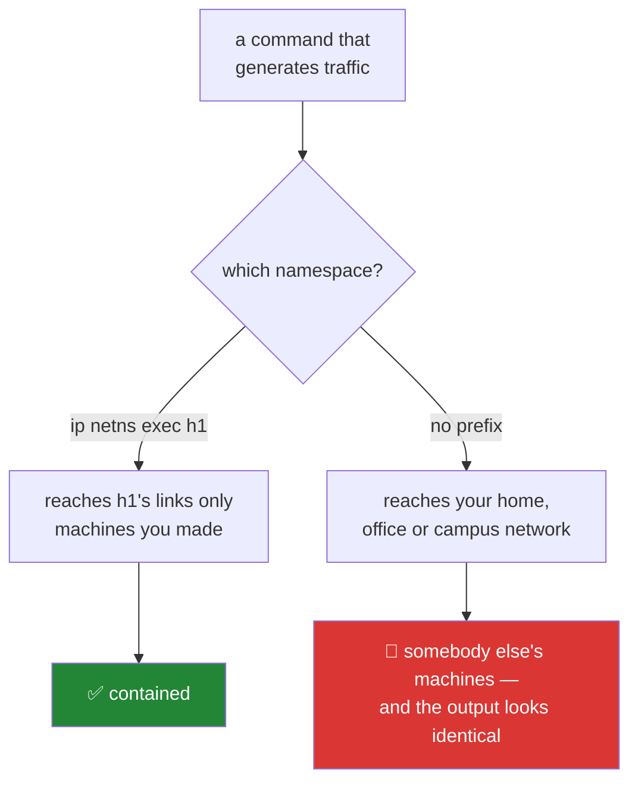

# 4.1 — 🛑 The rule that comes before every other rule

## One-line answer

Every scan, flood, spoof, injection and man-in-the-middle exercise in this curriculum runs
against machines you created with `ip netns add` seconds earlier — and the public internet is
read-only and gentle — because this is the one subject whose worst case is not a wasted
evening.

---

## The story

You are given a key to let yourself into a neighbour's flat while they are away, to water the
plants.

You water the plants. You do not open the drawers.

Nothing stops you opening the drawers. The key works on the whole flat, nobody is watching,
and you could say honestly that you were only curious and would not have taken anything. The
reason you do not is not that you might be caught. It is that **the key was for the plants**,
and the difference between having access and having permission is the entire thing being
trusted with a key means.

And here is the part that transfers. If you did open a drawer, you would not be able to say
afterwards that you had not — not to them, and not really to yourself. There is no version of
it that is undone by intending well. The line is crossed at the moment of the action, and
nothing about the action *feels* like crossing a line, because opening a drawer feels exactly
like opening a drawer.

---

## The idea in plain language

Plan §4.2 opens with the sentence this part exists to make real:

> Every other curriculum's worst case is a wasted evening. This one's worst case is a criminal
> offence, and pretending otherwise would be a failure of the plan rather than a matter of
> taste.

That is not a disclaimer bolted onto the front. It follows from what the subject *is*. Over
152 days this curriculum teaches you to forge a frame, answer an ARP request that was not
addressed to you, spoof a source address, inject a packet into somebody else's connection,
sit in the middle of a TLS handshake, and flood a link until it drops traffic. Every one of
those is a legitimate and necessary thing to understand. Every one of them, pointed at a
machine that is not yours, is a different act entirely — and **the command is identical**.

So the five rules, from §4.2, in plain language:

**1. Traffic you generate stays inside your own namespaces.** Not "be careful". The machines
you attack were created by `ip netns add` seconds earlier and will be deleted afterwards. They
are yours in a way that admits no ambiguity.

**2. The public internet is read-only, and gently.** `dig`, `traceroute`, `curl`, a looking
glass, a public route collector — a handful of requests, at human speed, to services that
publish themselves for exactly this. Never a scan, never a flood, never an automated sweep,
never a protocol violation aimed at somebody else's host.

**3. Your employer's network and your university's network are not your lab.** They belong to
somebody who has not agreed. And a packet capture on a shared network collects other people's
traffic, which is a privacy question before it is a technical one
([2.5](../02-the-six-ledgers/2.5-captures-the-provenance-never-the-bytes.md)).

**4. A capture is evidence and is handled as such.** It may contain credentials. Never
committed, never shared without redaction, deleted when the day is done.

**5. In many jurisdictions, port-scanning a host you do not own is a crime** — regardless of
intent, and regardless of whether anything broke. This plan does not offer a legal opinion and
neither should you. It tells you where the line is drawn safely, which is inside `ip netns`.

Now the two things that make this a *technical* rule rather than a moral aside.

**The failure is silent.** A scan of a host you own and a scan of a host you do not own produce
identical output. There is no error, no warning, no difference in the terminal. Nothing in the
tooling can tell you which one you just did — which is precisely why the containment is
declared in the document *before* the command runs, rather than checked afterwards.

**Intent is not a defence and is not detectable.** "I only wanted to see if it was up" is
indistinguishable, from the receiving end, from the first step of an attack — because it *is*
the first step of an attack; that is what makes it a useful step. The receiving end sees
packets, not motives.

`SEC-02` teaches this properly — the threat model, the law as a shape rather than a citation,
and how professional testing gets its authorisation in writing. It sits at the **front** of
the security phase because everything after it is a technique that is fine in a namespace and
a serious matter anywhere else.

---

## Why Jāla needs it

- **This is the rule that comes before every other rule** in `CLAUDE.md` and in plan §4.2. It
  is stated on Day 1 because Day 21 causes a broadcast storm, Day 23 poisons an ARP cache, and
  Day 104 sits in the middle of a connection — and a rule introduced on Day 20 arrives after
  the habits have formed.
- **`OPS-01` is the repo as the network's memory**, and the containment story is part of what
  the repository has to record. A part that teaches an attack and does not name its
  containment is not finished (§24.4.1 rule 5).
- **P13 — blast radius before capability.** Never a raw socket, a spoofed source, a scan or a
  flood without its containment story **in the same document**.
- **`./m depth` enforces the mechanical half** — a probe in an L0 part fails; traffic at L1
  without a named namespace fails
  ([Day 0, 4.2](../../../day-000-toolchain-skeleton-driver/parts/04-the-linux-door/4.2-the-four-tiers.md)).

---

## The mechanism

The containment is a command prefix, and it is worth seeing that it is this small:

```bash
ip netns exec h1 <command>
```

**Line by line:**

- `ip netns exec h1` — run the command **inside namespace `h1`**. The process gets `h1`'s
  interfaces, `h1`'s routing table, `h1`'s firewall rules and nothing else. A packet it sends
  can only reach what `h1` is wired to.
- Without this prefix the identical command runs in the **host's** namespace, which on a laptop
  is your home network, and on a work machine is your employer's. **The difference between a
  contained exercise and an incident is those four words**, and there is no output that tells
  you which one you ran.

What "read-only and gently" looks like at tier L2 — this is the whole permitted shape:

```bash
dig +short example.com A
```

**Line by line:**

- `dig` — one DNS query to a resolver, for a name that exists to be looked up. This is
  observation, not interrogation.
- `+short` — just the answer. Reading a published fact from a service designed to publish it.
- **One query, typed by a human.** The rule's limit is not the tool, it is the volume and the
  intent: the same binary in a loop over an address range is a sweep, and a sweep is rule 2's
  "automated sweep" no matter how polite each individual query looks.

Verify where you are before you do anything that generates traffic:

```bash
ip netns identify $$ || echo "HOST namespace — nothing hostile belongs here"
```

**Line by line:**

- `$$` — the current shell's process ID.
- `ip netns identify <pid>` — which namespace that process is in. Inside `h1` it prints `h1`;
  in the host namespace it prints nothing and exits non-zero.
- `|| echo "HOST namespace — …"` — turn silence into a sentence. **"Found nothing" and "did not
  run" must never look the same** — the same lesson as
  [Day 0's 3.1](../../../day-000-toolchain-skeleton-driver/parts/03-the-driver/3.1-set-euo-pipefail.md),
  and here the cost of confusing them is considerably higher than a wasted evening.

And the declaration that goes in every part that generates traffic, which is
[4.2](4.2-naming-your-containment.md)'s subject:

```text
## Topology
Namespaces: h1, h2 (created by lab/two-host.sh, deleted by lab/down.sh)
All traffic in this part stays between h1 and h2.
```



The two branches produce the same terminal output. That is the whole reason the left branch has
to be a habit rather than a decision.

---

## When it breaks

**The containment working**, which is what you want to be able to demonstrate:

```text
$ ip netns exec h1 ping -c1 10.0.0.2
64 bytes from 10.0.0.2: icmp_seq=1 ttl=64 time=0.061 ms

$ ip netns exec h1 ping -c1 8.8.8.8
ping: connect: Network is unreachable
```

**What the second one means.** The namespace has no route off its own link, so a packet
addressed outside it **cannot leave**. That error is not a problem to fix — it is the
containment, visible. A lab namespace that could reach the internet would be a lab namespace
that could reach somebody else.

**The prefix that was forgotten:**

```text
$ ping -c1 10.0.0.2
PING 10.0.0.2 (10.0.0.2) 56(84) bytes of data.
--- 10.0.0.2 ping statistics ---
1 packets transmitted, 0 received, 100% packet loss
```

**What it means.** This ran in the **host** namespace, where `10.0.0.2` is not your lab
host — it is whatever, if anything, has that address on the network your laptop is actually
connected to. In a home this is probably nothing. On a corporate network `10.0.0.2` is very
likely a real machine belonging to somebody else, and you have just sent it a packet. Nothing
in that output distinguishes the two cases.

**And the silent one, which is the reason this part is the one that comes first.** A scan
that works:

```text
$ nmap -sS 203.0.113.0/24
Starting Nmap 7.94 ( https://nmap.org )
Nmap scan report for 203.0.113.7
Host is up (0.011s latency).
PORT     STATE SERVICE
22/tcp   open  ssh
443/tcp  open  https
```

**Nothing failed. There is no error to read, and no warning anywhere.** The command succeeded,
the output is well-formatted and informative, and it looks exactly like every legitimate lab
exercise in this curriculum. The only thing distinguishing this from a permitted action is
**whose machines those addresses belong to** — which does not appear in the output, is not
checked by any tool, and cannot be recovered afterwards.

There is no technical check for this and there cannot be one. The check is the declared tier
and the named namespaces, written down **before** the command runs. That is why §4.2 is a
documentation rule enforced by `./m depth` rather than a runtime guard: by the time a runtime
guard could act, the packets have already left.

---

## In production

**Authorised testing is a paperwork discipline before it is a technical one.** Professional
penetration testing runs on a signed scope document: the addresses in scope, the time window,
the techniques permitted, and a named contact to stop the test. The technical skills are the
easy half. The scope is what makes it a profession rather than an offence, and it is written
down for exactly the reason the silent failure above describes — an in-scope scan and an
out-of-scope scan produce identical output, so the boundary has to exist somewhere other than
in the output.

**"Blast radius" is the first question asked before any change to a running network**, and it
has the same shape as containment: what is the affected set, is it what you intended, and how
would you know if it were larger. `OPS-08` — change windows and rollback — is this question
formalised, and the reason a change window exists at all is that "I only touched one thing" is
not verifiable after the fact.

**Test traffic escaping into production is a real and recurring incident**, not a beginner's
mistake. A load generator pointed at a staging hostname that now resolves to a production load
balancer; a configuration copied between environments with one address unchanged; a scan
configured with a wider netmask than intended. The professional defences are structural —
separate credentials, separate networks, address space that cannot route between them —
because "we were careful" has failed often enough to be uninteresting.

**Responsible disclosure exists because finding a flaw and acting on it are different acts.**
If you discover a vulnerability in something that is not yours, the professional path is to
report it through a published channel and give the owner time to fix it. Testing further "to
confirm the impact" is the step that converts a report into an intrusion, and it is a step
people take with entirely good intentions.

**What an operator does differently.** They say out loud where the packets are going before
they run the command, and they prefer a tool that refuses an out-of-scope target over a tool
that trusts them to type carefully. The habit being trained here is small, and it transfers
completely: **before anything that generates traffic, name the destination and confirm you own
it.**

**The review comment.** On a pull request adding an integration test that resolves a public
hostname: *"This hits somebody else's DNS on every CI run — that's traffic we don't own and a
dependency we don't control. Point it at a namespace, or record the response and replay it."*

**The interview question.** *"You've been asked to check whether a firewall rule works. What do
you do before running anything?"* The technical answer comes second. The first answer is
scope: which addresses, authorised by whom, in writing, and for what window. A candidate who
goes straight to the command has told you which tier they think everything is on — and it is
the question that a security team asks precisely because the technically strong answer is the
easy part.

---

## Check yourself

```bash
ip netns identify $$ 2>/dev/null || echo "0 — host namespace, no containment"
```

Today, on a machine with no Linux kernel or outside any namespace, this prints the fallback
sentence. From Day 9 onward, running it **inside** `ip netns exec h1 bash` prints `h1` — and
the number of namespaces between your command and somebody else's network is the only number
in this curriculum where the correct value is never zero.

**Answer out loud, without scrolling up:**

> State the five rules of §4.2 without looking, then name the four words that separate a
> contained exercise from an incident. Then explain why there can be no technical check for
> this — and what this repository uses instead.

---

**Next:** [4.2 — Naming your containment](4.2-naming-your-containment.md)
