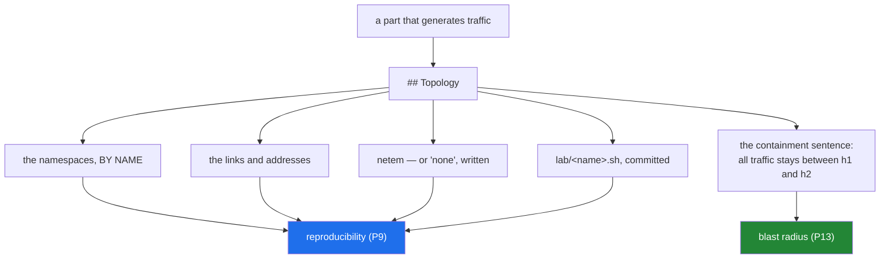

# 4.2 — Naming your containment, and the `## Topology` section as a safety artifact

## One-line answer

Every part that generates traffic names, in writing and before the command runs, the
namespaces the traffic stays inside — and that sentence is both the reproducibility record and
the only check that exists, because no tool can tell whose machine an address belongs to.

---

## The story

Somebody is about to cut into a wall to run a cable, and before the saw comes out they say out
loud: "there's a pipe behind here, it runs from the boiler down to about knee height, so I'm
cutting above that line."

They already knew that. Saying it changed nothing about the wall.

What it changed is that the thought became **checkable**. The other person in the room can now
say "actually I think it comes across, not down" — which they could not have said to a silent
plan. And the person holding the saw has now committed to a specific claim, which is different
from having a general intention to be careful, because a general intention cannot be wrong
about anything.

The saying-out-loud is not ceremony and it is not for the other person's benefit. It is the
step that converts *being careful* into *a statement that can be checked*.

---

## The idea in plain language

Plan §24.4 makes the `## Topology` section required in any part that runs at tier L1 or L2,
and §24.4.1 rule 5 adds the safety clause:

> **State the tier and the blast radius.** Any part that generates traffic **names the
> namespaces it stays inside**. A part that teaches an attack and does not name its containment
> is not finished.

So one section does two jobs at once, and it is worth seeing that they are the same job.

**As a reproducibility record**, it is what P9 requires: the namespaces, the links, the
addresses, the netem settings, and the exact `lab/<name>.sh` that builds it. A measurement
without a topology is an anecdote
([2.4](../02-the-six-ledgers/2.4-topologies-a-script-not-a-sentence.md)).

**As a safety artifact**, it is the sentence that says where the packets go. And it is the only
check available, because — as [4.1](4.1-the-rule-before-every-rule.md) established — a scan of
a host you own and a scan of a host you do not own produce identical output. There is nothing
to detect at runtime. The boundary has to be declared before the command, in a document
somebody can read and disagree with.

Those two jobs want the same information, which is why they are one section rather than two:
*which machines, wired how, and what did you do to them.*

What a complete `## Topology` section carries:

- **the namespaces, by name** — `h1`, `h2`, `r1`. Not "two hosts and a router";
- **the links** — which veth pair joins which namespaces;
- **the addresses** — the full plan, so a reader can follow a packet;
- **the netem settings** — or `none`, written out, because a blank cell is ambiguous between
  "no impairment" and "nobody recorded it";
- **the script** — `lab/<name>.sh`, committed and idempotent;
- **the containment sentence** — all traffic in this part stays between these namespaces.

`./m depth` enforces the mechanical half: a part declaring tier L1 or L2 with no `## Topology`
fails, and a part whose code blocks generate traffic at L1 without naming a namespace fails.

And the limit, stated honestly because
[3.3](../03-traceability/3.3-an-open-id-is-a-bug.md) just spent a whole part on why limits get
stated: **the checker verifies that a sentence exists, not that it is true.** A part could
name `h1` and `h2` and run a command against a public address. Nothing would catch it. The
section is the professional habit made visible and reviewable — which is what a scope document
is, and it is not less valuable for being made of words.

---

## Why Jāla needs it

- **P13 — blast radius before capability.** Never a raw socket, a spoofed source, a scan or a
  flood without its containment story **in the same document**.
- **P9 — configs and scripts are committed**, and a measurement names its topology. The same
  section serves both, which is why it is required rather than encouraged.
- **Day 21 causes a broadcast storm, Day 23 poisons an ARP cache, Day 104 sits in the middle
  of a handshake.** Each of those parts is finished only when it has named what it stays
  inside.
- **`./m depth` rejects an L1 part with no `## Topology`** — the one piece of this that can be
  automated, and it is automated.

---

## The mechanism

What a complete section looks like — this is Day 9's `two-host`, written the way every later
part will be:

```text
## Topology

Built by `lab/two-host.sh`. Namespaces `h1` and `h2`, one veth pair, no impairment.
**All traffic in this part stays between h1 and h2**, which are created at the start of the
part and deleted by `lab/down.sh` at the end.

| Namespace | Interface | Address | Peer |
| --- | --- | --- | --- |
| `h1` | `veth-h1` | 10.0.0.1/24 | `h2` |
| `h2` | `veth-h2` | 10.0.0.2/24 | `h1` |

netem: none
```

The three things that make that section do its job: the namespaces are **named**, the
containment is a **sentence in bold** rather than an implication, and `netem: none` is
**written out** rather than omitted.

The check that enforces the mechanical half:

```python
def containment_problems(tier: str, code: str, text: str) -> list[str]:
    """§4.2 — a part that generates traffic names the namespaces it stays inside."""
    probes = [p for p in PROBE_COMMANDS if re.search(p, code)]
    if probes and tier == "L0":
        return ["tier L0 but a code block runs a probe"]
    if probes and tier == "L1" and "netns" not in text:
        return ["generates traffic at L1 but never names a namespace"]
    return []
```

**Line by line:**

- `re.search(p, code)` — against **code blocks only**, never prose. A part must be able to
  discuss a ping without being accused of sending one; §4.2 governs what the reader is
  instructed to run. Getting this backwards would be worse than no check — an author who trips
  a false positive learns to delete the explanation, and deleting explanations is the one edit
  the depth contract forbids outright.
- `tier == "L0"` — L0 is one host in user space, so a probe there means either the tier is
  wrong or the packet is. **The error says both possibilities** rather than guessing, because
  the two have completely different fixes.
- `"netns" not in text` — searched against the **whole document**, because the namespace is
  named in the `## Topology` section rather than inside the command. The rule is "name your
  containment", not "put the word in the command line".
- Returning a list rather than raising — the caller collects problems across every part, so one
  run produces one fix list.

Confirm a part declares what it should, before you trust it:

```bash
grep -l '^tier: L1' days/*/parts/*/*.md 2>/dev/null | while read -r f; do
  grep -q '^## Topology' "$f" || echo "MISSING TOPOLOGY: $f"
done
```

**Line by line:**

- `grep -l` — list **file names** whose content matches, rather than the matching lines. This
  is the set of L1 parts.
- `while read -r f` — loop over them. `-r` stops backslashes in a path being interpreted as
  escapes, which is the habit that avoids a whole class of filename bug.
- `grep -q '^## Topology' "$f" || echo …` — anchored at line start so a mention of the word in
  prose does not count as the section. `||` turns the absence into a printed line, so silence
  means clean rather than meaning the loop did not run
  ([4.1](4.1-the-rule-before-every-rule.md)).
- Today this prints nothing, because no L1 part exists yet. **That is the honest state**, and
  it is worth running now so you have seen its clean output before you need to trust its dirty
  one.



One section, two obligations — and they want the same facts, which is why splitting them would
produce two documents that drift apart.

---

## When it breaks

**The checker refusing a mis-tiered part**, which is the mechanism working:

```text
  FAIL days/day-030-icmp/parts/02-echo/2.2-ping-by-hand.md
       tier L0 but a code block runs a probe (['\bping6?\b']). L0 is one host in
       user space - either the tier is wrong or the packet is (§4.1)
```

**What it means, and read the last clause carefully:** *either the tier is wrong or the packet
is.* Two genuinely different bugs. If the part really does build a topology and send a ping
inside it, the frontmatter should say `L1` and the part needs a `## Topology` section. If the
part is meant to be arithmetic, the command does not belong in it. **The error refuses to
guess**, because guessing would sometimes silently relabel a part that is putting packets
somewhere.

**Traffic at L1 with no containment named:**

```text
  FAIL days/day-034-forwarding/parts/03-the-path/3.1-two-hops.md
       generates traffic (['\bping6?\b']) at tier L1 but never names a namespace.
       Every part that generates traffic names its namespaces (§4.2)
```

**What it means.** The part is honest about its tier and has not said where the packets are
contained. This is the rule that makes §4.2 mechanical rather than aspirational.

**And the silent one, which is the limit of the whole mechanism.** A part with a perfect
`## Topology` section and a command that leaves it:

```text
## Topology
Namespaces h1 and h2, built by lab/two-host.sh. All traffic stays between h1 and h2.

## The mechanism
$ nmap -sS 203.0.113.0/24
Starting Nmap 7.94 ( https://nmap.org )
Nmap scan report for 203.0.113.7
Host is up (0.011s latency).
```

**Every check passes.** The tier is L1, the `## Topology` section exists, the word `netns`
appears in the document, and the depth contract is satisfied. And the command has no
`ip netns exec` prefix, so it ran in the host namespace against an address that is not in the
declared topology at all.

**Nothing catches this**, and it is important to say so rather than imply the tooling is
stronger than it is. The section is a *declaration*, and the check verifies the declaration
exists — the same relationship as a ticked checklist box
([Day 0, 3.3](../../../day-000-toolchain-skeleton-driver/parts/03-the-driver/3.3-the-done-gate.md))
and the same relationship as an ID in frontmatter
([3.3](../03-traceability/3.3-an-open-id-is-a-bug.md)). What the declaration buys is that the
discrepancy is now **visible to a reader**: the topology says `10.0.0.0/24` and the command
says `203.0.113.0/24`, and those disagree on the page. Before the declaration existed there
was nothing to disagree with.

---

## In production

**This is a scope document, and it is what makes security testing a profession.** A penetration
test runs on a signed agreement naming the addresses, the window, the permitted techniques and
a contact to stop the test. It exists for exactly the reason above: an in-scope action and an
out-of-scope action produce identical output, so the boundary must live somewhere other than in
the tooling. Writing it down first is not bureaucracy — it is the only artefact that can be
checked.

**Declaring the blast radius before a change is standard operational practice.** A change
request names the affected systems, the rollback, and how you will know it worked. The value is
not the form; it is that a specific claim can be challenged by somebody who knows something you
do not — which is the person in the room saying "I think the pipe comes across, not down".

**Naming resources explicitly beats matching them by pattern.** A firewall rule scoped to a
named group is auditable; one scoped to a wildcard is a rule whose actual scope changes when
somebody adds a resource. The same instinct applies to test targets, backup selectors and
monitoring queries: **an explicit list can be wrong in a way you can see, and a pattern is
wrong in a way you find out about later.**

**What an operator does differently.** They write the containment down before acting, and they
treat the written version as the thing to be reviewed rather than as a record of a decision
already made. The order matters: a scope written afterwards is a description, and a scope
written first is a check.

**The review comment.** On a pull request adding a part that runs a scan:
*"The topology names h1 and h2 but the command targets a public range and has no
`ip netns exec` prefix. Which is it? If this is meant to run in the lab it needs the prefix; if
it isn't, it can't be in this curriculum at all."*

**The interview question.** *"How do you make sure a load test doesn't hit production?"* The
weak answer is care and double-checking. The strong answer is structural: separate networks
and credentials so the traffic *cannot* route there, plus an explicit target list reviewed
before the run. And the strongest answer volunteers what remains — that a misconfiguration can
still defeat both, which is why the target is declared in writing and somebody else reads it.

---

## Check yourself

```bash
grep -rl '^tier: L1' days/ 2>/dev/null | wc -l
```

That number is **how many parts in this repository run in the lab** — today, zero, because
namespaces are `FOUND-14` on Day 9. Every one of them, from Day 9 onward, must carry a
`## Topology` section naming its namespaces, and `./m depth` will not let a single one through
without it.

**Answer out loud, without scrolling up:**

> Name the six things a complete `## Topology` section carries, and say which two obligations
> it is satisfying at once. Then explain what the containment declaration **cannot** catch —
> and say what it buys you anyway.

---

**Next:** [4.3 — 🅿️ The line, and the arithmetic for what you will not run](4.3-the-line-and-the-arithmetic.md)
