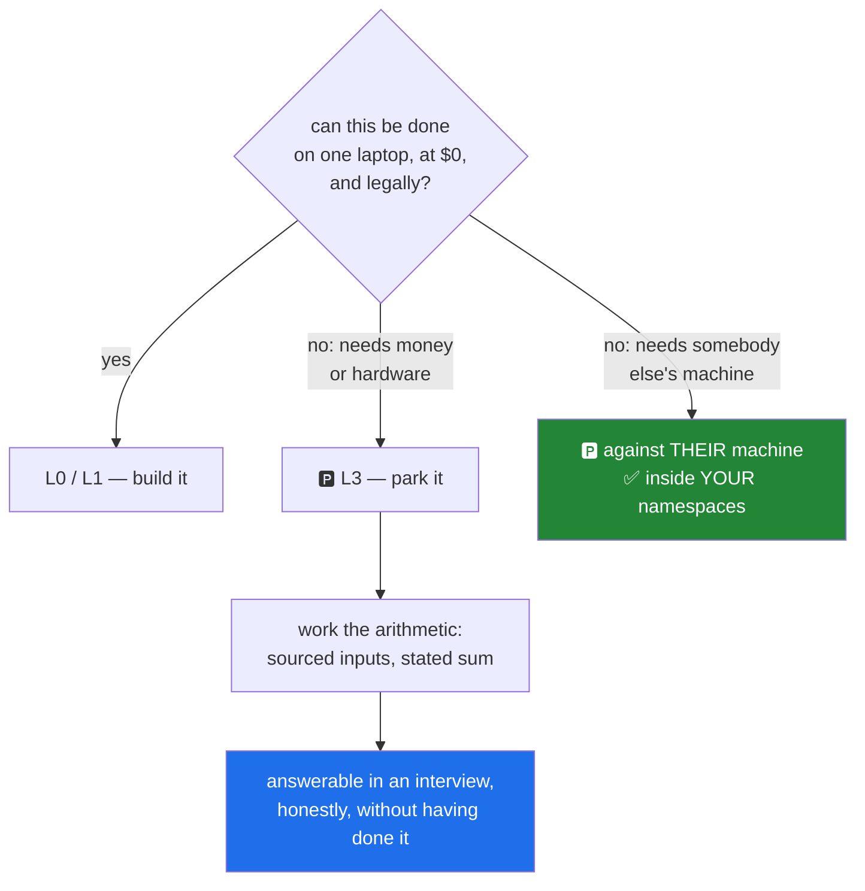

# 4.3 — 🅿️ The line, and the arithmetic for what you will not run

> **🅿️ This part is parked material** (plan §4.1). It covers things this curriculum will
> **never run** — because they cannot be done at $0, or cannot be done legally. Parked does not
> mean skipped: **the arithmetic is worked**, so the thing you did not run is still a thing you
> can size and reason about.

## One-line answer

Some of this subject cannot be practised — a real BGP peering, a hundred-gigabit link, an
attack against a machine you do not own — so those are taught as reading **with the numbers
worked out**, which is what lets you answer questions about them honestly without ever having
done them.

---

## The story

You will probably never do a skid recovery on ice.

You are still taught what happens. Braking makes it worse. You steer where you want to go
rather than away from where you are sliding. Stopping distances on ice are many times what
they are on a dry road — the number is not intuitive, and knowing roughly how wrong your
instinct is turns out to be the useful part.

Nobody thinks this is a gap in the teaching. The alternative — an instructor finding a frozen
car park so you can practise — would be more dangerous than the thing being prevented, and the
knowledge transfers perfectly well without it. What makes it *work* rather than being trivia is
that it comes with quantities: not "ice is slippery", but a stopping distance that is
startlingly long, so your mental model has a scale attached.

The teaching that fails is the one that says "be careful on ice" and leaves it there. That
sounds responsible and gives you nothing to reason with.

---

## The idea in plain language

Plan §4.1 defines tier **L3 — 🅿️ parked**: things that cannot be done at $0, or cannot be done
legally. And it attaches a condition that is the whole point:

> Taught as reading, **with the arithmetic worked**, so the thing you did not run is still a
> thing you can size.

Two categories end up here, and they are parked for completely different reasons.

**Cannot be done at $0.** A real BGP peering session needs an autonomous system number and a
block of address space. A 100-gigabit link needs hardware. A globally distributed anycast
deployment needs presence in many places. Carrier optics, a cellular core, a real internet
exchange — all real, all out of reach of one laptop, and none of them illegal.

**Cannot be done legally.** Attacking a machine you do not own — a scan, a flood, an injection,
a man-in-the-middle. Note carefully that **this category is not parked in this curriculum at
all**: it is parked *against other people's machines* and fully practised inside namespaces.
Day 21 causes a broadcast storm, Day 23 poisons an ARP cache, Day 104 sits in the middle of a
handshake. What is parked is the *target*, not the technique — which is the distinction
[4.1](4.1-the-rule-before-every-rule.md) is entirely about.

That distinction is worth holding, because it is what stops "we do not do that here" from
becoming a curriculum with holes in the security half. You will do all of it. You will do it
to machines you made a minute ago.

Now the discipline that makes parked material worth anything. **Working the arithmetic** means
the part carries real quantities from real sources — measured, specified in a named RFC
section, or cited to a named paper (P8) — so you can reason about the scale rather than gesture
at it.

For the parked topics in this plan, that looks like:

- **A full internet routing table.** You will never hold one on your own router. You can work
  out what it costs: the number of prefixes, times the bytes per entry, gives a memory figure —
  and that figure is why routers have specialised forwarding hardware rather than more RAM.
  Day 54 works it.
- **Oversubscription in a datacenter fabric.** You will not buy a leaf-spine fabric. The ratio
  is arithmetic: total edge bandwidth divided by uplink bandwidth, and what that ratio means
  when every host transmits at once. Day 126 works it, and builds the small version in
  namespaces.
- **Anycast.** You will not deploy to many sites. You can reason about what changes: routing
  decides which instance answers, so a connection can move sites when routing changes, which is
  fine for a request-response protocol and a problem for a long-lived stateful one.

The test of a parked part, and it is a demanding one: **can you answer an interview question
about it honestly?** Not "I have done this" — that would be a lie — but "I have not built one;
here is what it costs, here is why it is built that way, and here is the number that drives the
design." That is a strong answer, and it is stronger than a vague claim of experience because
it is checkable.

---

## Why Jāla needs it

- **Plan §4.1 defines L3 and requires the arithmetic**, and the plan marks ten concepts as
  parked across `PHY`, `ROUTE`, `NET`, `SOCK`, `APP`, `WIRE` and `DC`.
- **P15 — zero budget is a feature.** The constraint forces the arithmetic to be explicit
  rather than replaced by hardware you happened to have.
- **P18 — assume no prior knowledge, finish at production.** A parked topic still has to reach
  the production face: what an operator runs, what breaks at scale, what an interviewer probes.
- **`OPS-01` is the repo as memory**, and a parked topic's arithmetic is exactly the kind of
  thing that is expensive to re-derive and cheap to write down once.

---

## The mechanism

The arithmetic itself is the mechanism, and it is worth seeing the *shape* rather than a
number, because a number here would need a source and this day has not measured one.

```python
def table_memory_bytes(prefixes: int, bytes_per_entry: int) -> int:
    """Memory for a routing table, given a prefix count and a per-entry cost.

    Both inputs must be sourced (P8): the prefix count from a public route collector on a
    stated date, the per-entry cost from an implementation's documentation or measured.
    Neither is invented here, which is why this returns a function rather than a figure.
    """
    return prefixes * bytes_per_entry
```

**Line by line:**

- Two parameters, and **neither has a default**. A default would be an invented number
  ([2.6](../02-the-six-ledgers/2.6-measurements-what-turns-a-number-into-a-result.md)), and a
  plausible default is the most dangerous kind because nobody questions it.
- The docstring names **where each input must come from** — a public route collector for the
  prefix count, an implementation's documentation or a measurement for the per-entry cost. That
  is the difference between arithmetic and a rumour with a multiplication sign in it.
- `-> int` and a single expression — the function is trivial on purpose. **The hard part of
  parked arithmetic is sourcing the inputs, not doing the sum**, and writing it this way makes
  that obvious rather than hiding it behind a computation that looks impressive.

How you *would* source the first input, at tier L2 — read-only and gentle
([4.1](4.1-the-rule-before-every-rule.md)):

```bash
curl -s https://www.cidr-report.org/as2.0/ | grep -i -m1 'prefixes'
```

**Line by line:**

- A single request, by hand, to a public route report that exists to publish exactly this. One
  query at human speed is what rule 2 permits; the same command in a loop would not be.
- `-m1` — stop at the first match, so this is one line of output rather than a page.
- **This is a lookup, not a measurement.** The row it would produce belongs in `docs/SPECS.md`
  or as a citation with the date, not in `docs/MEASUREMENTS.md` — that ledger is for things
  measured *here*, on a stated topology, and reading somebody's published figure is a different
  kind of claim.

And the sizing that follows once both inputs have sources:

```text
prefixes × bytes_per_entry = table memory
table memory ÷ available fast memory = how many copies fit
```

That second line is the one that explains the hardware. A router needs the forwarding table in
memory it can consult at line rate for every packet, and that memory is expensive and small —
which is why forwarding is done by specialised hardware rather than by a general-purpose
processor with plenty of ordinary RAM. **The arithmetic is what turns "routers are specialised"
from a fact you were told into a conclusion you can reach.**



The green box is the one people get wrong about this curriculum. The technique is not parked.
The target is.

---

## Topology

**Tier L3 — parked.** There is **no topology**, and that is the definition of the tier rather
than an omission.

| | |
| --- | --- |
| Namespaces | none |
| Links | none |
| netem | none |
| Traffic generated | **none** |
| Hosts contacted | **none** |

Nothing in this part runs, connects, scans or measures anything. It reads, and it does
arithmetic on numbers that come from a named source. A part at this tier that generated traffic
would be a contradiction in terms, and `./m depth` would reject it.

---

## When it breaks

**Parked material done badly** — and this is the failure this part exists to prevent:

```text
🅿️ BGP peering is done between autonomous systems. It is complex and requires
   coordination with your upstream provider. This is beyond the scope of this
   curriculum.
```

**What is wrong with it.** Every sentence is true and the reader has gained nothing. There is
no quantity, no mechanism, and no way to reason about anything afterwards. "Beyond the scope"
is the phrase that converts a parked topic into a hole, and it is exactly the "be careful on
ice" version of the teaching. §24.9 names this failure as *summary in place of explanation*.

**The dishonest version, which is worse:**

```text
🅿️ A full routing table is around a million prefixes and takes roughly 500 MB.
```

**What is wrong with it.** Two numbers, both plausible, neither sourced. "Around" and "roughly"
are the hedges P8 warns about — *a rumour with a hedge in front of it* — and a reader who
repeats them in an interview is repeating something neither of you can defend. The honest form
names the collector and the date for the first number, and an implementation or a measurement
for the second.

**And the silent one, which is the specific risk of parked material.** A confident claim of
experience:

```text
"Yes, I've worked with BGP — we ran full tables and did prefix filtering."
```

**Nothing checks this in the moment, and it is the version that fails later.** Parked material
read carefully makes you *sound* experienced, because you have the vocabulary, the mechanism
and the numbers. The failure arrives on the follow-up question — the one about what actually
went wrong the day a session flapped — and there is nothing behind the vocabulary.

The defence is simple, costs nothing, and is stronger than the bluff: **say what you have built
and what you have only reasoned about.** *"I've not run a real peering — I built a speaker
against a second speaker in namespaces and exchanged a prefix with a policy applied, and I
know what a full table costs in memory and why that drives the hardware."* That is a better
answer than the confident one, because every clause of it is true and checkable, and the person
across the table can tell.

---

## In production

**Every engineer has a large parked category, and the good ones know where its edges are.**
Nobody has personally run every scale of every system. What distinguishes a strong engineer is
not having done more, but knowing precisely which things they have done, which they have
reasoned about, and where the boundary sits — because that boundary is what tells them when to
ask somebody.

**Reasoning from arithmetic is how capacity planning works**, and it is the professional
alternative to accepting a vendor's sizing. `OPS-10` is capacity planning from measured data,
and the method is exactly the one in this part: source your inputs, state the sum, and be
explicit about which numbers are measured and which are assumed. A capacity plan whose
assumptions are not labelled is a plan nobody can revise when one turns out to be wrong.

**Order-of-magnitude estimation is a genuine professional skill** — how much traffic, how much
storage, how many connections, how much memory per connection. Interviews probe it because
production demands it constantly, and the striking thing is how often the useful answer needs
only one significant figure and a correct exponent. Being wrong by a factor of two is fine;
being wrong by a factor of a thousand is a design that will not work.

**Knowing what you have not done is a safety property, not a confession.** An engineer who
believes they have experience they lack makes confident decisions in exactly the areas where
they should be asking questions. This is why the discipline of marking parked material
explicitly — 🅿️, in the document, on the day — is worth the small awkwardness: it keeps the
boundary visible to you, not only to a reader.

**The review comment.** On a design document asserting a capacity figure:
*"Where does this number come from? If it's measured, let's have the conditions; if it's
estimated, let's see the arithmetic and label the assumptions — I want to know which input to
re-check when this turns out to be wrong."*

**The interview question.** *"Have you run BGP in production?"* If the honest answer is no, the
strong response is the one above: what you built, what you reasoned about, and the number that
drives the design. Interviewers are not principally testing experience — they are testing
whether you know the difference between what you have done and what you have read, because
that is the thing that predicts how you will behave when you are out of your depth.

---

## Check yourself

```bash
grep -rc '🅿️' docs/00_MASTER_PLAN.md
```

That number is **how many times the parked marker appears in the plan** — the concepts and days
this curriculum will deliberately never run. Read a few of them in
[`docs/CURRICULUM_INDEX.md`](../../../../docs/CURRICULUM_INDEX.md) and, for each, ask what the
arithmetic would have to be for the reading to be worth anything.

**Answer out loud, without scrolling up:**

> Explain what 🅿️ parked means and the condition that comes with it. Then say why attacking a
> machine you do not own is parked while causing a broadcast storm is not — and give the shape
> of an honest interview answer about something you have only reasoned about.

---

**This is the last part of Day 1.** Back to the hub: [`LESSON.md`](../../LESSON.md) — then
write `scripts/trace.py`, tick the checklist, and `./m done 1`.
